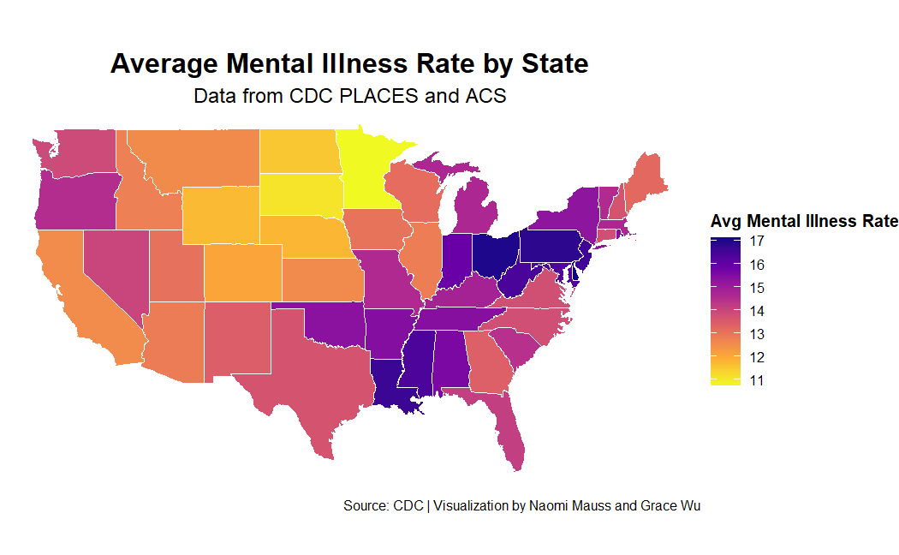
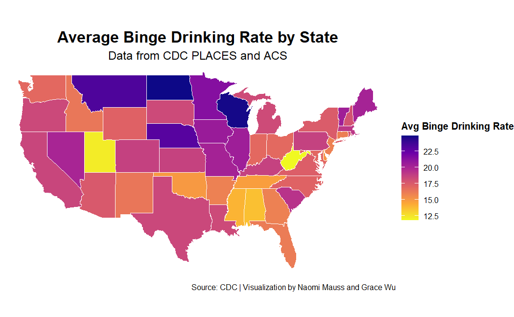
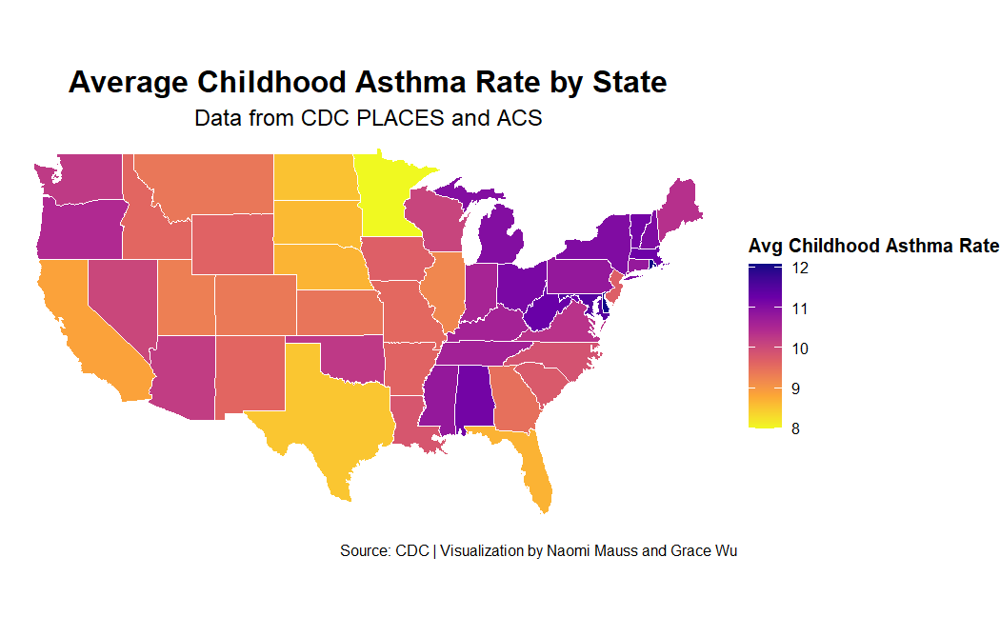
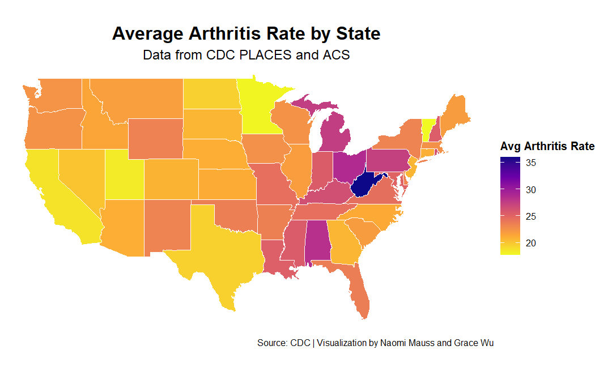
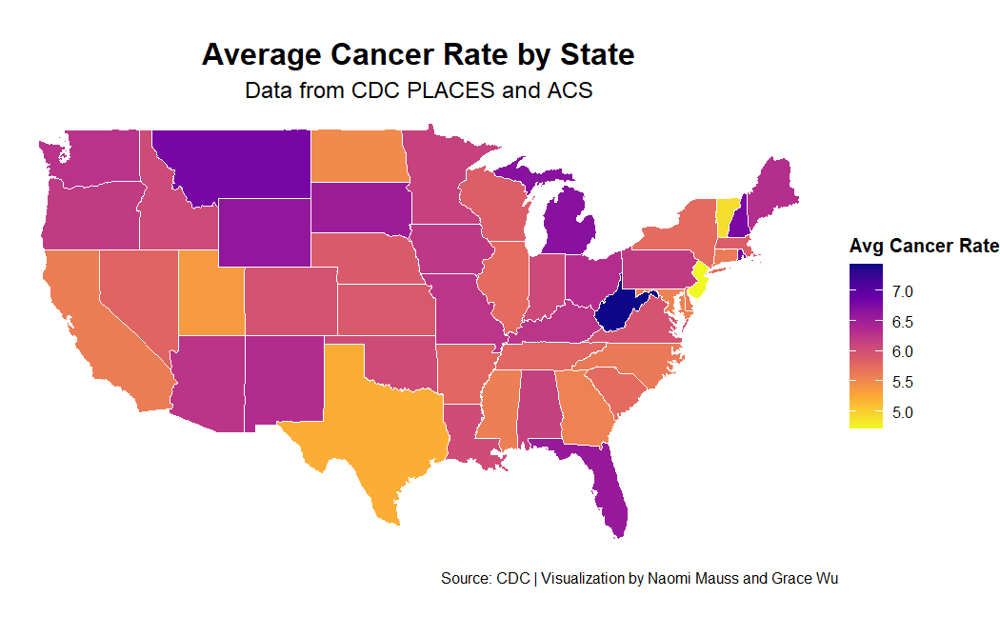
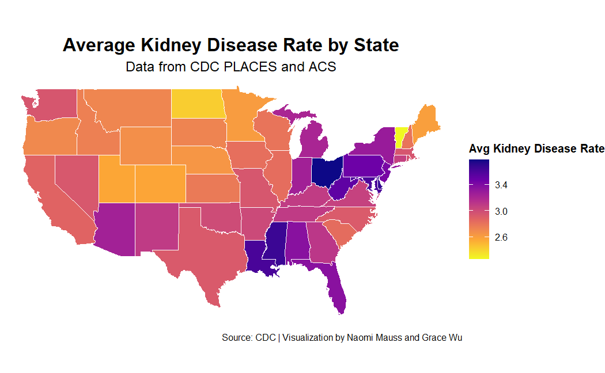
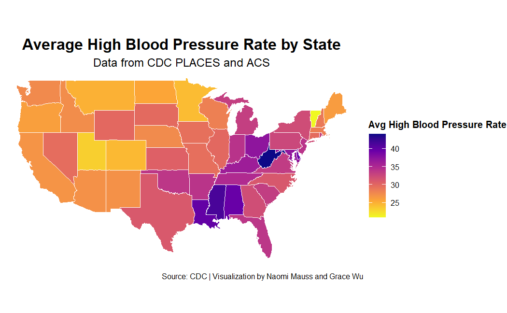
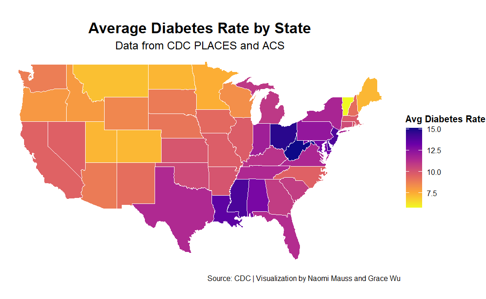
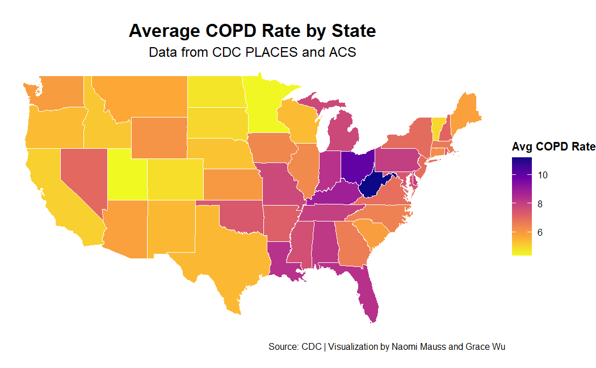

```{r setup, include=FALSE}
knitr::opts_chunk$set(echo = TRUE)
```


# Illnesses by State

This is the mental illness rate mapped by US state.



This is the binge drinking rate mapped by US state.



This is the childhood asthma rate mapped by US state.



This is the arthritis rate mapped by US state.



This is the cancer rate mapped by US state.



This is the kidney disease rate mapped by US state.



This is the high blood pressure rate mapped by US state.



This is the diabetes rate mapped by US state.



This is the COPD rate mapped by US state.



