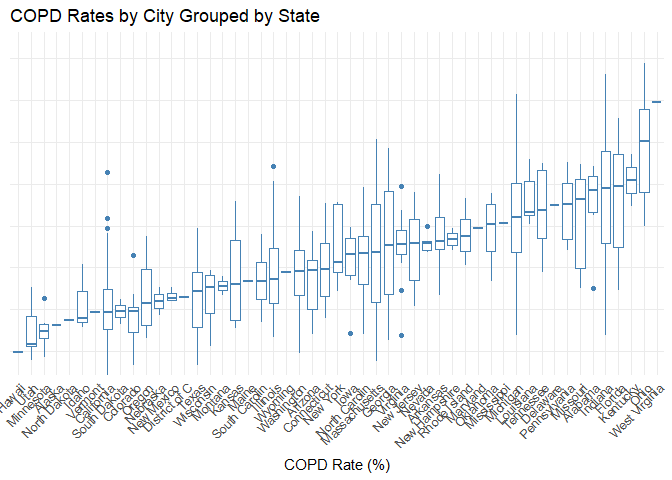
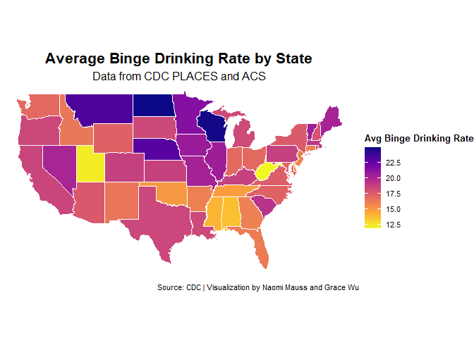
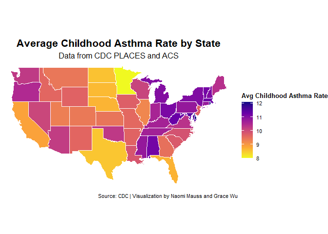
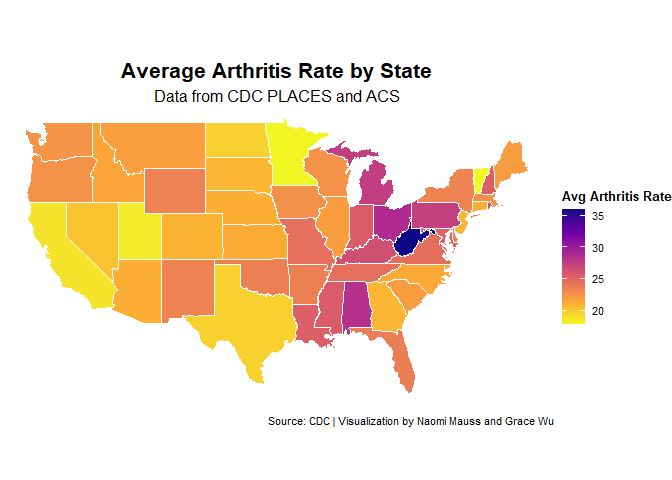
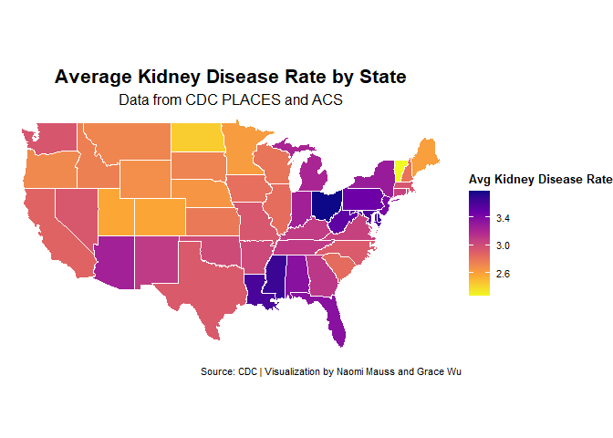
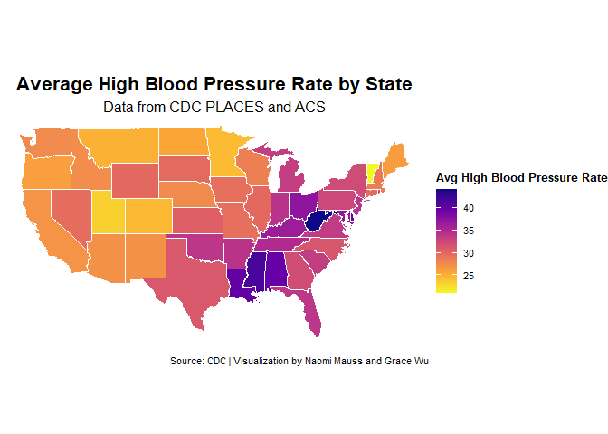
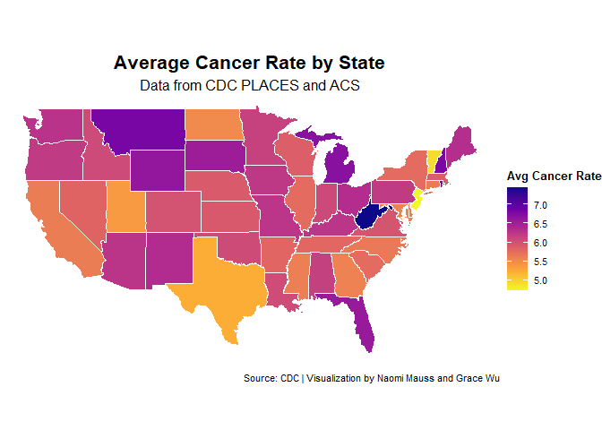
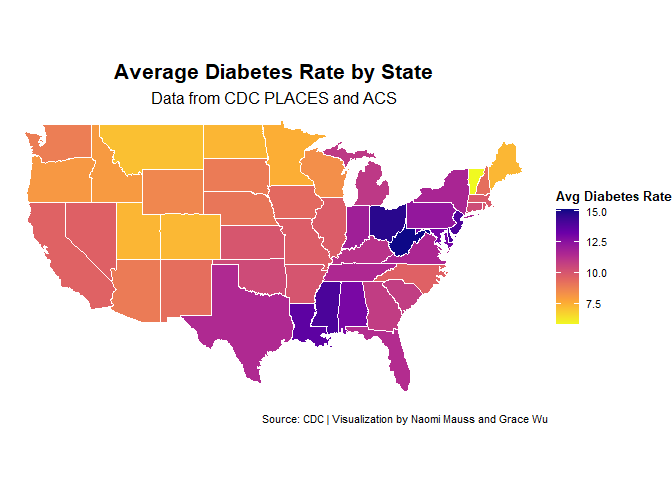
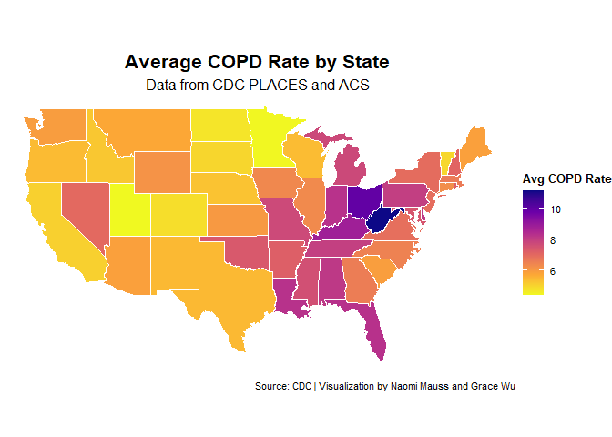

README
================
Naomi
2025-04-16

This imports the cleaned dataset from the initial data creation step in
Data Creation.Rmd

``` r
health <- read.csv("https://docs.google.com/spreadsheets/d/e/2PACX-1vQeaKrReyifqjPVoWB2pYHAo54wLlybjEnMZiPP0i6tdpWb-RLqmwrCvhz8HVOBLCjEo_0qYmrnOkEo/pub?output=csv")
```

``` r
library(readr)
library(dplyr)
```

    ## Warning: package 'dplyr' was built under R version 4.4.2

    ## 
    ## Attaching package: 'dplyr'

    ## The following objects are masked from 'package:stats':
    ## 
    ##     filter, lag

    ## The following objects are masked from 'package:base':
    ## 
    ##     intersect, setdiff, setequal, union

``` r
library(tidycensus)
library(tidyverse)
```

    ## Warning: package 'tidyverse' was built under R version 4.4.2

    ## Warning: package 'ggplot2' was built under R version 4.4.2

    ## Warning: package 'stringr' was built under R version 4.4.1

    ## ── Attaching core tidyverse packages ──────────────────────── tidyverse 2.0.0 ──
    ## ✔ forcats   1.0.0     ✔ stringr   1.5.1
    ## ✔ ggplot2   3.5.1     ✔ tibble    3.2.1
    ## ✔ lubridate 1.9.3     ✔ tidyr     1.3.1
    ## ✔ purrr     1.0.2

    ## ── Conflicts ────────────────────────────────────────── tidyverse_conflicts() ──
    ## ✖ dplyr::filter() masks stats::filter()
    ## ✖ dplyr::lag()    masks stats::lag()
    ## ℹ Use the conflicted package (<http://conflicted.r-lib.org/>) to force all conflicts to become errors

``` r
health %>%
  mutate(StateDesc = reorder(StateDesc, COPD, median)) %>%
  ggplot(aes(y = COPD, x = StateDesc)) +
    geom_boxplot(color = "steelblue") +
    labs(title = "COPD Rates by City Grouped by State",
         x = "COPD Rate (%)",
         y = NULL) +
    theme_minimal() +
    theme(axis.text.y = element_blank(),
          axis.ticks.y = element_blank(),
          axis.text.x = element_text(angle = 45, hjust = 1)) +
    scale_y_continuous(expand = expansion(mult = c(0, 0.1)))
```

<!-- -->

<!-- # DO NOT KEEP RELOADING THIS!!!!! -->
<!-- THE DATA CAN BE RETRIEVED FROM THE BOX FOLDER IT TAKES A LOT OF -->
<!-- COMPUTATIONAL POWER TO RUN THE FOLLOWING CODE CHUNK THANK YOU : ) -->
<!-- # Get 2019 ACS 5-Year population estimates for all US places -->
<!-- city_pop <- get_acs( -->
<!--   geography = "place", -->
<!--   variables = "B01003_001",  # Total population -->
<!--   year = 2019, -->
<!--   survey = "acs5", -->
<!--   output = "wide", -->
<!--   geometry = FALSE -->
<!-- ) -->
<!-- # This converts the columns to a more readable format -->
<!-- top_cities <- city_pop %>% -->
<!--   select(GEOID, NAME, B01003_001E) %>%  # GEOID is the FIPS code -->
<!--   rename( -->
<!--     fips = GEOID, -->
<!--     city = NAME, -->
<!--     population = B01003_001E -->
<!--   ) %>% -->
<!--   arrange(desc(population)) -->
<!-- # This ensures when we join our data the columns in health and top_cities have the same variable name -->
<!-- top_cities <- rename(top_cities, CityFIPS = fips) -->
<!-- #This casts top_cities as numeric so that it can be joined with the numeric CityFIPS column in health -->
<!-- top_cities$CityFIPS <- as.numeric(top_cities$CityFIPS) -->
<!-- # This is a slightly destructive join -->
<!-- # It removes two cities from our original dataset because their FIPS are not in the ACS dataset -->
<!-- # The fact that they are not in the ACS dataset means we probably don't care about them -->
<!-- # And 498 cities is an acceptable number of datapoints for the scope of this project -->
<!-- healthwfips <- inner_join(health, top_cities, by = "CityFIPS") -->
<!--  install.packages("writexl") -->
<!--  library(writexl) -->
<!--  write_xlsx(healthwfips, 'C:\\Users\\songb\\Desktop\\healthwfips.xlsx') -->
<!--  write_xlsx(map_data_combined, 'C:\\Users\\songb\\Desktop\\map_data_combined.xlsx') -->
<!--  write_xlsx(healthwfips, 'C:\\Users\\songb\\Desktop\\healthwfips.xlsx') -->
<!-- ``` -->
<!-- The questions we want to consider are as such: -->
<!-- Consider the variables: - mental illness - binge drinking - asthma - -->
<!-- arthritis - cancer - kidney disease - high blood pressure - diabetes - -->
<!-- COPD -->
<!-- Group By State -->
<!-- # The population represented here is the sum of the considered cities -->
<!-- # It represents a SAMPLE SIZE and is NOT IS NOT representative of the total population of those states -->
<!-- state_means <- healthwfips %>% group_by(StateDesc) %>% -->
<!--   summarise(avgMentalIllness = mean(MHLTH), avgBingeDrinking = mean(BINGE), avgChildhoodAsthma = mean(CASTHMA), avgArthritis = mean(ARTHRITIS), avgCancer = mean(CANCER), avgKidneyDisease = mean(KIDNEY), avgHighBP = mean(BPHIGH), avgDiabetes = mean(DIABETES), avgCOPD = mean(COPD), statePopulation = sum(population)) -->
<!-- state_means <- state_means %>% -->
<!--   mutate(StateDesc = tolower(StateDesc)) -->
<!-- state_means$StateDesc[state_means$StateDesc == "south carolin"] <- "south carolina" -->
<!-- state_means$StateDesc[state_means$StateDesc == "north carolin"] <- "north carolina" -->

Prepare the data to map by state

``` r
#install.packages("viridis")
#library(ggplot2)
#library(dplyr)
#library(maps)      # for map_data
#library(viridis)   # optional: better color scale

state_means <- read.csv("https://docs.google.com/spreadsheets/d/e/2PACX-1vRPtd9hIIamvljlqlmKcpm8xzcoSxkiNT4bLA78cgczFQqrSjI1DRrKnNiKR5Ger9CZHL8AEd0bx7OW/pub?output=csv")
```

``` r
states_map <- map_data("state")

my_data <- state_means %>% mutate(state = tolower(StateDesc))

map_data_combined <- left_join(states_map, my_data, by = c("region" = "state"))
```

``` r
# install.packages("writexl")
 
# library(writexl)
 
# write_xlsx(map_data_combined, 'C:\\Users\\songb\\Desktop\\ndata.xlsx')
 
 
# write_xlsx(state_means, 'C:\\Users\\songb\\Desktop\\state_means.xlsx')
```

Now we make the maps

``` r
ggplot(map_data_combined, aes(x = long, y = lat, group = group, fill = avgMentalIllness)) +
  geom_polygon(color = "white", size = 0.3) +
  coord_fixed(1.3) +
  scale_fill_viridis_c(
    option = "plasma",
    direction = -1,
    name = "Avg Mental Illness Rate"
  ) +
  labs(
    title = "Average Mental Illness Rate by State",
    subtitle = "Data from CDC PLACES and ACS",
    caption = "Source: CDC | Visualization by Naomi Mauss and Grace Wu"
  ) +
  theme_void() +
  theme(
    plot.title = element_text(hjust = 0.5, size = 16, face = "bold"),
    plot.subtitle = element_text(hjust = 0.5, size = 12),
    plot.caption = element_text(hjust = 1, size = 8),
    legend.position = "right",
    legend.title = element_text(size = 10, face = "bold"),
    legend.text = element_text(size = 8)
  )
```

    ## Warning: Using `size` aesthetic for lines was deprecated in ggplot2 3.4.0.
    ## ℹ Please use `linewidth` instead.
    ## This warning is displayed once every 8 hours.
    ## Call `lifecycle::last_lifecycle_warnings()` to see where this warning was
    ## generated.

<!-- -->

``` r
ggplot(map_data_combined, aes(x = long, y = lat, group = group, fill = avgBingeDrinking)) +
  geom_polygon(color = "white", size = 0.3) +
  coord_fixed(1.3) +
  scale_fill_viridis_c(
    option = "plasma",
    direction = -1,
    name = "Avg Binge Drinking Rate"
  ) +
  labs(
    title = "Average Binge Drinking Rate by State",
    subtitle = "Data from CDC PLACES and ACS",
    caption = "Source: CDC | Visualization by Naomi Mauss and Grace Wu"
  ) +
  theme_void() +
  theme(
    plot.title = element_text(hjust = 0.5, size = 16, face = "bold"),
    plot.subtitle = element_text(hjust = 0.5, size = 12),
    plot.caption = element_text(hjust = 1, size = 8),
    legend.position = "right",
    legend.title = element_text(size = 10, face = "bold"),
    legend.text = element_text(size = 8)
  )
```

<!-- -->

``` r
ggplot(map_data_combined, aes(x = long, y = lat, group = group, fill = avgChildhoodAsthma)) +
  geom_polygon(color = "white", size = 0.3) +
  coord_fixed(1.3) +
  scale_fill_viridis_c(
    option = "plasma",
    direction = -1,
    name = "Avg Childhood Asthma Rate"
  ) +
  labs(
    title = "Average Childhood Asthma Rate by State",
    subtitle = "Data from CDC PLACES and ACS",
    caption = "Source: CDC | Visualization by Naomi Mauss and Grace Wu"
  ) +
  theme_void() +
  theme(
    plot.title = element_text(hjust = 0.5, size = 16, face = "bold"),
    plot.subtitle = element_text(hjust = 0.5, size = 12),
    plot.caption = element_text(hjust = 1, size = 8),
    legend.position = "right",
    legend.title = element_text(size = 10, face = "bold"),
    legend.text = element_text(size = 8)
  )
```

<!-- -->

``` r
ggplot(map_data_combined, aes(x = long, y = lat, group = group, fill = avgArthritis)) +
  geom_polygon(color = "white", size = 0.3) +
  coord_fixed(1.3) +
  scale_fill_viridis_c(
    option = "plasma",
    direction = -1,
    name = "Avg Arthritis Rate"
  ) +
  labs(
    title = "Average Arthritis Rate by State",
    subtitle = "Data from CDC PLACES and ACS",
    caption = "Source: CDC | Visualization by Naomi Mauss and Grace Wu"
  ) +
  theme_void() +
  theme(
    plot.title = element_text(hjust = 0.5, size = 16, face = "bold"),
    plot.subtitle = element_text(hjust = 0.5, size = 12),
    plot.caption = element_text(hjust = 1, size = 8),
    legend.position = "right",
    legend.title = element_text(size = 10, face = "bold"),
    legend.text = element_text(size = 8)
  )
```

<!-- -->

``` r
ggplot(map_data_combined, aes(x = long, y = lat, group = group, fill = avgKidneyDisease)) +
  geom_polygon(color = "white", size = 0.3) +
  coord_fixed(1.3) +
  scale_fill_viridis_c(
    option = "plasma",
    direction = -1,
    name = "Avg Kidney Disease Rate"
  ) +
  labs(
    title = "Average Kidney Disease Rate by State",
    subtitle = "Data from CDC PLACES and ACS",
    caption = "Source: CDC | Visualization by Naomi Mauss and Grace Wu"
  ) +
  theme_void() +
  theme(
    plot.title = element_text(hjust = 0.5, size = 16, face = "bold"),
    plot.subtitle = element_text(hjust = 0.5, size = 12),
    plot.caption = element_text(hjust = 1, size = 8),
    legend.position = "right",
    legend.title = element_text(size = 10, face = "bold"),
    legend.text = element_text(size = 8)
  )
```

<!-- -->

``` r
ggplot(map_data_combined, aes(x = long, y = lat, group = group, fill = avgHighBP)) +
  geom_polygon(color = "white", size = 0.3) +
  coord_fixed(1.3) +
  scale_fill_viridis_c(
    option = "plasma",
    direction = -1,
    name = "Avg High Blood Pressure Rate"
  ) +
  labs(
    title = "Average High Blood Pressure Rate by State",
    subtitle = "Data from CDC PLACES and ACS",
    caption = "Source: CDC | Visualization by Naomi Mauss and Grace Wu"
  ) +
  theme_void() +
  theme(
    plot.title = element_text(hjust = 0.5, size = 16, face = "bold"),
    plot.subtitle = element_text(hjust = 0.5, size = 12),
    plot.caption = element_text(hjust = 1, size = 8),
    legend.position = "right",
    legend.title = element_text(size = 10, face = "bold"),
    legend.text = element_text(size = 8)
  )
```

<!-- -->

``` r
ggplot(map_data_combined, aes(x = long, y = lat, group = group, fill = avgCancer)) +
  geom_polygon(color = "white", size = 0.3) +
  coord_fixed(1.3) +
  scale_fill_viridis_c(
    option = "plasma",
    direction = -1,
    name = "Avg Cancer Rate"
  ) +
  labs(
    title = "Average Cancer Rate by State",
    subtitle = "Data from CDC PLACES and ACS",
    caption = "Source: CDC | Visualization by Naomi Mauss and Grace Wu"
  ) +
  theme_void() +
  theme(
    plot.title = element_text(hjust = 0.5, size = 16, face = "bold"),
    plot.subtitle = element_text(hjust = 0.5, size = 12),
    plot.caption = element_text(hjust = 1, size = 8),
    legend.position = "right",
    legend.title = element_text(size = 10, face = "bold"),
    legend.text = element_text(size = 8))
```

<!-- -->

``` r
ggplot(map_data_combined, aes(x = long, y = lat, group = group, fill = avgDiabetes)) +
  geom_polygon(color = "white", size = 0.3) +
  coord_fixed(1.3) +
  scale_fill_viridis_c(
    option = "plasma",
    direction = -1,
    name = "Avg Diabetes Rate"
  ) +
  labs(
    title = "Average Diabetes Rate by State",
    subtitle = "Data from CDC PLACES and ACS",
    caption = "Source: CDC | Visualization by Naomi Mauss and Grace Wu"
  ) +
  theme_void() +
  theme(
    plot.title = element_text(hjust = 0.5, size = 16, face = "bold"),
    plot.subtitle = element_text(hjust = 0.5, size = 12),
    plot.caption = element_text(hjust = 1, size = 8),
    legend.position = "right",
    legend.title = element_text(size = 10, face = "bold"),
    legend.text = element_text(size = 8))
```

<!-- -->

``` r
ggplot(map_data_combined, aes(x = long, y = lat, group = group, fill = avgCOPD)) +
  geom_polygon(color = "white", size = 0.3) +
  coord_fixed(1.3) +
  scale_fill_viridis_c(
    option = "plasma",
    direction = -1,
    name = "Avg COPD Rate"
  ) +
  labs(
    title = "Average COPD Rate by State",
    subtitle = "Data from CDC PLACES and ACS",
    caption = "Source: CDC | Visualization by Naomi Mauss and Grace Wu"
  ) +
  theme_void() +
  theme(
    plot.title = element_text(hjust = 0.5, size = 16, face = "bold"),
    plot.subtitle = element_text(hjust = 0.5, size = 12),
    plot.caption = element_text(hjust = 1, size = 8),
    legend.position = "right",
    legend.title = element_text(size = 10, face = "bold"),
    legend.text = element_text(size = 8)
  )
```

<!-- -->

``` r
state_means[state_means == 'district of c'] <- 'DC'
```

Find Healthiest States

``` r
library(data.table)
```

    ## 
    ## Attaching package: 'data.table'

    ## The following objects are masked from 'package:lubridate':
    ## 
    ##     hour, isoweek, mday, minute, month, quarter, second, wday, week,
    ##     yday, year

    ## The following object is masked from 'package:purrr':
    ## 
    ##     transpose

    ## The following objects are masked from 'package:dplyr':
    ## 
    ##     between, first, last

``` r
topTen <- state_means %>%
  arrange(avgMentalIllness) %>%
  head(5)

topTen_dt <- as.data.table(topTen)

healthiest <- data.table(StateDesc = topTen_dt$StateDesc)

names(healthiest)[1] <- "Mental Illness"

topTen <-  state_means %>%
  arrange(avgBingeDrinking) %>%
  head(5)

healthiest$BingeDrinking <- topTen$StateDesc


topTen <-  state_means %>%
  arrange(avgChildhoodAsthma) %>%
  head(5)

healthiest$ChildhoodAsthma <- topTen$StateDesc


topTen <-  state_means %>%
  arrange(avgArthritis) %>%
  head(5)

healthiest$Arthritis <- topTen$StateDesc


topTen <-  state_means %>%
  arrange(avgCancer) %>%
  head(5)

healthiest$Cancer <- topTen$StateDesc


topTen <-  state_means %>%
  arrange(avgKidneyDisease) %>%
  head(5)

healthiest$KidneyDisease <- topTen$StateDesc


topTen <-  state_means %>%
  arrange(avgHighBP) %>%
  head(5)

healthiest$HighBloodPressure <- topTen$StateDesc


topTen <-  state_means %>%
  arrange(avgDiabetes) %>%
  head(5)

healthiest$Diabetes <- topTen$StateDesc


topTen <-  state_means %>%
  arrange(avgCOPD) %>%
  head(5)

healthiest$COPD <- topTen$StateDesc


healthiest$Health <- rep("↓")
healthiest$Health[1] <- "Lowest Rate"
healthiest$Health[5] <- "Fifth Lowest Rate"

healthiest <- healthiest %>%
  select(Health, everything())
```

Make a table for the healthiest places

``` r
library(gt)
```

    ## Warning: package 'gt' was built under R version 4.4.1

``` r
value_counts <- healthiest %>%
  pivot_longer(everything()) %>%
  count(value, name = "freq")

# Step 2: Create a lookup table for frequency
freq_lookup <- setNames(value_counts$freq, value_counts$value)

gt_table <- healthiest %>%
  gt() %>%
  tab_header(
    title = "Healthiest States",
    subtitle = "States with lowest health ascending by Category"
  ) %>%
  tab_style(
    style = cell_text(weight = "bold"),
    locations = cells_column_labels(columns = everything())
  ) %>%
  tab_options(table.width = pct(100),
  table.font.size = 11,) %>%
  opt_align_table_header(align = "center") %>%
  tab_source_note(
    source_note = md(
      "**Legend:** Green = appears 5 times &nbsp;&nbsp;&nbsp; Blue = appears 6 times &nbsp;&nbsp;"
    )
  )

for (col_name in colnames(healthiest)) {
  for (row_index in seq_len(nrow(healthiest))) {
    cell_value <- healthiest[[col_name]][row_index]
    freq <- freq_lookup[[cell_value]]

    if (freq == 5) {
      gt_table <- gt_table %>%
        tab_style(
          style = cell_fill(color = "lightgreen"),
          locations = cells_body(columns = all_of(col_name), rows = row_index)
        )
    }
    else if (freq == 6) {
      gt_table <- gt_table %>%
        tab_style(
          style = cell_fill(color = "lightblue"),
          locations = cells_body(columns = all_of(col_name), rows = row_index)
        )
    }
  }
}

gt_table
```

<div id="tqxjcfkmab" style="padding-left:0px;padding-right:0px;padding-top:10px;padding-bottom:10px;overflow-x:auto;overflow-y:auto;width:auto;height:auto;">
<style>#tqxjcfkmab table {
  font-family: system-ui, 'Segoe UI', Roboto, Helvetica, Arial, sans-serif, 'Apple Color Emoji', 'Segoe UI Emoji', 'Segoe UI Symbol', 'Noto Color Emoji';
  -webkit-font-smoothing: antialiased;
  -moz-osx-font-smoothing: grayscale;
}
&#10;#tqxjcfkmab thead, #tqxjcfkmab tbody, #tqxjcfkmab tfoot, #tqxjcfkmab tr, #tqxjcfkmab td, #tqxjcfkmab th {
  border-style: none;
}
&#10;#tqxjcfkmab p {
  margin: 0;
  padding: 0;
}
&#10;#tqxjcfkmab .gt_table {
  display: table;
  border-collapse: collapse;
  line-height: normal;
  margin-left: auto;
  margin-right: auto;
  color: #333333;
  font-size: 11px;
  font-weight: normal;
  font-style: normal;
  background-color: #FFFFFF;
  width: 100%;
  border-top-style: solid;
  border-top-width: 2px;
  border-top-color: #A8A8A8;
  border-right-style: none;
  border-right-width: 2px;
  border-right-color: #D3D3D3;
  border-bottom-style: solid;
  border-bottom-width: 2px;
  border-bottom-color: #A8A8A8;
  border-left-style: none;
  border-left-width: 2px;
  border-left-color: #D3D3D3;
}
&#10;#tqxjcfkmab .gt_caption {
  padding-top: 4px;
  padding-bottom: 4px;
}
&#10;#tqxjcfkmab .gt_title {
  color: #333333;
  font-size: 125%;
  font-weight: initial;
  padding-top: 4px;
  padding-bottom: 4px;
  padding-left: 5px;
  padding-right: 5px;
  border-bottom-color: #FFFFFF;
  border-bottom-width: 0;
}
&#10;#tqxjcfkmab .gt_subtitle {
  color: #333333;
  font-size: 85%;
  font-weight: initial;
  padding-top: 3px;
  padding-bottom: 5px;
  padding-left: 5px;
  padding-right: 5px;
  border-top-color: #FFFFFF;
  border-top-width: 0;
}
&#10;#tqxjcfkmab .gt_heading {
  background-color: #FFFFFF;
  text-align: center;
  border-bottom-color: #FFFFFF;
  border-left-style: none;
  border-left-width: 1px;
  border-left-color: #D3D3D3;
  border-right-style: none;
  border-right-width: 1px;
  border-right-color: #D3D3D3;
}
&#10;#tqxjcfkmab .gt_bottom_border {
  border-bottom-style: solid;
  border-bottom-width: 2px;
  border-bottom-color: #D3D3D3;
}
&#10;#tqxjcfkmab .gt_col_headings {
  border-top-style: solid;
  border-top-width: 2px;
  border-top-color: #D3D3D3;
  border-bottom-style: solid;
  border-bottom-width: 2px;
  border-bottom-color: #D3D3D3;
  border-left-style: none;
  border-left-width: 1px;
  border-left-color: #D3D3D3;
  border-right-style: none;
  border-right-width: 1px;
  border-right-color: #D3D3D3;
}
&#10;#tqxjcfkmab .gt_col_heading {
  color: #333333;
  background-color: #FFFFFF;
  font-size: 100%;
  font-weight: normal;
  text-transform: inherit;
  border-left-style: none;
  border-left-width: 1px;
  border-left-color: #D3D3D3;
  border-right-style: none;
  border-right-width: 1px;
  border-right-color: #D3D3D3;
  vertical-align: bottom;
  padding-top: 5px;
  padding-bottom: 6px;
  padding-left: 5px;
  padding-right: 5px;
  overflow-x: hidden;
}
&#10;#tqxjcfkmab .gt_column_spanner_outer {
  color: #333333;
  background-color: #FFFFFF;
  font-size: 100%;
  font-weight: normal;
  text-transform: inherit;
  padding-top: 0;
  padding-bottom: 0;
  padding-left: 4px;
  padding-right: 4px;
}
&#10;#tqxjcfkmab .gt_column_spanner_outer:first-child {
  padding-left: 0;
}
&#10;#tqxjcfkmab .gt_column_spanner_outer:last-child {
  padding-right: 0;
}
&#10;#tqxjcfkmab .gt_column_spanner {
  border-bottom-style: solid;
  border-bottom-width: 2px;
  border-bottom-color: #D3D3D3;
  vertical-align: bottom;
  padding-top: 5px;
  padding-bottom: 5px;
  overflow-x: hidden;
  display: inline-block;
  width: 100%;
}
&#10;#tqxjcfkmab .gt_spanner_row {
  border-bottom-style: hidden;
}
&#10;#tqxjcfkmab .gt_group_heading {
  padding-top: 8px;
  padding-bottom: 8px;
  padding-left: 5px;
  padding-right: 5px;
  color: #333333;
  background-color: #FFFFFF;
  font-size: 100%;
  font-weight: initial;
  text-transform: inherit;
  border-top-style: solid;
  border-top-width: 2px;
  border-top-color: #D3D3D3;
  border-bottom-style: solid;
  border-bottom-width: 2px;
  border-bottom-color: #D3D3D3;
  border-left-style: none;
  border-left-width: 1px;
  border-left-color: #D3D3D3;
  border-right-style: none;
  border-right-width: 1px;
  border-right-color: #D3D3D3;
  vertical-align: middle;
  text-align: left;
}
&#10;#tqxjcfkmab .gt_empty_group_heading {
  padding: 0.5px;
  color: #333333;
  background-color: #FFFFFF;
  font-size: 100%;
  font-weight: initial;
  border-top-style: solid;
  border-top-width: 2px;
  border-top-color: #D3D3D3;
  border-bottom-style: solid;
  border-bottom-width: 2px;
  border-bottom-color: #D3D3D3;
  vertical-align: middle;
}
&#10;#tqxjcfkmab .gt_from_md > :first-child {
  margin-top: 0;
}
&#10;#tqxjcfkmab .gt_from_md > :last-child {
  margin-bottom: 0;
}
&#10;#tqxjcfkmab .gt_row {
  padding-top: 8px;
  padding-bottom: 8px;
  padding-left: 5px;
  padding-right: 5px;
  margin: 10px;
  border-top-style: solid;
  border-top-width: 1px;
  border-top-color: #D3D3D3;
  border-left-style: none;
  border-left-width: 1px;
  border-left-color: #D3D3D3;
  border-right-style: none;
  border-right-width: 1px;
  border-right-color: #D3D3D3;
  vertical-align: middle;
  overflow-x: hidden;
}
&#10;#tqxjcfkmab .gt_stub {
  color: #333333;
  background-color: #FFFFFF;
  font-size: 100%;
  font-weight: initial;
  text-transform: inherit;
  border-right-style: solid;
  border-right-width: 2px;
  border-right-color: #D3D3D3;
  padding-left: 5px;
  padding-right: 5px;
}
&#10;#tqxjcfkmab .gt_stub_row_group {
  color: #333333;
  background-color: #FFFFFF;
  font-size: 100%;
  font-weight: initial;
  text-transform: inherit;
  border-right-style: solid;
  border-right-width: 2px;
  border-right-color: #D3D3D3;
  padding-left: 5px;
  padding-right: 5px;
  vertical-align: top;
}
&#10;#tqxjcfkmab .gt_row_group_first td {
  border-top-width: 2px;
}
&#10;#tqxjcfkmab .gt_row_group_first th {
  border-top-width: 2px;
}
&#10;#tqxjcfkmab .gt_summary_row {
  color: #333333;
  background-color: #FFFFFF;
  text-transform: inherit;
  padding-top: 8px;
  padding-bottom: 8px;
  padding-left: 5px;
  padding-right: 5px;
}
&#10;#tqxjcfkmab .gt_first_summary_row {
  border-top-style: solid;
  border-top-color: #D3D3D3;
}
&#10;#tqxjcfkmab .gt_first_summary_row.thick {
  border-top-width: 2px;
}
&#10;#tqxjcfkmab .gt_last_summary_row {
  padding-top: 8px;
  padding-bottom: 8px;
  padding-left: 5px;
  padding-right: 5px;
  border-bottom-style: solid;
  border-bottom-width: 2px;
  border-bottom-color: #D3D3D3;
}
&#10;#tqxjcfkmab .gt_grand_summary_row {
  color: #333333;
  background-color: #FFFFFF;
  text-transform: inherit;
  padding-top: 8px;
  padding-bottom: 8px;
  padding-left: 5px;
  padding-right: 5px;
}
&#10;#tqxjcfkmab .gt_first_grand_summary_row {
  padding-top: 8px;
  padding-bottom: 8px;
  padding-left: 5px;
  padding-right: 5px;
  border-top-style: double;
  border-top-width: 6px;
  border-top-color: #D3D3D3;
}
&#10;#tqxjcfkmab .gt_last_grand_summary_row_top {
  padding-top: 8px;
  padding-bottom: 8px;
  padding-left: 5px;
  padding-right: 5px;
  border-bottom-style: double;
  border-bottom-width: 6px;
  border-bottom-color: #D3D3D3;
}
&#10;#tqxjcfkmab .gt_striped {
  background-color: rgba(128, 128, 128, 0.05);
}
&#10;#tqxjcfkmab .gt_table_body {
  border-top-style: solid;
  border-top-width: 2px;
  border-top-color: #D3D3D3;
  border-bottom-style: solid;
  border-bottom-width: 2px;
  border-bottom-color: #D3D3D3;
}
&#10;#tqxjcfkmab .gt_footnotes {
  color: #333333;
  background-color: #FFFFFF;
  border-bottom-style: none;
  border-bottom-width: 2px;
  border-bottom-color: #D3D3D3;
  border-left-style: none;
  border-left-width: 2px;
  border-left-color: #D3D3D3;
  border-right-style: none;
  border-right-width: 2px;
  border-right-color: #D3D3D3;
}
&#10;#tqxjcfkmab .gt_footnote {
  margin: 0px;
  font-size: 90%;
  padding-top: 4px;
  padding-bottom: 4px;
  padding-left: 5px;
  padding-right: 5px;
}
&#10;#tqxjcfkmab .gt_sourcenotes {
  color: #333333;
  background-color: #FFFFFF;
  border-bottom-style: none;
  border-bottom-width: 2px;
  border-bottom-color: #D3D3D3;
  border-left-style: none;
  border-left-width: 2px;
  border-left-color: #D3D3D3;
  border-right-style: none;
  border-right-width: 2px;
  border-right-color: #D3D3D3;
}
&#10;#tqxjcfkmab .gt_sourcenote {
  font-size: 90%;
  padding-top: 4px;
  padding-bottom: 4px;
  padding-left: 5px;
  padding-right: 5px;
}
&#10;#tqxjcfkmab .gt_left {
  text-align: left;
}
&#10;#tqxjcfkmab .gt_center {
  text-align: center;
}
&#10;#tqxjcfkmab .gt_right {
  text-align: right;
  font-variant-numeric: tabular-nums;
}
&#10;#tqxjcfkmab .gt_font_normal {
  font-weight: normal;
}
&#10;#tqxjcfkmab .gt_font_bold {
  font-weight: bold;
}
&#10;#tqxjcfkmab .gt_font_italic {
  font-style: italic;
}
&#10;#tqxjcfkmab .gt_super {
  font-size: 65%;
}
&#10;#tqxjcfkmab .gt_footnote_marks {
  font-size: 75%;
  vertical-align: 0.4em;
  position: initial;
}
&#10;#tqxjcfkmab .gt_asterisk {
  font-size: 100%;
  vertical-align: 0;
}
&#10;#tqxjcfkmab .gt_indent_1 {
  text-indent: 5px;
}
&#10;#tqxjcfkmab .gt_indent_2 {
  text-indent: 10px;
}
&#10;#tqxjcfkmab .gt_indent_3 {
  text-indent: 15px;
}
&#10;#tqxjcfkmab .gt_indent_4 {
  text-indent: 20px;
}
&#10;#tqxjcfkmab .gt_indent_5 {
  text-indent: 25px;
}
</style>
<table class="gt_table" data-quarto-disable-processing="false" data-quarto-bootstrap="false">
  <thead>
    <tr class="gt_heading">
      <td colspan="10" class="gt_heading gt_title gt_font_normal" style>Healthiest States</td>
    </tr>
    <tr class="gt_heading">
      <td colspan="10" class="gt_heading gt_subtitle gt_font_normal gt_bottom_border" style>States with lowest health ascending by Category</td>
    </tr>
    <tr class="gt_col_headings">
      <th class="gt_col_heading gt_columns_bottom_border gt_left" rowspan="1" colspan="1" style="font-weight: bold;" scope="col" id="Health">Health</th>
      <th class="gt_col_heading gt_columns_bottom_border gt_left" rowspan="1" colspan="1" style="font-weight: bold;" scope="col" id="Mental Illness">Mental Illness</th>
      <th class="gt_col_heading gt_columns_bottom_border gt_left" rowspan="1" colspan="1" style="font-weight: bold;" scope="col" id="BingeDrinking">BingeDrinking</th>
      <th class="gt_col_heading gt_columns_bottom_border gt_left" rowspan="1" colspan="1" style="font-weight: bold;" scope="col" id="ChildhoodAsthma">ChildhoodAsthma</th>
      <th class="gt_col_heading gt_columns_bottom_border gt_left" rowspan="1" colspan="1" style="font-weight: bold;" scope="col" id="Arthritis">Arthritis</th>
      <th class="gt_col_heading gt_columns_bottom_border gt_left" rowspan="1" colspan="1" style="font-weight: bold;" scope="col" id="Cancer">Cancer</th>
      <th class="gt_col_heading gt_columns_bottom_border gt_left" rowspan="1" colspan="1" style="font-weight: bold;" scope="col" id="KidneyDisease">KidneyDisease</th>
      <th class="gt_col_heading gt_columns_bottom_border gt_left" rowspan="1" colspan="1" style="font-weight: bold;" scope="col" id="HighBloodPressure">HighBloodPressure</th>
      <th class="gt_col_heading gt_columns_bottom_border gt_left" rowspan="1" colspan="1" style="font-weight: bold;" scope="col" id="Diabetes">Diabetes</th>
      <th class="gt_col_heading gt_columns_bottom_border gt_left" rowspan="1" colspan="1" style="font-weight: bold;" scope="col" id="COPD">COPD</th>
    </tr>
  </thead>
  <tbody class="gt_table_body">
    <tr><td headers="Health" class="gt_row gt_left">Lowest Rate</td>
<td headers="Mental Illness" class="gt_row gt_left" style="background-color: #90EE90;">minnesota</td>
<td headers="BingeDrinking" class="gt_row gt_left">west virginia</td>
<td headers="ChildhoodAsthma" class="gt_row gt_left" style="background-color: #90EE90;">minnesota</td>
<td headers="Arthritis" class="gt_row gt_left">DC</td>
<td headers="Cancer" class="gt_row gt_left">new jersey</td>
<td headers="KidneyDisease" class="gt_row gt_left" style="background-color: #90EE90;">vermont</td>
<td headers="HighBloodPressure" class="gt_row gt_left" style="background-color: #90EE90;">vermont</td>
<td headers="Diabetes" class="gt_row gt_left" style="background-color: #90EE90;">vermont</td>
<td headers="COPD" class="gt_row gt_left" style="background-color: #ADD8E6;">utah</td></tr>
    <tr><td headers="Health" class="gt_row gt_left">↓</td>
<td headers="Mental Illness" class="gt_row gt_left">south dakota</td>
<td headers="BingeDrinking" class="gt_row gt_left" style="background-color: #ADD8E6;">utah</td>
<td headers="ChildhoodAsthma" class="gt_row gt_left">texas</td>
<td headers="Arthritis" class="gt_row gt_left" style="background-color: #90EE90;">vermont</td>
<td headers="Cancer" class="gt_row gt_left" style="background-color: #90EE90;">vermont</td>
<td headers="KidneyDisease" class="gt_row gt_left">alaska</td>
<td headers="HighBloodPressure" class="gt_row gt_left" style="background-color: #ADD8E6;">utah</td>
<td headers="Diabetes" class="gt_row gt_left">montana</td>
<td headers="COPD" class="gt_row gt_left" style="background-color: #90EE90;">minnesota</td></tr>
    <tr><td headers="Health" class="gt_row gt_left">↓</td>
<td headers="Mental Illness" class="gt_row gt_left" style="background-color: #90EE90;">north dakota</td>
<td headers="BingeDrinking" class="gt_row gt_left">alabama</td>
<td headers="ChildhoodAsthma" class="gt_row gt_left" style="background-color: #90EE90;">north dakota</td>
<td headers="Arthritis" class="gt_row gt_left" style="background-color: #90EE90;">minnesota</td>
<td headers="Cancer" class="gt_row gt_left">DC</td>
<td headers="KidneyDisease" class="gt_row gt_left" style="background-color: #90EE90;">north dakota</td>
<td headers="HighBloodPressure" class="gt_row gt_left" style="background-color: #90EE90;">minnesota</td>
<td headers="Diabetes" class="gt_row gt_left">colorado</td>
<td headers="COPD" class="gt_row gt_left">alaska</td></tr>
    <tr><td headers="Health" class="gt_row gt_left">↓</td>
<td headers="Mental Illness" class="gt_row gt_left">alaska</td>
<td headers="BingeDrinking" class="gt_row gt_left">mississippi</td>
<td headers="ChildhoodAsthma" class="gt_row gt_left">south dakota</td>
<td headers="Arthritis" class="gt_row gt_left" style="background-color: #ADD8E6;">utah</td>
<td headers="Cancer" class="gt_row gt_left">texas</td>
<td headers="KidneyDisease" class="gt_row gt_left" style="background-color: #ADD8E6;">utah</td>
<td headers="HighBloodPressure" class="gt_row gt_left">colorado</td>
<td headers="Diabetes" class="gt_row gt_left">maine</td>
<td headers="COPD" class="gt_row gt_left" style="background-color: #90EE90;">north dakota</td></tr>
    <tr><td headers="Health" class="gt_row gt_left">Fifth Lowest Rate</td>
<td headers="Mental Illness" class="gt_row gt_left">wyoming</td>
<td headers="BingeDrinking" class="gt_row gt_left">tennessee</td>
<td headers="ChildhoodAsthma" class="gt_row gt_left">nebraska</td>
<td headers="Arthritis" class="gt_row gt_left">california</td>
<td headers="Cancer" class="gt_row gt_left" style="background-color: #ADD8E6;">utah</td>
<td headers="KidneyDisease" class="gt_row gt_left">colorado</td>
<td headers="HighBloodPressure" class="gt_row gt_left">montana</td>
<td headers="Diabetes" class="gt_row gt_left" style="background-color: #90EE90;">north dakota</td>
<td headers="COPD" class="gt_row gt_left">colorado</td></tr>
  </tbody>
  <tfoot class="gt_sourcenotes">
    <tr>
      <td class="gt_sourcenote" colspan="10"><strong>Legend:</strong> Green = appears 5 times     Blue = appears 6 times   </td>
    </tr>
  </tfoot>
  &#10;</table>
</div>

Make a chart

``` r
smallest_values <- state_means %>%
  reframe(across(everything(), ~ sort(.x)[1:5])) %>%
  pivot_longer(cols = where(is_double), 
             names_to = "Variable", 
             values_to = "value") %>%
  group_by(Variable) %>%
  mutate(Rank = row_number()) %>%
  ungroup()

ggplot(smallest_values, aes(x = Rank, y = value, color = Variable)) +
  geom_line() +
  geom_point() +
  labs(
    title = "Five Smallest Values per Illness",
    x = "Rank (1 = smallest, 5 = 5th smallest)",
    y = "Value"
  ) +
  theme_minimal() +
  scale_y_continuous(trans='log10') +
  scale_x_continuous(breaks = 1:5)
```

<!-- -->

Find Least Healthy States

``` r
library(data.table)

bottomTen <- state_means %>%
  arrange(desc(avgMentalIllness)) %>%
  head(5)

bottomTen_dt <- as.data.table(bottomTen)

leastHealthy <- data.table(StateDesc = bottomTen_dt$StateDesc)

names(leastHealthy)[1] <- "Mental Illness"

bottomTen <-  state_means %>%
  arrange(desc(avgBingeDrinking)) %>%
  head(5)

leastHealthy$BingeDrinking <- bottomTen$StateDesc


bottomTen <-  state_means %>%
  arrange(desc(avgChildhoodAsthma)) %>%
  head(5)

leastHealthy$ChildhoodAsthma <- bottomTen$StateDesc


bottomTen <-  state_means %>%
  arrange(desc(avgArthritis)) %>%
  head(5)

leastHealthy$Arthritis <- bottomTen$StateDesc


bottomTen <-  state_means %>%
  arrange(desc(avgCancer)) %>%
  head(5)

leastHealthy$Cancer <- bottomTen$StateDesc


bottomTen <-  state_means %>%
  arrange(desc(avgKidneyDisease)) %>%
  head(5)

leastHealthy$KidneyDisease <- bottomTen$StateDesc


bottomTen <-  state_means %>%
  arrange(desc(avgHighBP)) %>%
  head(5)

leastHealthy$HighBloodPressure <- bottomTen$StateDesc


bottomTen <-  state_means %>%
  arrange(desc(avgDiabetes)) %>%
  head(5)

leastHealthy$Diabetes <- bottomTen$StateDesc


bottomTen <-  state_means %>%
  arrange(desc(avgCOPD)) %>%
  head(5)

leastHealthy$COPD <- bottomTen$StateDesc


leastHealthy$Health <- rep("↓")
leastHealthy$Health[1] <- "Highest Rate"
leastHealthy$Health[5] <- "Fifth Highest Rate"

leastHealthy <- leastHealthy %>%
  select(Health, everything())
```

``` r
library(gt)

value_counts <- leastHealthy %>%
  pivot_longer(everything()) %>%
  count(value, name = "freq")

# Step 2: Create a lookup table for frequency
freq_lookup <- setNames(value_counts$freq, value_counts$value)

gt_table <- leastHealthy %>%
  gt() %>%
  tab_header(
    title = "Least Healthy States",
    subtitle = "States with lowest health ascending by Category"
  ) %>%
  tab_options(table.width = pct(100),
  table.font.size = 11,) %>%
  opt_align_table_header(align = "center") %>%
  tab_source_note(
    source_note = md(
      "**Legend:** Orange = appears 5 times &nbsp;&nbsp;&nbsp; Yellow = appears 6 times &nbsp;&nbsp;"
    )
  )%>%
  tab_style(
    style = cell_text(weight = "bold"),
    locations = cells_column_labels(columns = everything())
  )

for (col_name in colnames(leastHealthy)) {
  for (row_index in seq_len(nrow(leastHealthy))) {
    cell_value <- leastHealthy[[col_name]][row_index]
    freq <- freq_lookup[[cell_value]]

    if (freq == 5) {
      gt_table <- gt_table %>%
        tab_style(
          style = cell_fill(color = "orange"),
          locations = cells_body(columns = all_of(col_name), rows = row_index)
        )
    }
    else if (freq == 6) {
      gt_table <- gt_table %>%
        tab_style(
          style = list(cell_fill(color = "yellow"),
                       cell_text(weight = "bold")),
          locations = cells_body(columns = all_of(col_name), rows = row_index)
        )
    }
  }
}

gt_table
```

<div id="vexohgvfnu" style="padding-left:0px;padding-right:0px;padding-top:10px;padding-bottom:10px;overflow-x:auto;overflow-y:auto;width:auto;height:auto;">
<style>#vexohgvfnu table {
  font-family: system-ui, 'Segoe UI', Roboto, Helvetica, Arial, sans-serif, 'Apple Color Emoji', 'Segoe UI Emoji', 'Segoe UI Symbol', 'Noto Color Emoji';
  -webkit-font-smoothing: antialiased;
  -moz-osx-font-smoothing: grayscale;
}
&#10;#vexohgvfnu thead, #vexohgvfnu tbody, #vexohgvfnu tfoot, #vexohgvfnu tr, #vexohgvfnu td, #vexohgvfnu th {
  border-style: none;
}
&#10;#vexohgvfnu p {
  margin: 0;
  padding: 0;
}
&#10;#vexohgvfnu .gt_table {
  display: table;
  border-collapse: collapse;
  line-height: normal;
  margin-left: auto;
  margin-right: auto;
  color: #333333;
  font-size: 11px;
  font-weight: normal;
  font-style: normal;
  background-color: #FFFFFF;
  width: 100%;
  border-top-style: solid;
  border-top-width: 2px;
  border-top-color: #A8A8A8;
  border-right-style: none;
  border-right-width: 2px;
  border-right-color: #D3D3D3;
  border-bottom-style: solid;
  border-bottom-width: 2px;
  border-bottom-color: #A8A8A8;
  border-left-style: none;
  border-left-width: 2px;
  border-left-color: #D3D3D3;
}
&#10;#vexohgvfnu .gt_caption {
  padding-top: 4px;
  padding-bottom: 4px;
}
&#10;#vexohgvfnu .gt_title {
  color: #333333;
  font-size: 125%;
  font-weight: initial;
  padding-top: 4px;
  padding-bottom: 4px;
  padding-left: 5px;
  padding-right: 5px;
  border-bottom-color: #FFFFFF;
  border-bottom-width: 0;
}
&#10;#vexohgvfnu .gt_subtitle {
  color: #333333;
  font-size: 85%;
  font-weight: initial;
  padding-top: 3px;
  padding-bottom: 5px;
  padding-left: 5px;
  padding-right: 5px;
  border-top-color: #FFFFFF;
  border-top-width: 0;
}
&#10;#vexohgvfnu .gt_heading {
  background-color: #FFFFFF;
  text-align: center;
  border-bottom-color: #FFFFFF;
  border-left-style: none;
  border-left-width: 1px;
  border-left-color: #D3D3D3;
  border-right-style: none;
  border-right-width: 1px;
  border-right-color: #D3D3D3;
}
&#10;#vexohgvfnu .gt_bottom_border {
  border-bottom-style: solid;
  border-bottom-width: 2px;
  border-bottom-color: #D3D3D3;
}
&#10;#vexohgvfnu .gt_col_headings {
  border-top-style: solid;
  border-top-width: 2px;
  border-top-color: #D3D3D3;
  border-bottom-style: solid;
  border-bottom-width: 2px;
  border-bottom-color: #D3D3D3;
  border-left-style: none;
  border-left-width: 1px;
  border-left-color: #D3D3D3;
  border-right-style: none;
  border-right-width: 1px;
  border-right-color: #D3D3D3;
}
&#10;#vexohgvfnu .gt_col_heading {
  color: #333333;
  background-color: #FFFFFF;
  font-size: 100%;
  font-weight: normal;
  text-transform: inherit;
  border-left-style: none;
  border-left-width: 1px;
  border-left-color: #D3D3D3;
  border-right-style: none;
  border-right-width: 1px;
  border-right-color: #D3D3D3;
  vertical-align: bottom;
  padding-top: 5px;
  padding-bottom: 6px;
  padding-left: 5px;
  padding-right: 5px;
  overflow-x: hidden;
}
&#10;#vexohgvfnu .gt_column_spanner_outer {
  color: #333333;
  background-color: #FFFFFF;
  font-size: 100%;
  font-weight: normal;
  text-transform: inherit;
  padding-top: 0;
  padding-bottom: 0;
  padding-left: 4px;
  padding-right: 4px;
}
&#10;#vexohgvfnu .gt_column_spanner_outer:first-child {
  padding-left: 0;
}
&#10;#vexohgvfnu .gt_column_spanner_outer:last-child {
  padding-right: 0;
}
&#10;#vexohgvfnu .gt_column_spanner {
  border-bottom-style: solid;
  border-bottom-width: 2px;
  border-bottom-color: #D3D3D3;
  vertical-align: bottom;
  padding-top: 5px;
  padding-bottom: 5px;
  overflow-x: hidden;
  display: inline-block;
  width: 100%;
}
&#10;#vexohgvfnu .gt_spanner_row {
  border-bottom-style: hidden;
}
&#10;#vexohgvfnu .gt_group_heading {
  padding-top: 8px;
  padding-bottom: 8px;
  padding-left: 5px;
  padding-right: 5px;
  color: #333333;
  background-color: #FFFFFF;
  font-size: 100%;
  font-weight: initial;
  text-transform: inherit;
  border-top-style: solid;
  border-top-width: 2px;
  border-top-color: #D3D3D3;
  border-bottom-style: solid;
  border-bottom-width: 2px;
  border-bottom-color: #D3D3D3;
  border-left-style: none;
  border-left-width: 1px;
  border-left-color: #D3D3D3;
  border-right-style: none;
  border-right-width: 1px;
  border-right-color: #D3D3D3;
  vertical-align: middle;
  text-align: left;
}
&#10;#vexohgvfnu .gt_empty_group_heading {
  padding: 0.5px;
  color: #333333;
  background-color: #FFFFFF;
  font-size: 100%;
  font-weight: initial;
  border-top-style: solid;
  border-top-width: 2px;
  border-top-color: #D3D3D3;
  border-bottom-style: solid;
  border-bottom-width: 2px;
  border-bottom-color: #D3D3D3;
  vertical-align: middle;
}
&#10;#vexohgvfnu .gt_from_md > :first-child {
  margin-top: 0;
}
&#10;#vexohgvfnu .gt_from_md > :last-child {
  margin-bottom: 0;
}
&#10;#vexohgvfnu .gt_row {
  padding-top: 8px;
  padding-bottom: 8px;
  padding-left: 5px;
  padding-right: 5px;
  margin: 10px;
  border-top-style: solid;
  border-top-width: 1px;
  border-top-color: #D3D3D3;
  border-left-style: none;
  border-left-width: 1px;
  border-left-color: #D3D3D3;
  border-right-style: none;
  border-right-width: 1px;
  border-right-color: #D3D3D3;
  vertical-align: middle;
  overflow-x: hidden;
}
&#10;#vexohgvfnu .gt_stub {
  color: #333333;
  background-color: #FFFFFF;
  font-size: 100%;
  font-weight: initial;
  text-transform: inherit;
  border-right-style: solid;
  border-right-width: 2px;
  border-right-color: #D3D3D3;
  padding-left: 5px;
  padding-right: 5px;
}
&#10;#vexohgvfnu .gt_stub_row_group {
  color: #333333;
  background-color: #FFFFFF;
  font-size: 100%;
  font-weight: initial;
  text-transform: inherit;
  border-right-style: solid;
  border-right-width: 2px;
  border-right-color: #D3D3D3;
  padding-left: 5px;
  padding-right: 5px;
  vertical-align: top;
}
&#10;#vexohgvfnu .gt_row_group_first td {
  border-top-width: 2px;
}
&#10;#vexohgvfnu .gt_row_group_first th {
  border-top-width: 2px;
}
&#10;#vexohgvfnu .gt_summary_row {
  color: #333333;
  background-color: #FFFFFF;
  text-transform: inherit;
  padding-top: 8px;
  padding-bottom: 8px;
  padding-left: 5px;
  padding-right: 5px;
}
&#10;#vexohgvfnu .gt_first_summary_row {
  border-top-style: solid;
  border-top-color: #D3D3D3;
}
&#10;#vexohgvfnu .gt_first_summary_row.thick {
  border-top-width: 2px;
}
&#10;#vexohgvfnu .gt_last_summary_row {
  padding-top: 8px;
  padding-bottom: 8px;
  padding-left: 5px;
  padding-right: 5px;
  border-bottom-style: solid;
  border-bottom-width: 2px;
  border-bottom-color: #D3D3D3;
}
&#10;#vexohgvfnu .gt_grand_summary_row {
  color: #333333;
  background-color: #FFFFFF;
  text-transform: inherit;
  padding-top: 8px;
  padding-bottom: 8px;
  padding-left: 5px;
  padding-right: 5px;
}
&#10;#vexohgvfnu .gt_first_grand_summary_row {
  padding-top: 8px;
  padding-bottom: 8px;
  padding-left: 5px;
  padding-right: 5px;
  border-top-style: double;
  border-top-width: 6px;
  border-top-color: #D3D3D3;
}
&#10;#vexohgvfnu .gt_last_grand_summary_row_top {
  padding-top: 8px;
  padding-bottom: 8px;
  padding-left: 5px;
  padding-right: 5px;
  border-bottom-style: double;
  border-bottom-width: 6px;
  border-bottom-color: #D3D3D3;
}
&#10;#vexohgvfnu .gt_striped {
  background-color: rgba(128, 128, 128, 0.05);
}
&#10;#vexohgvfnu .gt_table_body {
  border-top-style: solid;
  border-top-width: 2px;
  border-top-color: #D3D3D3;
  border-bottom-style: solid;
  border-bottom-width: 2px;
  border-bottom-color: #D3D3D3;
}
&#10;#vexohgvfnu .gt_footnotes {
  color: #333333;
  background-color: #FFFFFF;
  border-bottom-style: none;
  border-bottom-width: 2px;
  border-bottom-color: #D3D3D3;
  border-left-style: none;
  border-left-width: 2px;
  border-left-color: #D3D3D3;
  border-right-style: none;
  border-right-width: 2px;
  border-right-color: #D3D3D3;
}
&#10;#vexohgvfnu .gt_footnote {
  margin: 0px;
  font-size: 90%;
  padding-top: 4px;
  padding-bottom: 4px;
  padding-left: 5px;
  padding-right: 5px;
}
&#10;#vexohgvfnu .gt_sourcenotes {
  color: #333333;
  background-color: #FFFFFF;
  border-bottom-style: none;
  border-bottom-width: 2px;
  border-bottom-color: #D3D3D3;
  border-left-style: none;
  border-left-width: 2px;
  border-left-color: #D3D3D3;
  border-right-style: none;
  border-right-width: 2px;
  border-right-color: #D3D3D3;
}
&#10;#vexohgvfnu .gt_sourcenote {
  font-size: 90%;
  padding-top: 4px;
  padding-bottom: 4px;
  padding-left: 5px;
  padding-right: 5px;
}
&#10;#vexohgvfnu .gt_left {
  text-align: left;
}
&#10;#vexohgvfnu .gt_center {
  text-align: center;
}
&#10;#vexohgvfnu .gt_right {
  text-align: right;
  font-variant-numeric: tabular-nums;
}
&#10;#vexohgvfnu .gt_font_normal {
  font-weight: normal;
}
&#10;#vexohgvfnu .gt_font_bold {
  font-weight: bold;
}
&#10;#vexohgvfnu .gt_font_italic {
  font-style: italic;
}
&#10;#vexohgvfnu .gt_super {
  font-size: 65%;
}
&#10;#vexohgvfnu .gt_footnote_marks {
  font-size: 75%;
  vertical-align: 0.4em;
  position: initial;
}
&#10;#vexohgvfnu .gt_asterisk {
  font-size: 100%;
  vertical-align: 0;
}
&#10;#vexohgvfnu .gt_indent_1 {
  text-indent: 5px;
}
&#10;#vexohgvfnu .gt_indent_2 {
  text-indent: 10px;
}
&#10;#vexohgvfnu .gt_indent_3 {
  text-indent: 15px;
}
&#10;#vexohgvfnu .gt_indent_4 {
  text-indent: 20px;
}
&#10;#vexohgvfnu .gt_indent_5 {
  text-indent: 25px;
}
</style>
<table class="gt_table" data-quarto-disable-processing="false" data-quarto-bootstrap="false">
  <thead>
    <tr class="gt_heading">
      <td colspan="10" class="gt_heading gt_title gt_font_normal" style>Least Healthy States</td>
    </tr>
    <tr class="gt_heading">
      <td colspan="10" class="gt_heading gt_subtitle gt_font_normal gt_bottom_border" style>States with lowest health ascending by Category</td>
    </tr>
    <tr class="gt_col_headings">
      <th class="gt_col_heading gt_columns_bottom_border gt_left" rowspan="1" colspan="1" style="font-weight: bold;" scope="col" id="Health">Health</th>
      <th class="gt_col_heading gt_columns_bottom_border gt_left" rowspan="1" colspan="1" style="font-weight: bold;" scope="col" id="Mental Illness">Mental Illness</th>
      <th class="gt_col_heading gt_columns_bottom_border gt_left" rowspan="1" colspan="1" style="font-weight: bold;" scope="col" id="BingeDrinking">BingeDrinking</th>
      <th class="gt_col_heading gt_columns_bottom_border gt_left" rowspan="1" colspan="1" style="font-weight: bold;" scope="col" id="ChildhoodAsthma">ChildhoodAsthma</th>
      <th class="gt_col_heading gt_columns_bottom_border gt_left" rowspan="1" colspan="1" style="font-weight: bold;" scope="col" id="Arthritis">Arthritis</th>
      <th class="gt_col_heading gt_columns_bottom_border gt_left" rowspan="1" colspan="1" style="font-weight: bold;" scope="col" id="Cancer">Cancer</th>
      <th class="gt_col_heading gt_columns_bottom_border gt_left" rowspan="1" colspan="1" style="font-weight: bold;" scope="col" id="KidneyDisease">KidneyDisease</th>
      <th class="gt_col_heading gt_columns_bottom_border gt_left" rowspan="1" colspan="1" style="font-weight: bold;" scope="col" id="HighBloodPressure">HighBloodPressure</th>
      <th class="gt_col_heading gt_columns_bottom_border gt_left" rowspan="1" colspan="1" style="font-weight: bold;" scope="col" id="Diabetes">Diabetes</th>
      <th class="gt_col_heading gt_columns_bottom_border gt_left" rowspan="1" colspan="1" style="font-weight: bold;" scope="col" id="COPD">COPD</th>
    </tr>
  </thead>
  <tbody class="gt_table_body">
    <tr><td headers="Health" class="gt_row gt_left">Highest Rate</td>
<td headers="Mental Illness" class="gt_row gt_left" style="background-color: #FFA500;">delaware</td>
<td headers="BingeDrinking" class="gt_row gt_left">north dakota</td>
<td headers="ChildhoodAsthma" class="gt_row gt_left" style="background-color: #FFA500;">delaware</td>
<td headers="Arthritis" class="gt_row gt_left" style="background-color: #FFFF00; font-weight: bold;">west virginia</td>
<td headers="Cancer" class="gt_row gt_left" style="background-color: #FFFF00; font-weight: bold;">west virginia</td>
<td headers="KidneyDisease" class="gt_row gt_left" style="background-color: #FFA500;">ohio</td>
<td headers="HighBloodPressure" class="gt_row gt_left" style="background-color: #FFFF00; font-weight: bold;">west virginia</td>
<td headers="Diabetes" class="gt_row gt_left" style="background-color: #FFFF00; font-weight: bold;">west virginia</td>
<td headers="COPD" class="gt_row gt_left" style="background-color: #FFFF00; font-weight: bold;">west virginia</td></tr>
    <tr><td headers="Health" class="gt_row gt_left">↓</td>
<td headers="Mental Illness" class="gt_row gt_left" style="background-color: #FFA500;">ohio</td>
<td headers="BingeDrinking" class="gt_row gt_left">wisconsin</td>
<td headers="ChildhoodAsthma" class="gt_row gt_left">rhode island</td>
<td headers="Arthritis" class="gt_row gt_left" style="background-color: #FFA500;">ohio</td>
<td headers="Cancer" class="gt_row gt_left">rhode island</td>
<td headers="KidneyDisease" class="gt_row gt_left" style="background-color: #FFA500;">delaware</td>
<td headers="HighBloodPressure" class="gt_row gt_left">mississippi</td>
<td headers="Diabetes" class="gt_row gt_left" style="background-color: #FFA500;">ohio</td>
<td headers="COPD" class="gt_row gt_left" style="background-color: #FFA500;">ohio</td></tr>
    <tr><td headers="Health" class="gt_row gt_left">↓</td>
<td headers="Mental Illness" class="gt_row gt_left">pennsylvania</td>
<td headers="BingeDrinking" class="gt_row gt_left">montana</td>
<td headers="ChildhoodAsthma" class="gt_row gt_left">maryland</td>
<td headers="Arthritis" class="gt_row gt_left">alabama</td>
<td headers="Cancer" class="gt_row gt_left">montana</td>
<td headers="KidneyDisease" class="gt_row gt_left">mississippi</td>
<td headers="HighBloodPressure" class="gt_row gt_left">louisiana</td>
<td headers="Diabetes" class="gt_row gt_left" style="background-color: #FFA500;">delaware</td>
<td headers="COPD" class="gt_row gt_left">kentucky</td></tr>
    <tr><td headers="Health" class="gt_row gt_left">↓</td>
<td headers="Mental Illness" class="gt_row gt_left">louisiana</td>
<td headers="BingeDrinking" class="gt_row gt_left">nebraska</td>
<td headers="ChildhoodAsthma" class="gt_row gt_left" style="background-color: #FFFF00; font-weight: bold;">west virginia</td>
<td headers="Arthritis" class="gt_row gt_left">michigan</td>
<td headers="Cancer" class="gt_row gt_left">new hampshire</td>
<td headers="KidneyDisease" class="gt_row gt_left">louisiana</td>
<td headers="HighBloodPressure" class="gt_row gt_left" style="background-color: #FFA500;">delaware</td>
<td headers="Diabetes" class="gt_row gt_left">mississippi</td>
<td headers="COPD" class="gt_row gt_left">florida</td></tr>
    <tr><td headers="Health" class="gt_row gt_left">Fifth Highest Rate</td>
<td headers="Mental Illness" class="gt_row gt_left">new jersey</td>
<td headers="BingeDrinking" class="gt_row gt_left">DC</td>
<td headers="ChildhoodAsthma" class="gt_row gt_left">massachusetts</td>
<td headers="Arthritis" class="gt_row gt_left">pennsylvania</td>
<td headers="Cancer" class="gt_row gt_left">michigan</td>
<td headers="KidneyDisease" class="gt_row gt_left">maryland</td>
<td headers="HighBloodPressure" class="gt_row gt_left">alabama</td>
<td headers="Diabetes" class="gt_row gt_left">new jersey</td>
<td headers="COPD" class="gt_row gt_left">louisiana</td></tr>
  </tbody>
  <tfoot class="gt_sourcenotes">
    <tr>
      <td class="gt_sourcenote" colspan="10"><strong>Legend:</strong> Orange = appears 5 times     Yellow = appears 6 times   </td>
    </tr>
  </tfoot>
  &#10;</table>
</div>

Make a chart

``` r
biggest_values <- state_means %>%
  reframe(across(everything(), ~ sort(.x, decreasing = TRUE)[1:5])) %>%
  pivot_longer(cols = where(is_double), 
             names_to = "Variable", 
             values_to = "value") %>%
  group_by(Variable) %>%
  mutate(Rank = row_number()) %>%
  ungroup()

ggplot(biggest_values, aes(x = Rank, y = value, color = Variable)) +
  geom_line() +
  geom_point() +
  labs(
    title = "Five Biggest Values per Illness",
    x = "Rank (1 = smallest, 5 = 5th smallest)",
    y = "Value"
  ) +
  theme_minimal() +
  scale_y_continuous(trans='log10') +
  scale_x_continuous(breaks = 1:5)
```

<!-- -->

Create a new grouping and perform Kruskal-Wallis analysis

``` r
group1_states <- c("alabama", "georgia", "louisiana")
group2_states <- c("ohio", "west virginia", "pennsylvania")


state_means$Group <- ifelse(state_means$StateDesc %in% group1_states, "Group1",
                      ifelse(state_means$StateDesc %in% group2_states, "Group2", "Group3"))

group_averages <- state_means %>%
  group_by(Group) %>%
  summarise(across(-StateDesc, mean, na.rm = TRUE))
```

    ## Warning: There was 1 warning in `summarise()`.
    ## ℹ In argument: `across(-StateDesc, mean, na.rm = TRUE)`.
    ## ℹ In group 1: `Group = "Group1"`.
    ## Caused by warning:
    ## ! The `...` argument of `across()` is deprecated as of dplyr 1.1.0.
    ## Supply arguments directly to `.fns` through an anonymous function instead.
    ## 
    ##   # Previously
    ##   across(a:b, mean, na.rm = TRUE)
    ## 
    ##   # Now
    ##   across(a:b, \(x) mean(x, na.rm = TRUE))

``` r
long_data <- state_means %>%
  pivot_longer(cols = -c(StateDesc, Group), names_to = "Illness", values_to = "Rate")


results <- long_data %>%
  group_by(Illness) %>%
  summarise(p_value = kruskal.test(Rate ~ Group)$p.value)

results <- results[-10, ]

print(results)
```

    ## # A tibble: 9 × 2
    ##   Illness            p_value
    ##   <chr>                <dbl>
    ## 1 avgArthritis       0.0109 
    ## 2 avgBingeDrinking   0.154  
    ## 3 avgCOPD            0.00586
    ## 4 avgCancer          0.147  
    ## 5 avgChildhoodAsthma 0.0939 
    ## 6 avgDiabetes        0.00429
    ## 7 avgHighBP          0.0138 
    ## 8 avgKidneyDisease   0.00382
    ## 9 avgMentalIllness   0.0102

``` r
ggplot(results, aes(x = Illness, y = p_value)) +
  geom_bar(stat = "identity", fill = "steelblue") +
  geom_hline(yintercept = 0.05, linetype = "dashed", color = "red") +
  labs(title = "Kruskal-Wallis p-values by Illness",
       x = "Illness",
       y = "p-value") +
  geom_text(aes(label = sprintf("%.4f", p_value)), vjust = -0.5) +
  theme_minimal() +
  theme(axis.text.x = element_text(angle = 45, hjust = 1)) +
  scale_y_continuous(expand = expansion(mult = c(0, 0.1)))
```

<!-- -->
