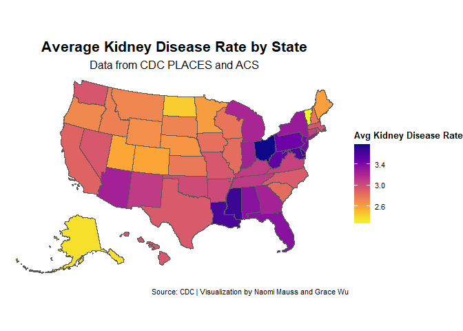
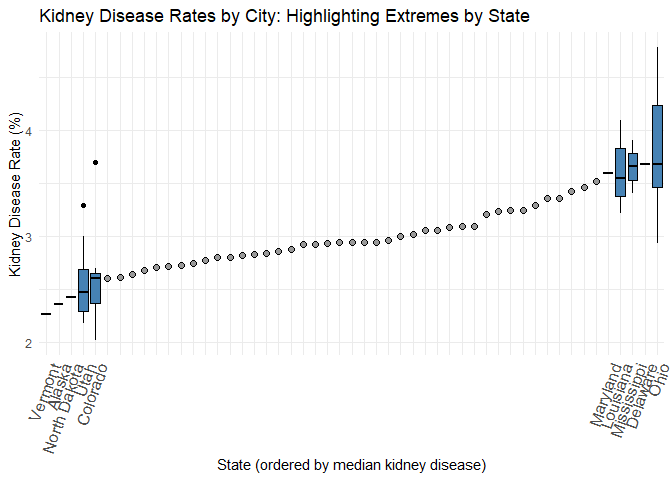

README
================
Naomi
2025-04-16

This imports the cleaned dataset from the initial data creation step in
Data Creation.Rmd

``` r
health <- read.csv("https://docs.google.com/spreadsheets/d/e/2PACX-1vQeaKrReyifqjPVoWB2pYHAo54wLlybjEnMZiPP0i6tdpWb-RLqmwrCvhz8HVOBLCjEo_0qYmrnOkEo/pub?output=csv")


healthwfips <-read.csv("https://docs.google.com/spreadsheets/d/e/2PACX-1vTZ4PRD5X0Zcr1rEWwCTusXmef1IkAFgnpPXeJ1dZ3lVpp7iX-ZsbMFCOpkzS-zSA/pub?output=csv")
```

``` r
library(readr)
library(dplyr)
```

    ## Warning: package 'dplyr' was built under R version 4.4.3

    ## 
    ## Attaching package: 'dplyr'

    ## The following objects are masked from 'package:stats':
    ## 
    ##     filter, lag

    ## The following objects are masked from 'package:base':
    ## 
    ##     intersect, setdiff, setequal, union

``` r
library(tidycensus)
library(tidyverse)
```

    ## Warning: package 'tidyverse' was built under R version 4.4.2

    ## Warning: package 'ggplot2' was built under R version 4.4.3

    ## Warning: package 'stringr' was built under R version 4.4.1

    ## ── Attaching core tidyverse packages ──────────────────────── tidyverse 2.0.0 ──
    ## ✔ forcats   1.0.0     ✔ stringr   1.5.1
    ## ✔ ggplot2   3.5.2     ✔ tibble    3.2.1
    ## ✔ lubridate 1.9.3     ✔ tidyr     1.3.1
    ## ✔ purrr     1.0.2

    ## ── Conflicts ────────────────────────────────────────── tidyverse_conflicts() ──
    ## ✖ dplyr::filter() masks stats::filter()
    ## ✖ dplyr::lag()    masks stats::lag()
    ## ℹ Use the conflicted package (<http://conflicted.r-lib.org/>) to force all conflicts to become errors

``` r
library(data.table)
```

    ## 
    ## Attaching package: 'data.table'
    ## 
    ## The following objects are masked from 'package:lubridate':
    ## 
    ##     hour, isoweek, mday, minute, month, quarter, second, wday, week,
    ##     yday, year
    ## 
    ## The following object is masked from 'package:purrr':
    ## 
    ##     transpose
    ## 
    ## The following objects are masked from 'package:dplyr':
    ## 
    ##     between, first, last

``` r
library(gt)
```

    ## Warning: package 'gt' was built under R version 4.4.1

``` r
library(xgboost)
```

    ## Warning: package 'xgboost' was built under R version 4.4.3

    ## 
    ## Attaching package: 'xgboost'
    ## 
    ## The following object is masked from 'package:dplyr':
    ## 
    ##     slice

``` r
library(tigris)
```

    ## Warning: package 'tigris' was built under R version 4.4.3

    ## To enable caching of data, set `options(tigris_use_cache = TRUE)`
    ## in your R script or .Rprofile.

``` r
library(ggplot2)
library(sf)
```

    ## Warning: package 'sf' was built under R version 4.4.3

    ## Linking to GEOS 3.13.0, GDAL 3.10.1, PROJ 9.5.1; sf_use_s2() is TRUE

``` r
library(stringr)
library(rmapshaper)
```

    ## Warning: package 'rmapshaper' was built under R version 4.4.3

``` r
state_means <- healthwfips %>%
  group_by(StateDesc) %>%
  summarise(
    avgMentalIllness = mean(MHLTH, na.rm = TRUE),
    avgBingeDrinking = mean(BINGE, na.rm = TRUE),
    avgChildhoodAsthma = mean(CASTHMA, na.rm = TRUE),
    avgArthritis = mean(ARTHRITIS, na.rm = TRUE),
    avgCancer = mean(CANCER, na.rm = TRUE),
    avgKidneyDisease = mean(KIDNEY, na.rm = TRUE),
    avgHighBP = mean(BPHIGH, na.rm = TRUE),
    avgDiabetes = mean(DIABETES, na.rm = TRUE),
    avgCOPD = mean(COPD, na.rm = TRUE),
    .groups = "drop"
  )

state_means <- state_means %>%
  mutate(StateDesc = tolower(StateDesc))

state_means <- healthwfips %>% group_by(StateDesc) %>%
  summarise(avgMentalIllness = mean(MHLTH), avgBingeDrinking = mean(BINGE), avgChildhoodAsthma = mean(CASTHMA), avgArthritis = mean(ARTHRITIS), avgCancer = mean(CANCER), avgKidneyDisease = mean(KIDNEY), avgHighBP = mean(BPHIGH), avgDiabetes = mean(DIABETES), avgCOPD = mean(COPD))


state_means$StateDesc[state_means$StateDesc == "South Carolin"] <- "South Carolina"
state_means$StateDesc[state_means$StateDesc == "North Carolin"] <- "North Carolina"
```

Prepare the data to map by state

``` r
#install.packages("viridis")
#library(ggplot2)
#library(dplyr)
#library(maps)      # for map_data
#library(viridis)   # optional: better color scale

# state_means <- read.csv("https://docs.google.com/spreadsheets/d/e/2PACX-1vRPtd9hIIamvljlqlmKcpm8xzcoSxkiNT4bLA78cgczFQqrSjI1DRrKnNiKR5Ger9CZHL8AEd0bx7OW/pub?output=csv")

state_means$StateDesc <- str_to_title(state_means$StateDesc)
```

``` r
# Download the shapefile for all states, including Alaska and Hawaii
us_states_sf <- states(cb = TRUE)
```

    ## Retrieving data for the year 2024

    ##   |                                                                              |                                                                      |   0%  |                                                                              |=                                                                     |   1%  |                                                                              |=                                                                     |   2%  |                                                                              |==                                                                    |   2%  |                                                                              |===                                                                   |   4%  |                                                                              |===                                                                   |   5%  |                                                                              |====                                                                  |   5%  |                                                                              |=====                                                                 |   7%  |                                                                              |=====                                                                 |   8%  |                                                                              |======                                                                |   8%  |                                                                              |======                                                                |   9%  |                                                                              |=======                                                               |  11%  |                                                                              |=========                                                             |  13%  |                                                                              |==========                                                            |  14%  |                                                                              |============                                                          |  17%  |                                                                              |=============                                                         |  18%  |                                                                              |==============                                                        |  20%  |                                                                              |==============                                                        |  21%  |                                                                              |===============                                                       |  21%  |                                                                              |================                                                      |  22%  |                                                                              |=================                                                     |  25%  |                                                                              |==================                                                    |  25%  |                                                                              |==================                                                    |  26%  |                                                                              |===================                                                   |  28%  |                                                                              |=====================                                                 |  30%  |                                                                              |======================                                                |  31%  |                                                                              |======================                                                |  32%  |                                                                              |=======================                                               |  33%  |                                                                              |========================                                              |  34%  |                                                                              |========================                                              |  35%  |                                                                              |=========================                                             |  35%  |                                                                              |=========================                                             |  36%  |                                                                              |==========================                                            |  37%  |                                                                              |===========================                                           |  39%  |                                                                              |============================                                          |  40%  |                                                                              |=============================                                         |  42%  |                                                                              |==============================                                        |  43%  |                                                                              |===============================                                       |  45%  |                                                                              |================================                                      |  46%  |                                                                              |=================================                                     |  47%  |                                                                              |==================================                                    |  48%  |                                                                              |==================================                                    |  49%  |                                                                              |===================================                                   |  49%  |                                                                              |===================================                                   |  50%  |                                                                              |====================================                                  |  51%  |                                                                              |======================================                                |  55%  |                                                                              |=======================================                               |  55%  |                                                                              |=======================================                               |  56%  |                                                                              |========================================                              |  57%  |                                                                              |=========================================                             |  58%  |                                                                              |=========================================                             |  59%  |                                                                              |==========================================                            |  60%  |                                                                              |===========================================                           |  61%  |                                                                              |=============================================                         |  64%  |                                                                              |==============================================                        |  66%  |                                                                              |===============================================                       |  67%  |                                                                              |===============================================                       |  68%  |                                                                              |================================================                      |  69%  |                                                                              |=================================================                     |  71%  |                                                                              |===================================================                   |  73%  |                                                                              |=====================================================                 |  76%  |                                                                              |======================================================                |  77%  |                                                                              |=======================================================               |  78%  |                                                                              |========================================================              |  80%  |                                                                              |=========================================================             |  82%  |                                                                              |===========================================================           |  84%  |                                                                              |============================================================          |  86%  |                                                                              |=============================================================         |  87%  |                                                                              |===============================================================       |  90%  |                                                                              |=================================================================     |  93%  |                                                                              |==================================================================    |  95%  |                                                                              |===================================================================   |  95%  |                                                                              |===================================================================== |  98%  |                                                                              |======================================================================|  99%  |                                                                              |======================================================================| 100%

``` r
# View the structure of the data (optional)
head(us_states_sf)
```

    ## Simple feature collection with 6 features and 9 fields
    ## Geometry type: MULTIPOLYGON
    ## Dimension:     XY
    ## Bounding box:  xmin: -124.4096 ymin: 30.22333 xmax: -80.84038 ymax: 45.94545
    ## Geodetic CRS:  NAD83
    ##   STATEFP  STATENS     GEOIDFQ GEOID STUSPS         NAME LSAD        ALAND
    ## 1      35 00897535 0400000US35    35     NM   New Mexico   00 314198519809
    ## 2      46 01785534 0400000US46    46     SD South Dakota   00 196341670967
    ## 3      06 01779778 0400000US06    06     CA   California   00 403673433805
    ## 4      21 01779786 0400000US21    21     KY     Kentucky   00 102266755818
    ## 5      01 01779775 0400000US01    01     AL      Alabama   00 131185561946
    ## 6      13 01705317 0400000US13    13     GA      Georgia   00 149485762701
    ##        AWATER                       geometry
    ## 1   726531289 MULTIPOLYGON (((-109.0502 3...
    ## 2  3387563375 MULTIPOLYGON (((-104.0579 4...
    ## 3 20291632828 MULTIPOLYGON (((-118.6044 3...
    ## 4  2384136185 MULTIPOLYGON (((-89.40565 3...
    ## 5  4581813708 MULTIPOLYGON (((-88.05338 3...
    ## 6  4419221858 MULTIPOLYGON (((-81.27939 3...

``` r
# Map state names in your data to their respective state abbreviations
state_abbreviations <- c(
  "Alaska" = "AK", "Hawaii" = "HI", "Alabama" = "AL", "Arizona" = "AZ", 
  "Arkansas" = "AR", "California" = "CA", "Colorado" = "CO", "Connecticut" = "CT",
  "Delaware" = "DE", "Florida" = "FL", "Georgia" = "GA", "Hawaii" = "HI", 
  "Idaho" = "ID", "Illinois" = "IL", "Indiana" = "IN", "Iowa" = "IA", 
  "Kansas" = "KS", "Kentucky" = "KY", "Louisiana" = "LA", "Maine" = "ME", 
  "Maryland" = "MD", "Massachusetts" = "MA", "Michigan" = "MI", "Minnesota" = "MN", 
  "Mississippi" = "MS", "Missouri" = "MO", "Montana" = "MT", "Nebraska" = "NE", 
  "Nevada" = "NV", "New Hampshire" = "NH", "New Jersey" = "NJ", "New Mexico" = "NM", 
  "New York" = "NY", "North Carolina" = "NC", "North Dakota" = "ND", "Ohio" = "OH", 
  "Oklahoma" = "OK", "Oregon" = "OR", "Pennsylvania" = "PA", "Rhode Island" = "RI", 
  "South Carolina" = "SC", "South Dakota" = "SD", "Tennessee" = "TN", "Texas" = "TX", 
  "Utah" = "UT", "Vermont" = "VT", "Virginia" = "VA", "Washington" = "WA", 
  "West Virginia" = "WV", "Wisconsin" = "WI", "Wyoming" = "WY"
)

# my_data <- state_means %>%
#   mutate(state = tolower(StateDesc)) %>%
#   mutate(state_abbr = recode(state, !!!state_abbreviations))

# Merge map data with your data
map_data_combined <- left_join(us_states_sf, state_means, by = c("NAME" = "StateDesc"))
```

``` r
# install.packages("writexl")
 
# library(writexl)
 
# write_xlsx(map_data_combined, 'C:\\Users\\songb\\Desktop\\ndata.xlsx')
 
 
# write_xlsx(state_means, 'C:\\Users\\songb\\Desktop\\state_means.xlsx')


# state_means[state_means == 'district of c'] <- 'DC'
```

Now we make the maps and box plots

Mental Illness Map

``` r
# Plot full map with AK/HI shifted
formatting <- tigris::states() %>%
  dplyr::filter(GEOID < "60") %>%
  tigris::shift_geometry()
```

    ## Retrieving data for the year 2024

    ##   |                                                                              |                                                                      |   0%  |                                                                              |                                                                      |   1%  |                                                                              |=                                                                     |   1%  |                                                                              |=                                                                     |   2%  |                                                                              |==                                                                    |   2%  |                                                                              |==                                                                    |   3%  |                                                                              |===                                                                   |   4%  |                                                                              |====                                                                  |   5%  |                                                                              |====                                                                  |   6%  |                                                                              |=====                                                                 |   7%  |                                                                              |=====                                                                 |   8%  |                                                                              |======                                                                |   8%  |                                                                              |======                                                                |   9%  |                                                                              |=======                                                               |  10%  |                                                                              |=======                                                               |  11%  |                                                                              |========                                                              |  11%  |                                                                              |========                                                              |  12%  |                                                                              |=========                                                             |  12%  |                                                                              |=========                                                             |  13%  |                                                                              |==========                                                            |  14%  |                                                                              |==========                                                            |  15%  |                                                                              |===========                                                           |  15%  |                                                                              |===========                                                           |  16%  |                                                                              |============                                                          |  17%  |                                                                              |============                                                          |  18%  |                                                                              |=============                                                         |  18%  |                                                                              |=============                                                         |  19%  |                                                                              |==============                                                        |  20%  |                                                                              |==============                                                        |  21%  |                                                                              |===============                                                       |  21%  |                                                                              |===============                                                       |  22%  |                                                                              |================                                                      |  22%  |                                                                              |================                                                      |  23%  |                                                                              |=================                                                     |  24%  |                                                                              |=================                                                     |  25%  |                                                                              |==================                                                    |  25%  |                                                                              |==================                                                    |  26%  |                                                                              |===================                                                   |  26%  |                                                                              |===================                                                   |  27%  |                                                                              |===================                                                   |  28%  |                                                                              |====================                                                  |  28%  |                                                                              |====================                                                  |  29%  |                                                                              |=====================                                                 |  29%  |                                                                              |=====================                                                 |  30%  |                                                                              |======================                                                |  31%  |                                                                              |======================                                                |  32%  |                                                                              |=======================                                               |  32%  |                                                                              |=======================                                               |  33%  |                                                                              |=======================                                               |  34%  |                                                                              |========================                                              |  34%  |                                                                              |=========================                                             |  35%  |                                                                              |=========================                                             |  36%  |                                                                              |==========================                                            |  37%  |                                                                              |==========================                                            |  38%  |                                                                              |===========================                                           |  38%  |                                                                              |===========================                                           |  39%  |                                                                              |============================                                          |  39%  |                                                                              |============================                                          |  40%  |                                                                              |=============================                                         |  41%  |                                                                              |=============================                                         |  42%  |                                                                              |==============================                                        |  42%  |                                                                              |==============================                                        |  43%  |                                                                              |===============================                                       |  44%  |                                                                              |===============================                                       |  45%  |                                                                              |================================                                      |  46%  |                                                                              |=================================                                     |  47%  |                                                                              |=================================                                     |  48%  |                                                                              |==================================                                    |  48%  |                                                                              |==================================                                    |  49%  |                                                                              |===================================                                   |  50%  |                                                                              |===================================                                   |  51%  |                                                                              |====================================                                  |  51%  |                                                                              |====================================                                  |  52%  |                                                                              |=====================================                                 |  52%  |                                                                              |=====================================                                 |  53%  |                                                                              |=====================================                                 |  54%  |                                                                              |======================================                                |  54%  |                                                                              |======================================                                |  55%  |                                                                              |=======================================                               |  56%  |                                                                              |========================================                              |  57%  |                                                                              |========================================                              |  58%  |                                                                              |=========================================                             |  58%  |                                                                              |=========================================                             |  59%  |                                                                              |==========================================                            |  59%  |                                                                              |==========================================                            |  60%  |                                                                              |===========================================                           |  61%  |                                                                              |===========================================                           |  62%  |                                                                              |============================================                          |  62%  |                                                                              |============================================                          |  63%  |                                                                              |============================================                          |  64%  |                                                                              |=============================================                         |  64%  |                                                                              |=============================================                         |  65%  |                                                                              |==============================================                        |  65%  |                                                                              |==============================================                        |  66%  |                                                                              |===============================================                       |  66%  |                                                                              |===============================================                       |  67%  |                                                                              |===============================================                       |  68%  |                                                                              |================================================                      |  68%  |                                                                              |================================================                      |  69%  |                                                                              |=================================================                     |  69%  |                                                                              |=================================================                     |  70%  |                                                                              |==================================================                    |  71%  |                                                                              |==================================================                    |  72%  |                                                                              |===================================================                   |  72%  |                                                                              |===================================================                   |  73%  |                                                                              |====================================================                  |  74%  |                                                                              |====================================================                  |  75%  |                                                                              |=====================================================                 |  76%  |                                                                              |======================================================                |  77%  |                                                                              |======================================================                |  78%  |                                                                              |=======================================================               |  78%  |                                                                              |=======================================================               |  79%  |                                                                              |========================================================              |  79%  |                                                                              |========================================================              |  80%  |                                                                              |=========================================================             |  81%  |                                                                              |=========================================================             |  82%  |                                                                              |==========================================================            |  82%  |                                                                              |==========================================================            |  83%  |                                                                              |==========================================================            |  84%  |                                                                              |===========================================================           |  84%  |                                                                              |===========================================================           |  85%  |                                                                              |============================================================          |  85%  |                                                                              |============================================================          |  86%  |                                                                              |=============================================================         |  87%  |                                                                              |==============================================================        |  88%  |                                                                              |==============================================================        |  89%  |                                                                              |===============================================================       |  90%  |                                                                              |================================================================      |  91%  |                                                                              |================================================================      |  92%  |                                                                              |=================================================================     |  92%  |                                                                              |=================================================================     |  93%  |                                                                              |==================================================================    |  94%  |                                                                              |==================================================================    |  95%  |                                                                              |===================================================================   |  96%  |                                                                              |====================================================================  |  97%  |                                                                              |====================================================================  |  98%  |                                                                              |===================================================================== |  98%  |                                                                              |===================================================================== |  99%  |                                                                              |======================================================================| 100%

``` r
formatting <- formatting %>%
  left_join(state_means, by = c("NAME" = "StateDesc"))

# plot(formatting$geometry, formatting$avgArthritis)


ggplot(formatting) +
  geom_sf(aes(fill = avgMentalIllness)) +
  scale_fill_viridis_c(
      option = "plasma",
      direction = -1,
      name = "Avg Mental Illness Rate"
    ) +
    labs(
      title = "Average Mental Illness Rate by State",
      subtitle = "Data from CDC PLACES and ACS",
      caption = "Source: CDC | Visualization by Naomi Mauss and Grace Wu"
    ) +
    theme_void() +
    theme(
      plot.title = element_text(hjust = 0.5, size = 16, face = "bold"),
      plot.subtitle = element_text(hjust = 0.5, size = 12),
      plot.caption = element_text(hjust = 1, size = 8),
      legend.position = "right",
      legend.title = element_text(size = 10, face = "bold"),
      legend.text = element_text(size = 8)
   )
```

<!-- -->

``` html
# # Download the shapefile for all states, including Alaska and Hawaii
# us_states <- states(cb = TRUE)
# 
# # Convert to sf object
# us_states_sf <- st_as_sf(us_states)
# 
# # Map state names in your data to their respective state abbreviations
# state_abbreviations <- c(
#   "alaska" = "AK", "hawaii" = "HI", "alabama" = "AL", "arizona" = "AZ", 
#   "arkansas" = "AR", "california" = "CA", "colorado" = "CO", "connecticut" = "CT",
#   "delaware" = "DE", "florida" = "FL", "georgia" = "GA", "idaho" = "ID", 
#   "illinois" = "IL", "indiana" = "IN", "iowa" = "IA", "kansas" = "KS", 
#   "kentucky" = "KY", "louisiana" = "LA", "maine" = "ME", "maryland" = "MD", 
#   "massachusetts" = "MA", "michigan" = "MI", "minnesota" = "MN", "mississippi" = "MS", 
#   "missouri" = "MO", "montana" = "MT", "nebraska" = "NE", "nevada" = "NV", 
#   "new hampshire" = "NH", "new jersey" = "NJ", "new mexico" = "NM", 
#   "new york" = "NY", "north carolina" = "NC", "north dakota" = "ND", "ohio" = "OH", 
#   "oklahoma" = "OK", "oregon" = "OR", "pennsylvania" = "PA", "rhode island" = "RI", 
#   "south carolina" = "SC", "south dakota" = "SD", "tennessee" = "TN", "texas" = "TX", 
#   "utah" = "UT", "vermont" = "VT", "virginia" = "VA", "washington" = "WA", 
#   "west virginia" = "WV", "wisconsin" = "WI", "wyoming" = "WY"
# )
# 
# # Merge the map data with your data for the mainland U.S.
# my_data <- state_means %>%
#   mutate(state = tolower(StateDesc)) %>%
#   mutate(state_abbr = recode(state, !!!state_abbreviations))
# 
# map_data_mainland <- us_states_sf %>%
#   filter(!STUSPS %in% c("AK", "HI")) %>%
#   left_join(my_data, by = c(StateDesc = "state_abbr"))
# 
# us_states_shifted <- shift_geometry(
#   us_states_sf,
#   geoid_column = NULL,
#   preserve_area = FALSE,
#   position = c("below", "outside")
# )
# 
# map_data_shifted <- us_states_shifted %>%
#   left_join(state_means, by = c("STUSPS" = "state_abbr"))
# 
# # Plot the map
# ggplot() + 
#   # Mainland U.S. plot
#   geom_sf(data = map_data_mainland, aes(fill = avgMentalIllness)) + 
#   coord_sf(
#     xlim = c(-125, -66),  # Longitude range for mainland U.S.
#     ylim = c(24, 50),      # Latitude range for mainland U.S.
#     expand = FALSE
#   ) + 
#   scale_fill_viridis_c(
#     option = "plasma",
#     direction = -1,
#     name = "Avg Mental Illness Rate"
#   ) +
#   labs(
#     title = "Average Mental Illness Rate by State",
#     subtitle = "Data from CDC PLACES and ACS",
#     caption = "Source: CDC | Visualization by Naomi Mauss and Grace Wu"
#   ) +
#   theme_void() +
#   theme(
#     plot.title = element_text(hjust = 0.5, size = 16, face = "bold"),
#     plot.subtitle = element_text(hjust = 0.5, size = 12),
#     plot.caption = element_text(hjust = 1, size = 8),
#     legend.position = "right",
#     legend.title = element_text(size = 10, face = "bold"),
#     legend.text = element_text(size = 8)
#   )


# ggplot(map_data_combined, aes(x = long, y = lat, group = group, fill = avgMentalIllness)) +
#   geom_polygon(color = "white", size = 0.3) +
#   coord_fixed(1.3) +
#   scale_fill_viridis_c(
#     option = "plasma",
#     direction = -1,
#     name = "Avg Mental Illness Rate"
#   ) +
#   labs(
#     title = "Average Mental Illness Rate by State",
#     subtitle = "Data from CDC PLACES and ACS",
#     caption = "Source: CDC | Visualization by Naomi Mauss and Grace Wu"
#   ) +
#   theme_void() +
#   theme(
#     plot.title = element_text(hjust = 0.5, size = 16, face = "bold"),
#     plot.subtitle = element_text(hjust = 0.5, size = 12),
#     plot.caption = element_text(hjust = 1, size = 8),
#     legend.position = "right",
#     legend.title = element_text(size = 10, face = "bold"),
#     legend.text = element_text(size = 8))
#     
# ggplot(map_data_combined) + 
#   geom_sf(aes(fill = avgMentalIllness)) +  # Fill by 'value' column from your data
#   coord_sf(
#     xlim = c(-125, -66),  # Longitude range to zoom in on the mainland US
#     ylim = c(24, 50),      # Latitude range for mainland U.S.
#     expand = FALSE
#   ) + 
#   scale_fill_viridis_c(
#     option = "plasma",
#     direction = -1,
#     name = "Avg Mental Illness Rate"
#   ) +
#   labs(
#     title = "Average Mental Illness Rate by State",
#     subtitle = "Data from CDC PLACES and ACS",
#     caption = "Source: CDC | Visualization by Naomi Mauss and Grace Wu"
#   ) +
#   theme_void() +
#   theme(
#     plot.title = element_text(hjust = 0.5, size = 16, face = "bold"),
#     plot.subtitle = element_text(hjust = 0.5, size = 12),
#     plot.caption = element_text(hjust = 1, size = 8),
#     legend.position = "right",
#     legend.title = element_text(size = 10, face = "bold"),
#     legend.text = element_text(size = 8)
#   )
    
```

Mental Illness Box Plot Desc

``` r
stored_means <- data.frame(health %>%
  group_by(StateDesc) %>%
  summarise(mean_COPD = mean(MHLTH, na.rm = TRUE)) %>%
  arrange(mean_COPD))

highlight_states <- c(
  head(stored_means$StateDesc, 5),
  tail(stored_means$StateDesc, 5)
)

health <- health %>%
  mutate(Highlight = ifelse(StateDesc %in% highlight_states, "Highlight", "Other"))

health$StateDesc <- reorder(health$StateDesc, health$MHLTH, FUN = median)


health <- health %>%
  mutate(Highlight = ifelse(StateDesc %in% highlight_states, "Highlight", "Other"),
         StateDesc = factor(StateDesc, levels = stored_means$StateDesc))  # Ensure the correct order

x_mapping <- health %>%
  filter(Highlight == "Highlight") %>%
  arrange(COPD) %>%
  mutate(x_pos = as.numeric(factor(StateDesc)))

# Plot
ggplot() +
  # Plot all "Other" states as points (mean) in the middle
  stat_summary(data = filter(health, Highlight == "Other"),
               aes(x = StateDesc, y = MHLTH),
               fun = mean, geom = "point", shape = 21, fill = "gray60", size = 2) +

  # Plot boxplots for highlighted states (top and bottom 5)
  geom_boxplot(data = filter(health, Highlight == "Highlight"),
               aes(x = StateDesc, y = MHLTH),
               width = 0.8, fill = "steelblue", color = "black") +

  scale_x_continuous(
    breaks = x_mapping$x_pos[x_mapping$StateDesc %in% highlight_states],
    labels = x_mapping$StateDesc[x_mapping$StateDesc %in% highlight_states]) +
  
  labs(title = "Mental Illness Rates by City: Highlighting Extremes by State",
       x = "State (ordered by median mental illness)",
       y = "Mental Illness Rate (%)") +
  theme_minimal() +
  theme(axis.text.x = element_text(angle = 55, hjust = 1)) +
  scale_x_discrete(limits = levels(health$StateDesc), labels = function(x) ifelse(x %in% highlight_states, x, ""))
```

    ## Scale for x is already present.
    ## Adding another scale for x, which will replace the existing scale.

<!-- -->

Binge Drinking Map

``` r
ggplot(formatting) +
  geom_sf(aes(fill = avgBingeDrinking))+
  scale_fill_viridis_c(
    option = "plasma",
    direction = -1,
    name = "Avg Binge Drinking Rate"
  ) +
  labs(
    title = "Average Binge Drinking Rate by State",
    subtitle = "Data from CDC PLACES and ACS",
    caption = "Source: CDC | Visualization by Naomi Mauss and Grace Wu"
  ) +
  theme_void() +
  theme(
    plot.title = element_text(hjust = 0.5, size = 16, face = "bold"),
    plot.subtitle = element_text(hjust = 0.5, size = 12),
    plot.caption = element_text(hjust = 1, size = 8),
    legend.position = "right",
    legend.title = element_text(size = 10, face = "bold"),
    legend.text = element_text(size = 8)
  )
```

<!-- -->

Binge Drinking Box Plot Desc

``` r
stored_means <- health %>%
  group_by(StateDesc) %>%
  summarise(mean_COPD = mean(BINGE, na.rm = TRUE)) %>%
  arrange(mean_COPD)

highlight_states <- c(
  head(stored_means$StateDesc, 5),
  tail(stored_means$StateDesc, 5)
)

health <- health %>%
  mutate(Highlight = ifelse(StateDesc %in% highlight_states, "Highlight", "Other"))

health$StateDesc <- reorder(health$StateDesc, health$BINGE, FUN = median)


health <- health %>%
  mutate(Highlight = ifelse(StateDesc %in% highlight_states, "Highlight", "Other"),
         StateDesc = factor(StateDesc, levels = stored_means$StateDesc))  # Ensure the correct order

x_mapping <- health %>%
  filter(Highlight == "Highlight") %>%
  arrange(COPD) %>%
  mutate(x_pos = as.numeric(factor(StateDesc)))

# Plot
ggplot() +
  # Plot all "Other" states as points (mean) in the middle
  stat_summary(data = filter(health, Highlight == "Other"),
               aes(x = StateDesc, y = BINGE),
               fun = mean, geom = "point", shape = 21, fill = "gray60", size = 2) +

  # Plot boxplots for highlighted states (top and bottom 5)
  geom_boxplot(data = filter(health, Highlight == "Highlight"),
               aes(x = StateDesc, y = BINGE),
               width = 0.8, fill = "steelblue", color = "black") +

  scale_x_continuous(
    breaks = x_mapping$x_pos[x_mapping$StateDesc %in% highlight_states],
    labels = x_mapping$StateDesc[x_mapping$StateDesc %in% highlight_states]) +
  
  labs(title = "Binge Drinking Rates by City: Highlighting Extremes by State",
       x = "State (ordered by median binge drinking)",
       y = "Binge Drinking Rate (%)") +
  theme_minimal() +
  theme(axis.text.x = element_text(angle = 55, hjust = 1)) +
  scale_x_discrete(limits = levels(health$StateDesc), labels = function(x) ifelse(x %in% highlight_states, x, ""))
```

    ## Scale for x is already present.
    ## Adding another scale for x, which will replace the existing scale.

<!-- -->

Asthma Map

``` r
ggplot(formatting) +
  geom_sf(aes(fill = avgChildhoodAsthma)) +
  scale_fill_viridis_c(
    option = "plasma",
    direction = -1,
    name = "Avg Childhood Asthma Rate"
  ) +
  labs(
    title = "Average Childhood Asthma Rate by State",
    subtitle = "Data from CDC PLACES and ACS",
    caption = "Source: CDC | Visualization by Naomi Mauss and Grace Wu"
  ) +
  theme_void() +
  theme(
    plot.title = element_text(hjust = 0.5, size = 16, face = "bold"),
    plot.subtitle = element_text(hjust = 0.5, size = 12),
    plot.caption = element_text(hjust = 1, size = 8),
    legend.position = "right",
    legend.title = element_text(size = 10, face = "bold"),
    legend.text = element_text(size = 8)
  )
```

<!-- -->

Childhood Asthma Box Plot Desc

``` r
stored_means <- health %>%
  group_by(StateDesc) %>%
  summarise(mean_COPD = mean(CASTHMA, na.rm = TRUE)) %>%
  arrange(mean_COPD)

highlight_states <- c(
  head(stored_means$StateDesc, 5),
  tail(stored_means$StateDesc, 5)
)

health <- health %>%
  mutate(Highlight = ifelse(StateDesc %in% highlight_states, "Highlight", "Other"))

health$StateDesc <- reorder(health$StateDesc, health$CASTHMA, FUN = median)


health <- health %>%
  mutate(Highlight = ifelse(StateDesc %in% highlight_states, "Highlight", "Other"),
         StateDesc = factor(StateDesc, levels = stored_means$StateDesc))  # Ensure the correct order

x_mapping <- health %>%
  filter(Highlight == "Highlight") %>%
  arrange(COPD) %>%
  mutate(x_pos = as.numeric(factor(StateDesc)))

# Plot
ggplot() +
  # Plot all "Other" states as points (mean) in the middle
  stat_summary(data = filter(health, Highlight == "Other"),
               aes(x = StateDesc, y = CASTHMA),
               fun = mean, geom = "point", shape = 21, fill = "gray60", size = 2) +

  # Plot boxplots for highlighted states (top and bottom 5)
  geom_boxplot(data = filter(health, Highlight == "Highlight"),
               aes(x = StateDesc, y = CASTHMA),
               width = 0.8, fill = "steelblue", color = "black") +

  scale_x_continuous(
    breaks = x_mapping$x_pos[x_mapping$StateDesc %in% highlight_states],
    labels = x_mapping$StateDesc[x_mapping$StateDesc %in% highlight_states]) +
  
  labs(title = "Childhood Asthma Rates by City: Highlighting Extremes by State",
       x = "State (ordered by median childhood asthma)",
       y = "Childhood Asthma Rate (%)") +
  theme_minimal() +
  theme(axis.text.x = element_text(angle = 55, hjust = 1)) +
  scale_x_discrete(limits = levels(health$StateDesc), labels = function(x) ifelse(x %in% highlight_states, x, ""))
```

    ## Scale for x is already present.
    ## Adding another scale for x, which will replace the existing scale.

<!-- -->

Arthritis Map

``` r
ggplot(formatting) +
  geom_sf(aes(fill = avgArthritis)) +
  scale_fill_viridis_c(
    option = "plasma",
    direction = -1,
    name = "Avg Arthritis Rate"
  ) +
  labs(
    title = "Average Arthritis Rate by State",
    subtitle = "Data from CDC PLACES and ACS",
    caption = "Source: CDC | Visualization by Naomi Mauss and Grace Wu"
  ) +
  theme_void() +
  theme(
    plot.title = element_text(hjust = 0.5, size = 16, face = "bold"),
    plot.subtitle = element_text(hjust = 0.5, size = 12),
    plot.caption = element_text(hjust = 1, size = 8),
    legend.position = "right",
    legend.title = element_text(size = 10, face = "bold"),
    legend.text = element_text(size = 8)
  )
```

<!-- -->

Arthritis Box Plot Desc

``` r
stored_means <- health %>%
  group_by(StateDesc) %>%
  summarise(mean_COPD = mean(ARTHRITIS, na.rm = TRUE)) %>%
  arrange(mean_COPD)

highlight_states <- c(
  head(stored_means$StateDesc, 5),
  tail(stored_means$StateDesc, 5)
)

health <- health %>%
  mutate(Highlight = ifelse(StateDesc %in% highlight_states, "Highlight", "Other"))

health$StateDesc <- reorder(health$StateDesc, health$ARTHRITIS, FUN = median)


health <- health %>%
  mutate(Highlight = ifelse(StateDesc %in% highlight_states, "Highlight", "Other"),
         StateDesc = factor(StateDesc, levels = stored_means$StateDesc))  # Ensure the correct order

x_mapping <- health %>%
  filter(Highlight == "Highlight") %>%
  arrange(COPD) %>%
  mutate(x_pos = as.numeric(factor(StateDesc)))

# Plot
ggplot() +
  # Plot all "Other" states as points (mean) in the middle
  stat_summary(data = filter(health, Highlight == "Other"),
               aes(x = StateDesc, y = ARTHRITIS),
               fun = mean, geom = "point", shape = 21, fill = "gray60", size = 2) +

  # Plot boxplots for highlighted states (top and bottom 5)
  geom_boxplot(data = filter(health, Highlight == "Highlight"),
               aes(x = StateDesc, y = ARTHRITIS),
               width = 0.8, fill = "steelblue", color = "black") +

  scale_x_continuous(
    breaks = x_mapping$x_pos[x_mapping$StateDesc %in% highlight_states],
    labels = x_mapping$StateDesc[x_mapping$StateDesc %in% highlight_states]) +
  
  labs(title = "Arthritis Rates by City: Highlighting Extremes by State",
       x = "State (ordered by median arthritis)",
       y = "Childhood Arthritis Rate (%)") +
  theme_minimal() +
  theme(axis.text.x = element_text(angle = 55, hjust = 1)) +
  scale_x_discrete(limits = levels(health$StateDesc), labels = function(x) ifelse(x %in% highlight_states, x, ""))
```

    ## Scale for x is already present.
    ## Adding another scale for x, which will replace the existing scale.

<!-- -->

Kidney Disease Map

``` r
ggplot(formatting) +
  geom_sf(aes(fill = avgKidneyDisease)) +
  scale_fill_viridis_c(
    option = "plasma",
    direction = -1,
    name = "Avg Kidney Disease Rate"
  ) +
  labs(
    title = "Average Kidney Disease Rate by State",
    subtitle = "Data from CDC PLACES and ACS",
    caption = "Source: CDC | Visualization by Naomi Mauss and Grace Wu"
  ) +
  theme_void() +
  theme(
    plot.title = element_text(hjust = 0.5, size = 16, face = "bold"),
    plot.subtitle = element_text(hjust = 0.5, size = 12),
    plot.caption = element_text(hjust = 1, size = 8),
    legend.position = "right",
    legend.title = element_text(size = 10, face = "bold"),
    legend.text = element_text(size = 8)
  )
```

<!-- -->

Kidney Disease Box Plot Desc

``` r
stored_means <- health %>%
  group_by(StateDesc) %>%
  summarise(mean_COPD = mean(KIDNEY, na.rm = TRUE)) %>%
  arrange(mean_COPD)

highlight_states <- c(
  head(stored_means$StateDesc, 5),
  tail(stored_means$StateDesc, 5)
)

health <- health %>%
  mutate(Highlight = ifelse(StateDesc %in% highlight_states, "Highlight", "Other"))

health$StateDesc <- reorder(health$StateDesc, health$KIDNEY, FUN = median)


health <- health %>%
  mutate(Highlight = ifelse(StateDesc %in% highlight_states, "Highlight", "Other"),
         StateDesc = factor(StateDesc, levels = stored_means$StateDesc))  # Ensure the correct order

x_mapping <- health %>%
  filter(Highlight == "Highlight") %>%
  arrange(COPD) %>%
  mutate(x_pos = as.numeric(factor(StateDesc)))

# Plot
ggplot() +
  # Plot all "Other" states as points (mean) in the middle
  stat_summary(data = filter(health, Highlight == "Other"),
               aes(x = StateDesc, y = KIDNEY),
               fun = mean, geom = "point", shape = 21, fill = "gray60", size = 2) +

  # Plot boxplots for highlighted states (top and bottom 5)
  geom_boxplot(data = filter(health, Highlight == "Highlight"),
               aes(x = StateDesc, y = KIDNEY),
               width = 0.8, fill = "steelblue", color = "black") +

  scale_x_continuous(
    breaks = x_mapping$x_pos[x_mapping$StateDesc %in% highlight_states],
    labels = x_mapping$StateDesc[x_mapping$StateDesc %in% highlight_states]) +
  
  labs(title = "Kidney Disease Rates by City: Highlighting Extremes by State",
       x = "State (ordered by median kidney disease)",
       y = "Kidney Disease Rate (%)") +
  theme_minimal() +
  theme(axis.text.x = element_text(angle = 55, hjust = 1)) +
  scale_x_discrete(limits = levels(health$StateDesc), labels = function(x) ifelse(x %in% highlight_states, x, ""))
```

    ## Scale for x is already present.
    ## Adding another scale for x, which will replace the existing scale.

<!-- -->

High Blood Pressure Map

``` r
ggplot(formatting) +
  geom_sf(aes(fill = avgHighBP)) +
  scale_fill_viridis_c(
    option = "plasma",
    direction = -1,
    name = "Avg High Blood Pressure Rate"
  ) +
  labs(
    title = "Average High Blood Pressure Rate by State",
    subtitle = "Data from CDC PLACES and ACS",
    caption = "Source: CDC | Visualization by Naomi Mauss and Grace Wu"
  ) +
  theme_void() +
  theme(
    plot.title = element_text(hjust = 0.5, size = 16, face = "bold"),
    plot.subtitle = element_text(hjust = 0.5, size = 12),
    plot.caption = element_text(hjust = 1, size = 8),
    legend.position = "right",
    legend.title = element_text(size = 10, face = "bold"),
    legend.text = element_text(size = 8)
  )
```

<!-- -->

High Blood Pressure Box Plot Desc

``` r
stored_means <- health %>%
  group_by(StateDesc) %>%
  summarise(mean_COPD = mean(BPHIGH, na.rm = TRUE)) %>%
  arrange(mean_COPD)

highlight_states <- c(
  head(stored_means$StateDesc, 5),
  tail(stored_means$StateDesc, 5)
)

health <- health %>%
  mutate(Highlight = ifelse(StateDesc %in% highlight_states, "Highlight", "Other"))

health$StateDesc <- reorder(health$StateDesc, health$BPHIGH, FUN = median)


health <- health %>%
  mutate(Highlight = ifelse(StateDesc %in% highlight_states, "Highlight", "Other"),
         StateDesc = factor(StateDesc, levels = stored_means$StateDesc))  # Ensure the correct order

x_mapping <- health %>%
  filter(Highlight == "Highlight") %>%
  arrange(COPD) %>%
  mutate(x_pos = as.numeric(factor(StateDesc)))

# Plot
ggplot() +
  # Plot all "Other" states as points (mean) in the middle
  stat_summary(data = filter(health, Highlight == "Other"),
               aes(x = StateDesc, y = BPHIGH),
               fun = mean, geom = "point", shape = 21, fill = "gray60", size = 2) +

  # Plot boxplots for highlighted states (top and bottom 5)
  geom_boxplot(data = filter(health, Highlight == "Highlight"),
               aes(x = StateDesc, y = BPHIGH),
               width = 0.8, fill = "steelblue", color = "black") +

  scale_x_continuous(
    breaks = x_mapping$x_pos[x_mapping$StateDesc %in% highlight_states],
    labels = x_mapping$StateDesc[x_mapping$StateDesc %in% highlight_states]) +
  
  labs(title = "High Blood Pressure Rates by City: Highlighting Extremes by State",
       x = "State (ordered by median high blood pressure)",
       y = "High Blood Pressure Rate (%)") +
  theme_minimal() +
  theme(axis.text.x = element_text(angle = 55, hjust = 1)) +
  scale_x_discrete(limits = levels(health$StateDesc), labels = function(x) ifelse(x %in% highlight_states, x, ""))
```

    ## Scale for x is already present.
    ## Adding another scale for x, which will replace the existing scale.

<!-- -->

Cancer Map

``` r
ggplot(formatting) +
  geom_sf(aes(fill = avgCancer)) +
  scale_fill_viridis_c(
    option = "plasma",
    direction = -1,
    name = "Avg Cancer Rate"
  ) +
  labs(
    title = "Average Cancer Rate by State",
    subtitle = "Data from CDC PLACES and ACS",
    caption = "Source: CDC | Visualization by Naomi Mauss and Grace Wu"
  ) +
  theme_void() +
  theme(
    plot.title = element_text(hjust = 0.5, size = 16, face = "bold"),
    plot.subtitle = element_text(hjust = 0.5, size = 12),
    plot.caption = element_text(hjust = 1, size = 8),
    legend.position = "right",
    legend.title = element_text(size = 10, face = "bold"),
    legend.text = element_text(size = 8))
```

<!-- -->

Childhood Box Plot Desc

``` r
stored_means <- health %>%
  group_by(StateDesc) %>%
  summarise(mean_COPD = mean(CANCER, na.rm = TRUE)) %>%
  arrange(mean_COPD)

highlight_states <- c(
  head(stored_means$StateDesc, 5),
  tail(stored_means$StateDesc, 5)
)

health <- health %>%
  mutate(Highlight = ifelse(StateDesc %in% highlight_states, "Highlight", "Other"))

health$StateDesc <- reorder(health$StateDesc, health$CANCER, FUN = median)


health <- health %>%
  mutate(Highlight = ifelse(StateDesc %in% highlight_states, "Highlight", "Other"),
         StateDesc = factor(StateDesc, levels = stored_means$StateDesc))  # Ensure the correct order

x_mapping <- health %>%
  filter(Highlight == "Highlight") %>%
  arrange(COPD) %>%
  mutate(x_pos = as.numeric(factor(StateDesc)))

# Plot
ggplot() +
  # Plot all "Other" states as points (mean) in the middle
  stat_summary(data = filter(health, Highlight == "Other"),
               aes(x = StateDesc, y = CANCER),
               fun = mean, geom = "point", shape = 21, fill = "gray60", size = 2) +

  # Plot boxplots for highlighted states (top and bottom 5)
  geom_boxplot(data = filter(health, Highlight == "Highlight"),
               aes(x = StateDesc, y = CANCER),
               width = 0.8, fill = "steelblue", color = "black") +

  scale_x_continuous(
    breaks = x_mapping$x_pos[x_mapping$StateDesc %in% highlight_states],
    labels = x_mapping$StateDesc[x_mapping$StateDesc %in% highlight_states]) +
  
  labs(title = "Cancer Rates by City: Highlighting Extremes by State",
       x = "State (ordered by median cancer)",
       y = "Cancer Rate (%)") +
  theme_minimal() +
  theme(axis.text.x = element_text(angle = 55, hjust = 1)) +
  scale_x_discrete(limits = levels(health$StateDesc), labels = function(x) ifelse(x %in% highlight_states, x, ""))
```

    ## Scale for x is already present.
    ## Adding another scale for x, which will replace the existing scale.

<!-- -->

Diabetes Map

``` r
ggplot(formatting) +
  geom_sf(aes(fill = avgDiabetes)) +
  scale_fill_viridis_c(
    option = "plasma",
    direction = -1,
    name = "Avg Diabetes Rate"
  ) +
  labs(
    title = "Average Diabetes Rate by State",
    subtitle = "Data from CDC PLACES and ACS",
    caption = "Source: CDC | Visualization by Naomi Mauss and Grace Wu"
  ) +
  theme_void() +
  theme(
    plot.title = element_text(hjust = 0.5, size = 16, face = "bold"),
    plot.subtitle = element_text(hjust = 0.5, size = 12),
    plot.caption = element_text(hjust = 1, size = 8),
    legend.position = "right",
    legend.title = element_text(size = 10, face = "bold"),
    legend.text = element_text(size = 8))
```

<!-- -->

Childhood Box Plot Desc

``` r
stored_means <- health %>%
  group_by(StateDesc) %>%
  summarise(mean_COPD = mean(DIABETES, na.rm = TRUE)) %>%
  arrange(mean_COPD)

highlight_states <- c(
  head(stored_means$StateDesc, 5),
  tail(stored_means$StateDesc, 5)
)

health <- health %>%
  mutate(Highlight = ifelse(StateDesc %in% highlight_states, "Highlight", "Other"))

health$StateDesc <- reorder(health$StateDesc, health$DIABETES, FUN = median)


health <- health %>%
  mutate(Highlight = ifelse(StateDesc %in% highlight_states, "Highlight", "Other"),
         StateDesc = factor(StateDesc, levels = stored_means$StateDesc))  # Ensure the correct order

x_mapping <- health %>%
  filter(Highlight == "Highlight") %>%
  arrange(COPD) %>%
  mutate(x_pos = as.numeric(factor(StateDesc)))

# Plot
ggplot() +
  # Plot all "Other" states as points (mean) in the middle
  stat_summary(data = filter(health, Highlight == "Other"),
               aes(x = StateDesc, y = DIABETES),
               fun = mean, geom = "point", shape = 21, fill = "gray60", size = 2) +

  # Plot boxplots for highlighted states (top and bottom 5)
  geom_boxplot(data = filter(health, Highlight == "Highlight"),
               aes(x = StateDesc, y = DIABETES),
               width = 0.8, fill = "steelblue", color = "black") +

  scale_x_continuous(
    breaks = x_mapping$x_pos[x_mapping$StateDesc %in% highlight_states],
    labels = x_mapping$StateDesc[x_mapping$StateDesc %in% highlight_states]) +
  
  labs(title = "Diabetes Rates by City: Highlighting Extremes by State",
       x = "State (ordered by median diabetes)",
       y = "Diabetes Rate (%)") +
  theme_minimal() +
  theme(axis.text.x = element_text(angle = 55, hjust = 1)) +
  scale_x_discrete(limits = levels(health$StateDesc), labels = function(x) ifelse(x %in% highlight_states, x, ""))
```

    ## Scale for x is already present.
    ## Adding another scale for x, which will replace the existing scale.

<!-- -->

COPD Map

``` r
ggplot(formatting) +
  geom_sf(aes(fill = avgCOPD)) +
  scale_fill_viridis_c(
    option = "plasma",
    direction = -1,
    name = "Avg COPD Rate"
  ) +
  labs(
    title = "Average COPD Rate by State",
    subtitle = "Data from CDC PLACES and ACS",
    caption = "Source: CDC | Visualization by Naomi Mauss and Grace Wu"
  ) +
  theme_void() +
  theme(
    plot.title = element_text(hjust = 0.5, size = 16, face = "bold"),
    plot.subtitle = element_text(hjust = 0.5, size = 12),
    plot.caption = element_text(hjust = 1, size = 8),
    legend.position = "right",
    legend.title = element_text(size = 10, face = "bold"),
    legend.text = element_text(size = 8)
  )
```

<!-- -->

COPD Box Plot Desc

``` r
stored_means <- health %>%
  group_by(StateDesc) %>%
  summarise(mean_COPD = mean(COPD, na.rm = TRUE)) %>%
  arrange(mean_COPD)

highlight_states <- c(
  head(stored_means$StateDesc, 5),
  tail(stored_means$StateDesc, 5)
)


health <- health %>%
  mutate(Highlight = ifelse(StateDesc %in% highlight_states, "Highlight", "Other"))

health$StateDesc <- reorder(health$StateDesc, health$COPD, FUN = median)


health <- health %>%
  mutate(Highlight = ifelse(StateDesc %in% highlight_states, "Highlight", "Other"),
         StateDesc = factor(StateDesc, levels = stored_means$StateDesc))  # Ensure the correct order

x_mapping <- health %>%
  filter(Highlight == "Highlight") %>%
  arrange(COPD) %>%
  mutate(x_pos = as.numeric(factor(StateDesc)))

# Plot
ggplot() +
  # Plot all "Other" states as points (mean) in the middle
  stat_summary(data = filter(health, Highlight == "Other"),
               aes(x = StateDesc, y = COPD),
               fun = mean, geom = "point", shape = 21, fill = "gray60", size = 2) +

  # Plot boxplots for highlighted states (top and bottom 5)
  geom_boxplot(data = filter(health, Highlight == "Highlight"),
               aes(x = StateDesc, y = COPD),
               width = 0.8, fill = "steelblue", color = "black") +

  scale_x_continuous(
    breaks = x_mapping$x_pos[x_mapping$StateDesc %in% highlight_states],
    labels = x_mapping$StateDesc[x_mapping$StateDesc %in% highlight_states]) +
  
  labs(title = "COPD Rates by City: Highlighting Extremes by State",
       x = "State (ordered by median COPD)",
       y = "COPD Rate (%)") +
  theme_minimal() +
  theme(axis.text.x = element_text(angle = 55, hjust = 1)) +
  scale_x_discrete(limits = levels(health$StateDesc), labels = function(x) ifelse(x %in% highlight_states, x, ""))  # Reverses the order on the x-axis
```

    ## Scale for x is already present.
    ## Adding another scale for x, which will replace the existing scale.

<!-- -->

Find Healthiest States

``` r
topTen <- state_means %>%
  arrange(avgMentalIllness) %>%
  head(5)

topTen_dt <- as.data.table(topTen)

healthiest <- data.table(StateDesc = topTen_dt$StateDesc)

names(healthiest)[1] <- "Mental Illness"

topTen <-  state_means %>%
  arrange(avgBingeDrinking) %>%
  head(5)

healthiest$BingeDrinking <- topTen$StateDesc


topTen <-  state_means %>%
  arrange(avgChildhoodAsthma) %>%
  head(5)

healthiest$ChildhoodAsthma <- topTen$StateDesc


topTen <-  state_means %>%
  arrange(avgArthritis) %>%
  head(5)

healthiest$Arthritis <- topTen$StateDesc


topTen <-  state_means %>%
  arrange(avgCancer) %>%
  head(5)

healthiest$Cancer <- topTen$StateDesc


topTen <-  state_means %>%
  arrange(avgKidneyDisease) %>%
  head(5)

healthiest$KidneyDisease <- topTen$StateDesc


topTen <-  state_means %>%
  arrange(avgHighBP) %>%
  head(5)

healthiest$HighBloodPressure <- topTen$StateDesc


topTen <-  state_means %>%
  arrange(avgDiabetes) %>%
  head(5)

healthiest$Diabetes <- topTen$StateDesc


topTen <-  state_means %>%
  arrange(avgCOPD) %>%
  head(5)

healthiest$COPD <- topTen$StateDesc


healthiest$Health <- rep("↓")
healthiest$Health[1] <- "Lowest Rate"
healthiest$Health[5] <- "Fifth Lowest Rate"

healthiest <- healthiest %>%
  select(Health, everything())
```

Make a table for the healthiest places

``` r
value_counts <- healthiest %>%
  pivot_longer(everything()) %>%
  count(value, name = "freq")

# Step 2: Create a lookup table for frequency
freq_lookup <- setNames(value_counts$freq, value_counts$value)

gt_table <- healthiest %>%
  gt() %>%
  tab_header(
    title = "Healthiest States",
    subtitle = "States with lowest health ascending by Category"
  ) %>%
  tab_style(
    style = cell_text(weight = "bold"),
    locations = cells_column_labels(columns = everything())
  ) %>%
  tab_options(table.width = pct(100),
  table.font.size = 11,) %>%
  opt_align_table_header(align = "center") %>%
  tab_source_note(
    source_note = md(
      "**Legend:** Green = appears 5 times &nbsp;&nbsp;&nbsp; Blue = appears 6 times &nbsp;&nbsp;"
    )
  )

for (col_name in colnames(healthiest)) {
  for (row_index in seq_len(nrow(healthiest))) {
    cell_value <- healthiest[[col_name]][row_index]
    freq <- freq_lookup[[cell_value]]

    if (freq == 5) {
      gt_table <- gt_table %>%
        tab_style(
          style = cell_fill(color = "lightgreen"),
          locations = cells_body(columns = all_of(col_name), rows = row_index)
        )
    }
    else if (freq == 6) {
      gt_table <- gt_table %>%
        tab_style(
          style = cell_fill(color = "lightblue"),
          locations = cells_body(columns = all_of(col_name), rows = row_index)
        )
    }
  }
}

gt_table
```

<div id="urgvkanigd" style="padding-left:0px;padding-right:0px;padding-top:10px;padding-bottom:10px;overflow-x:auto;overflow-y:auto;width:auto;height:auto;">
<style>#urgvkanigd table {
  font-family: system-ui, 'Segoe UI', Roboto, Helvetica, Arial, sans-serif, 'Apple Color Emoji', 'Segoe UI Emoji', 'Segoe UI Symbol', 'Noto Color Emoji';
  -webkit-font-smoothing: antialiased;
  -moz-osx-font-smoothing: grayscale;
}
&#10;#urgvkanigd thead, #urgvkanigd tbody, #urgvkanigd tfoot, #urgvkanigd tr, #urgvkanigd td, #urgvkanigd th {
  border-style: none;
}
&#10;#urgvkanigd p {
  margin: 0;
  padding: 0;
}
&#10;#urgvkanigd .gt_table {
  display: table;
  border-collapse: collapse;
  line-height: normal;
  margin-left: auto;
  margin-right: auto;
  color: #333333;
  font-size: 11px;
  font-weight: normal;
  font-style: normal;
  background-color: #FFFFFF;
  width: 100%;
  border-top-style: solid;
  border-top-width: 2px;
  border-top-color: #A8A8A8;
  border-right-style: none;
  border-right-width: 2px;
  border-right-color: #D3D3D3;
  border-bottom-style: solid;
  border-bottom-width: 2px;
  border-bottom-color: #A8A8A8;
  border-left-style: none;
  border-left-width: 2px;
  border-left-color: #D3D3D3;
}
&#10;#urgvkanigd .gt_caption {
  padding-top: 4px;
  padding-bottom: 4px;
}
&#10;#urgvkanigd .gt_title {
  color: #333333;
  font-size: 125%;
  font-weight: initial;
  padding-top: 4px;
  padding-bottom: 4px;
  padding-left: 5px;
  padding-right: 5px;
  border-bottom-color: #FFFFFF;
  border-bottom-width: 0;
}
&#10;#urgvkanigd .gt_subtitle {
  color: #333333;
  font-size: 85%;
  font-weight: initial;
  padding-top: 3px;
  padding-bottom: 5px;
  padding-left: 5px;
  padding-right: 5px;
  border-top-color: #FFFFFF;
  border-top-width: 0;
}
&#10;#urgvkanigd .gt_heading {
  background-color: #FFFFFF;
  text-align: center;
  border-bottom-color: #FFFFFF;
  border-left-style: none;
  border-left-width: 1px;
  border-left-color: #D3D3D3;
  border-right-style: none;
  border-right-width: 1px;
  border-right-color: #D3D3D3;
}
&#10;#urgvkanigd .gt_bottom_border {
  border-bottom-style: solid;
  border-bottom-width: 2px;
  border-bottom-color: #D3D3D3;
}
&#10;#urgvkanigd .gt_col_headings {
  border-top-style: solid;
  border-top-width: 2px;
  border-top-color: #D3D3D3;
  border-bottom-style: solid;
  border-bottom-width: 2px;
  border-bottom-color: #D3D3D3;
  border-left-style: none;
  border-left-width: 1px;
  border-left-color: #D3D3D3;
  border-right-style: none;
  border-right-width: 1px;
  border-right-color: #D3D3D3;
}
&#10;#urgvkanigd .gt_col_heading {
  color: #333333;
  background-color: #FFFFFF;
  font-size: 100%;
  font-weight: normal;
  text-transform: inherit;
  border-left-style: none;
  border-left-width: 1px;
  border-left-color: #D3D3D3;
  border-right-style: none;
  border-right-width: 1px;
  border-right-color: #D3D3D3;
  vertical-align: bottom;
  padding-top: 5px;
  padding-bottom: 6px;
  padding-left: 5px;
  padding-right: 5px;
  overflow-x: hidden;
}
&#10;#urgvkanigd .gt_column_spanner_outer {
  color: #333333;
  background-color: #FFFFFF;
  font-size: 100%;
  font-weight: normal;
  text-transform: inherit;
  padding-top: 0;
  padding-bottom: 0;
  padding-left: 4px;
  padding-right: 4px;
}
&#10;#urgvkanigd .gt_column_spanner_outer:first-child {
  padding-left: 0;
}
&#10;#urgvkanigd .gt_column_spanner_outer:last-child {
  padding-right: 0;
}
&#10;#urgvkanigd .gt_column_spanner {
  border-bottom-style: solid;
  border-bottom-width: 2px;
  border-bottom-color: #D3D3D3;
  vertical-align: bottom;
  padding-top: 5px;
  padding-bottom: 5px;
  overflow-x: hidden;
  display: inline-block;
  width: 100%;
}
&#10;#urgvkanigd .gt_spanner_row {
  border-bottom-style: hidden;
}
&#10;#urgvkanigd .gt_group_heading {
  padding-top: 8px;
  padding-bottom: 8px;
  padding-left: 5px;
  padding-right: 5px;
  color: #333333;
  background-color: #FFFFFF;
  font-size: 100%;
  font-weight: initial;
  text-transform: inherit;
  border-top-style: solid;
  border-top-width: 2px;
  border-top-color: #D3D3D3;
  border-bottom-style: solid;
  border-bottom-width: 2px;
  border-bottom-color: #D3D3D3;
  border-left-style: none;
  border-left-width: 1px;
  border-left-color: #D3D3D3;
  border-right-style: none;
  border-right-width: 1px;
  border-right-color: #D3D3D3;
  vertical-align: middle;
  text-align: left;
}
&#10;#urgvkanigd .gt_empty_group_heading {
  padding: 0.5px;
  color: #333333;
  background-color: #FFFFFF;
  font-size: 100%;
  font-weight: initial;
  border-top-style: solid;
  border-top-width: 2px;
  border-top-color: #D3D3D3;
  border-bottom-style: solid;
  border-bottom-width: 2px;
  border-bottom-color: #D3D3D3;
  vertical-align: middle;
}
&#10;#urgvkanigd .gt_from_md > :first-child {
  margin-top: 0;
}
&#10;#urgvkanigd .gt_from_md > :last-child {
  margin-bottom: 0;
}
&#10;#urgvkanigd .gt_row {
  padding-top: 8px;
  padding-bottom: 8px;
  padding-left: 5px;
  padding-right: 5px;
  margin: 10px;
  border-top-style: solid;
  border-top-width: 1px;
  border-top-color: #D3D3D3;
  border-left-style: none;
  border-left-width: 1px;
  border-left-color: #D3D3D3;
  border-right-style: none;
  border-right-width: 1px;
  border-right-color: #D3D3D3;
  vertical-align: middle;
  overflow-x: hidden;
}
&#10;#urgvkanigd .gt_stub {
  color: #333333;
  background-color: #FFFFFF;
  font-size: 100%;
  font-weight: initial;
  text-transform: inherit;
  border-right-style: solid;
  border-right-width: 2px;
  border-right-color: #D3D3D3;
  padding-left: 5px;
  padding-right: 5px;
}
&#10;#urgvkanigd .gt_stub_row_group {
  color: #333333;
  background-color: #FFFFFF;
  font-size: 100%;
  font-weight: initial;
  text-transform: inherit;
  border-right-style: solid;
  border-right-width: 2px;
  border-right-color: #D3D3D3;
  padding-left: 5px;
  padding-right: 5px;
  vertical-align: top;
}
&#10;#urgvkanigd .gt_row_group_first td {
  border-top-width: 2px;
}
&#10;#urgvkanigd .gt_row_group_first th {
  border-top-width: 2px;
}
&#10;#urgvkanigd .gt_summary_row {
  color: #333333;
  background-color: #FFFFFF;
  text-transform: inherit;
  padding-top: 8px;
  padding-bottom: 8px;
  padding-left: 5px;
  padding-right: 5px;
}
&#10;#urgvkanigd .gt_first_summary_row {
  border-top-style: solid;
  border-top-color: #D3D3D3;
}
&#10;#urgvkanigd .gt_first_summary_row.thick {
  border-top-width: 2px;
}
&#10;#urgvkanigd .gt_last_summary_row {
  padding-top: 8px;
  padding-bottom: 8px;
  padding-left: 5px;
  padding-right: 5px;
  border-bottom-style: solid;
  border-bottom-width: 2px;
  border-bottom-color: #D3D3D3;
}
&#10;#urgvkanigd .gt_grand_summary_row {
  color: #333333;
  background-color: #FFFFFF;
  text-transform: inherit;
  padding-top: 8px;
  padding-bottom: 8px;
  padding-left: 5px;
  padding-right: 5px;
}
&#10;#urgvkanigd .gt_first_grand_summary_row {
  padding-top: 8px;
  padding-bottom: 8px;
  padding-left: 5px;
  padding-right: 5px;
  border-top-style: double;
  border-top-width: 6px;
  border-top-color: #D3D3D3;
}
&#10;#urgvkanigd .gt_last_grand_summary_row_top {
  padding-top: 8px;
  padding-bottom: 8px;
  padding-left: 5px;
  padding-right: 5px;
  border-bottom-style: double;
  border-bottom-width: 6px;
  border-bottom-color: #D3D3D3;
}
&#10;#urgvkanigd .gt_striped {
  background-color: rgba(128, 128, 128, 0.05);
}
&#10;#urgvkanigd .gt_table_body {
  border-top-style: solid;
  border-top-width: 2px;
  border-top-color: #D3D3D3;
  border-bottom-style: solid;
  border-bottom-width: 2px;
  border-bottom-color: #D3D3D3;
}
&#10;#urgvkanigd .gt_footnotes {
  color: #333333;
  background-color: #FFFFFF;
  border-bottom-style: none;
  border-bottom-width: 2px;
  border-bottom-color: #D3D3D3;
  border-left-style: none;
  border-left-width: 2px;
  border-left-color: #D3D3D3;
  border-right-style: none;
  border-right-width: 2px;
  border-right-color: #D3D3D3;
}
&#10;#urgvkanigd .gt_footnote {
  margin: 0px;
  font-size: 90%;
  padding-top: 4px;
  padding-bottom: 4px;
  padding-left: 5px;
  padding-right: 5px;
}
&#10;#urgvkanigd .gt_sourcenotes {
  color: #333333;
  background-color: #FFFFFF;
  border-bottom-style: none;
  border-bottom-width: 2px;
  border-bottom-color: #D3D3D3;
  border-left-style: none;
  border-left-width: 2px;
  border-left-color: #D3D3D3;
  border-right-style: none;
  border-right-width: 2px;
  border-right-color: #D3D3D3;
}
&#10;#urgvkanigd .gt_sourcenote {
  font-size: 90%;
  padding-top: 4px;
  padding-bottom: 4px;
  padding-left: 5px;
  padding-right: 5px;
}
&#10;#urgvkanigd .gt_left {
  text-align: left;
}
&#10;#urgvkanigd .gt_center {
  text-align: center;
}
&#10;#urgvkanigd .gt_right {
  text-align: right;
  font-variant-numeric: tabular-nums;
}
&#10;#urgvkanigd .gt_font_normal {
  font-weight: normal;
}
&#10;#urgvkanigd .gt_font_bold {
  font-weight: bold;
}
&#10;#urgvkanigd .gt_font_italic {
  font-style: italic;
}
&#10;#urgvkanigd .gt_super {
  font-size: 65%;
}
&#10;#urgvkanigd .gt_footnote_marks {
  font-size: 75%;
  vertical-align: 0.4em;
  position: initial;
}
&#10;#urgvkanigd .gt_asterisk {
  font-size: 100%;
  vertical-align: 0;
}
&#10;#urgvkanigd .gt_indent_1 {
  text-indent: 5px;
}
&#10;#urgvkanigd .gt_indent_2 {
  text-indent: 10px;
}
&#10;#urgvkanigd .gt_indent_3 {
  text-indent: 15px;
}
&#10;#urgvkanigd .gt_indent_4 {
  text-indent: 20px;
}
&#10;#urgvkanigd .gt_indent_5 {
  text-indent: 25px;
}
</style>
<table class="gt_table" data-quarto-disable-processing="false" data-quarto-bootstrap="false">
  <thead>
    <tr class="gt_heading">
      <td colspan="10" class="gt_heading gt_title gt_font_normal" style>Healthiest States</td>
    </tr>
    <tr class="gt_heading">
      <td colspan="10" class="gt_heading gt_subtitle gt_font_normal gt_bottom_border" style>States with lowest health ascending by Category</td>
    </tr>
    <tr class="gt_col_headings">
      <th class="gt_col_heading gt_columns_bottom_border gt_left" rowspan="1" colspan="1" style="font-weight: bold;" scope="col" id="Health">Health</th>
      <th class="gt_col_heading gt_columns_bottom_border gt_left" rowspan="1" colspan="1" style="font-weight: bold;" scope="col" id="Mental Illness">Mental Illness</th>
      <th class="gt_col_heading gt_columns_bottom_border gt_left" rowspan="1" colspan="1" style="font-weight: bold;" scope="col" id="BingeDrinking">BingeDrinking</th>
      <th class="gt_col_heading gt_columns_bottom_border gt_left" rowspan="1" colspan="1" style="font-weight: bold;" scope="col" id="ChildhoodAsthma">ChildhoodAsthma</th>
      <th class="gt_col_heading gt_columns_bottom_border gt_left" rowspan="1" colspan="1" style="font-weight: bold;" scope="col" id="Arthritis">Arthritis</th>
      <th class="gt_col_heading gt_columns_bottom_border gt_left" rowspan="1" colspan="1" style="font-weight: bold;" scope="col" id="Cancer">Cancer</th>
      <th class="gt_col_heading gt_columns_bottom_border gt_left" rowspan="1" colspan="1" style="font-weight: bold;" scope="col" id="KidneyDisease">KidneyDisease</th>
      <th class="gt_col_heading gt_columns_bottom_border gt_left" rowspan="1" colspan="1" style="font-weight: bold;" scope="col" id="HighBloodPressure">HighBloodPressure</th>
      <th class="gt_col_heading gt_columns_bottom_border gt_left" rowspan="1" colspan="1" style="font-weight: bold;" scope="col" id="Diabetes">Diabetes</th>
      <th class="gt_col_heading gt_columns_bottom_border gt_left" rowspan="1" colspan="1" style="font-weight: bold;" scope="col" id="COPD">COPD</th>
    </tr>
  </thead>
  <tbody class="gt_table_body">
    <tr><td headers="Health" class="gt_row gt_left">Lowest Rate</td>
<td headers="Mental Illness" class="gt_row gt_left">Hawaii</td>
<td headers="BingeDrinking" class="gt_row gt_left">West Virginia</td>
<td headers="ChildhoodAsthma" class="gt_row gt_left" style="background-color: #90EE90;">Minnesota</td>
<td headers="Arthritis" class="gt_row gt_left">District Of C</td>
<td headers="Cancer" class="gt_row gt_left">New Jersey</td>
<td headers="KidneyDisease" class="gt_row gt_left" style="background-color: #90EE90;">Vermont</td>
<td headers="HighBloodPressure" class="gt_row gt_left" style="background-color: #90EE90;">Vermont</td>
<td headers="Diabetes" class="gt_row gt_left" style="background-color: #90EE90;">Vermont</td>
<td headers="COPD" class="gt_row gt_left">Hawaii</td></tr>
    <tr><td headers="Health" class="gt_row gt_left">↓</td>
<td headers="Mental Illness" class="gt_row gt_left" style="background-color: #90EE90;">Minnesota</td>
<td headers="BingeDrinking" class="gt_row gt_left" style="background-color: #ADD8E6;">Utah</td>
<td headers="ChildhoodAsthma" class="gt_row gt_left">Texas</td>
<td headers="Arthritis" class="gt_row gt_left" style="background-color: #90EE90;">Vermont</td>
<td headers="Cancer" class="gt_row gt_left" style="background-color: #90EE90;">Vermont</td>
<td headers="KidneyDisease" class="gt_row gt_left">Alaska</td>
<td headers="HighBloodPressure" class="gt_row gt_left" style="background-color: #ADD8E6;">Utah</td>
<td headers="Diabetes" class="gt_row gt_left">Montana</td>
<td headers="COPD" class="gt_row gt_left" style="background-color: #ADD8E6;">Utah</td></tr>
    <tr><td headers="Health" class="gt_row gt_left">↓</td>
<td headers="Mental Illness" class="gt_row gt_left">South Dakota</td>
<td headers="BingeDrinking" class="gt_row gt_left">Alabama</td>
<td headers="ChildhoodAsthma" class="gt_row gt_left" style="background-color: #90EE90;">North Dakota</td>
<td headers="Arthritis" class="gt_row gt_left" style="background-color: #90EE90;">Minnesota</td>
<td headers="Cancer" class="gt_row gt_left">District Of C</td>
<td headers="KidneyDisease" class="gt_row gt_left" style="background-color: #90EE90;">North Dakota</td>
<td headers="HighBloodPressure" class="gt_row gt_left" style="background-color: #90EE90;">Minnesota</td>
<td headers="Diabetes" class="gt_row gt_left">Colorado</td>
<td headers="COPD" class="gt_row gt_left" style="background-color: #90EE90;">Minnesota</td></tr>
    <tr><td headers="Health" class="gt_row gt_left">↓</td>
<td headers="Mental Illness" class="gt_row gt_left" style="background-color: #90EE90;">North Dakota</td>
<td headers="BingeDrinking" class="gt_row gt_left">Mississippi</td>
<td headers="ChildhoodAsthma" class="gt_row gt_left">South Dakota</td>
<td headers="Arthritis" class="gt_row gt_left">Hawaii</td>
<td headers="Cancer" class="gt_row gt_left">Texas</td>
<td headers="KidneyDisease" class="gt_row gt_left" style="background-color: #ADD8E6;">Utah</td>
<td headers="HighBloodPressure" class="gt_row gt_left">Colorado</td>
<td headers="Diabetes" class="gt_row gt_left">Maine</td>
<td headers="COPD" class="gt_row gt_left">Alaska</td></tr>
    <tr><td headers="Health" class="gt_row gt_left">Fifth Lowest Rate</td>
<td headers="Mental Illness" class="gt_row gt_left">Alaska</td>
<td headers="BingeDrinking" class="gt_row gt_left">Tennessee</td>
<td headers="ChildhoodAsthma" class="gt_row gt_left">Nebraska</td>
<td headers="Arthritis" class="gt_row gt_left" style="background-color: #ADD8E6;">Utah</td>
<td headers="Cancer" class="gt_row gt_left" style="background-color: #ADD8E6;">Utah</td>
<td headers="KidneyDisease" class="gt_row gt_left">Colorado</td>
<td headers="HighBloodPressure" class="gt_row gt_left">Montana</td>
<td headers="Diabetes" class="gt_row gt_left" style="background-color: #90EE90;">North Dakota</td>
<td headers="COPD" class="gt_row gt_left" style="background-color: #90EE90;">North Dakota</td></tr>
  </tbody>
  <tfoot class="gt_sourcenotes">
    <tr>
      <td class="gt_sourcenote" colspan="10"><strong>Legend:</strong> Green = appears 5 times     Blue = appears 6 times   </td>
    </tr>
  </tfoot>
  &#10;</table>
</div>

Make a chart

``` r
smallest_values <- state_means %>%
  reframe(across(everything(), ~ sort(.x)[1:5])) %>%
  pivot_longer(cols = where(is_double), 
             names_to = "Variable", 
             values_to = "value") %>%
  group_by(Variable) %>%
  mutate(Rank = row_number()) %>%
  ungroup()

ggplot(smallest_values, aes(x = Rank, y = value, color = Variable)) +
  geom_line() +
  geom_point() +
  labs(
    title = "Five Smallest Values per Illness",
    x = "Rank (1 = smallest, 5 = 5th smallest)",
    y = "Value"
  ) +
  theme_minimal() +
  scale_y_continuous(trans='log10') +
  scale_x_continuous(breaks = 1:5)
```

<!-- -->

Find Least Healthy States

``` r
bottomTen <- state_means %>%
  arrange(desc(avgMentalIllness)) %>%
  head(5)

bottomTen_dt <- as.data.table(bottomTen)

leastHealthy <- data.table(StateDesc = bottomTen_dt$StateDesc)

names(leastHealthy)[1] <- "Mental Illness"

bottomTen <-  state_means %>%
  arrange(desc(avgBingeDrinking)) %>%
  head(5)

leastHealthy$BingeDrinking <- bottomTen$StateDesc


bottomTen <-  state_means %>%
  arrange(desc(avgChildhoodAsthma)) %>%
  head(5)

leastHealthy$ChildhoodAsthma <- bottomTen$StateDesc


bottomTen <-  state_means %>%
  arrange(desc(avgArthritis)) %>%
  head(5)

leastHealthy$Arthritis <- bottomTen$StateDesc


bottomTen <-  state_means %>%
  arrange(desc(avgCancer)) %>%
  head(5)

leastHealthy$Cancer <- bottomTen$StateDesc


bottomTen <-  state_means %>%
  arrange(desc(avgKidneyDisease)) %>%
  head(5)

leastHealthy$KidneyDisease <- bottomTen$StateDesc


bottomTen <-  state_means %>%
  arrange(desc(avgHighBP)) %>%
  head(5)

leastHealthy$HighBloodPressure <- bottomTen$StateDesc


bottomTen <-  state_means %>%
  arrange(desc(avgDiabetes)) %>%
  head(5)

leastHealthy$Diabetes <- bottomTen$StateDesc


bottomTen <-  state_means %>%
  arrange(desc(avgCOPD)) %>%
  head(5)

leastHealthy$COPD <- bottomTen$StateDesc


leastHealthy$Health <- rep("↓")
leastHealthy$Health[1] <- "Highest Rate"
leastHealthy$Health[5] <- "Fifth Highest Rate"

leastHealthy <- leastHealthy %>%
  select(Health, everything())
```

``` r
library(gt)

value_counts <- leastHealthy %>%
  pivot_longer(everything()) %>%
  count(value, name = "freq")

# Step 2: Create a lookup table for frequency
freq_lookup <- setNames(value_counts$freq, value_counts$value)

gt_table <- leastHealthy %>%
  gt() %>%
  tab_header(
    title = "Least Healthy States",
    subtitle = "States with lowest health ascending by Category"
  ) %>%
  tab_options(table.width = pct(100),
  table.font.size = 11,) %>%
  opt_align_table_header(align = "center") %>%
  tab_source_note(
    source_note = md(
      "**Legend:** Orange = appears 5 times &nbsp;&nbsp;&nbsp; Yellow = appears 6 times &nbsp;&nbsp;"
    )
  )%>%
  tab_style(
    style = cell_text(weight = "bold"),
    locations = cells_column_labels(columns = everything())
  )

for (col_name in colnames(leastHealthy)) {
  for (row_index in seq_len(nrow(leastHealthy))) {
    cell_value <- leastHealthy[[col_name]][row_index]
    freq <- freq_lookup[[cell_value]]

    if (freq == 5) {
      gt_table <- gt_table %>%
        tab_style(
          style = cell_fill(color = "orange"),
          locations = cells_body(columns = all_of(col_name), rows = row_index)
        )
    }
    else if (freq == 6) {
      gt_table <- gt_table %>%
        tab_style(
          style = list(cell_fill(color = "yellow"),
                       cell_text(weight = "bold")),
          locations = cells_body(columns = all_of(col_name), rows = row_index)
        )
    }
  }
}

gt_table
```

<div id="nkbgcsdfos" style="padding-left:0px;padding-right:0px;padding-top:10px;padding-bottom:10px;overflow-x:auto;overflow-y:auto;width:auto;height:auto;">
<style>#nkbgcsdfos table {
  font-family: system-ui, 'Segoe UI', Roboto, Helvetica, Arial, sans-serif, 'Apple Color Emoji', 'Segoe UI Emoji', 'Segoe UI Symbol', 'Noto Color Emoji';
  -webkit-font-smoothing: antialiased;
  -moz-osx-font-smoothing: grayscale;
}
&#10;#nkbgcsdfos thead, #nkbgcsdfos tbody, #nkbgcsdfos tfoot, #nkbgcsdfos tr, #nkbgcsdfos td, #nkbgcsdfos th {
  border-style: none;
}
&#10;#nkbgcsdfos p {
  margin: 0;
  padding: 0;
}
&#10;#nkbgcsdfos .gt_table {
  display: table;
  border-collapse: collapse;
  line-height: normal;
  margin-left: auto;
  margin-right: auto;
  color: #333333;
  font-size: 11px;
  font-weight: normal;
  font-style: normal;
  background-color: #FFFFFF;
  width: 100%;
  border-top-style: solid;
  border-top-width: 2px;
  border-top-color: #A8A8A8;
  border-right-style: none;
  border-right-width: 2px;
  border-right-color: #D3D3D3;
  border-bottom-style: solid;
  border-bottom-width: 2px;
  border-bottom-color: #A8A8A8;
  border-left-style: none;
  border-left-width: 2px;
  border-left-color: #D3D3D3;
}
&#10;#nkbgcsdfos .gt_caption {
  padding-top: 4px;
  padding-bottom: 4px;
}
&#10;#nkbgcsdfos .gt_title {
  color: #333333;
  font-size: 125%;
  font-weight: initial;
  padding-top: 4px;
  padding-bottom: 4px;
  padding-left: 5px;
  padding-right: 5px;
  border-bottom-color: #FFFFFF;
  border-bottom-width: 0;
}
&#10;#nkbgcsdfos .gt_subtitle {
  color: #333333;
  font-size: 85%;
  font-weight: initial;
  padding-top: 3px;
  padding-bottom: 5px;
  padding-left: 5px;
  padding-right: 5px;
  border-top-color: #FFFFFF;
  border-top-width: 0;
}
&#10;#nkbgcsdfos .gt_heading {
  background-color: #FFFFFF;
  text-align: center;
  border-bottom-color: #FFFFFF;
  border-left-style: none;
  border-left-width: 1px;
  border-left-color: #D3D3D3;
  border-right-style: none;
  border-right-width: 1px;
  border-right-color: #D3D3D3;
}
&#10;#nkbgcsdfos .gt_bottom_border {
  border-bottom-style: solid;
  border-bottom-width: 2px;
  border-bottom-color: #D3D3D3;
}
&#10;#nkbgcsdfos .gt_col_headings {
  border-top-style: solid;
  border-top-width: 2px;
  border-top-color: #D3D3D3;
  border-bottom-style: solid;
  border-bottom-width: 2px;
  border-bottom-color: #D3D3D3;
  border-left-style: none;
  border-left-width: 1px;
  border-left-color: #D3D3D3;
  border-right-style: none;
  border-right-width: 1px;
  border-right-color: #D3D3D3;
}
&#10;#nkbgcsdfos .gt_col_heading {
  color: #333333;
  background-color: #FFFFFF;
  font-size: 100%;
  font-weight: normal;
  text-transform: inherit;
  border-left-style: none;
  border-left-width: 1px;
  border-left-color: #D3D3D3;
  border-right-style: none;
  border-right-width: 1px;
  border-right-color: #D3D3D3;
  vertical-align: bottom;
  padding-top: 5px;
  padding-bottom: 6px;
  padding-left: 5px;
  padding-right: 5px;
  overflow-x: hidden;
}
&#10;#nkbgcsdfos .gt_column_spanner_outer {
  color: #333333;
  background-color: #FFFFFF;
  font-size: 100%;
  font-weight: normal;
  text-transform: inherit;
  padding-top: 0;
  padding-bottom: 0;
  padding-left: 4px;
  padding-right: 4px;
}
&#10;#nkbgcsdfos .gt_column_spanner_outer:first-child {
  padding-left: 0;
}
&#10;#nkbgcsdfos .gt_column_spanner_outer:last-child {
  padding-right: 0;
}
&#10;#nkbgcsdfos .gt_column_spanner {
  border-bottom-style: solid;
  border-bottom-width: 2px;
  border-bottom-color: #D3D3D3;
  vertical-align: bottom;
  padding-top: 5px;
  padding-bottom: 5px;
  overflow-x: hidden;
  display: inline-block;
  width: 100%;
}
&#10;#nkbgcsdfos .gt_spanner_row {
  border-bottom-style: hidden;
}
&#10;#nkbgcsdfos .gt_group_heading {
  padding-top: 8px;
  padding-bottom: 8px;
  padding-left: 5px;
  padding-right: 5px;
  color: #333333;
  background-color: #FFFFFF;
  font-size: 100%;
  font-weight: initial;
  text-transform: inherit;
  border-top-style: solid;
  border-top-width: 2px;
  border-top-color: #D3D3D3;
  border-bottom-style: solid;
  border-bottom-width: 2px;
  border-bottom-color: #D3D3D3;
  border-left-style: none;
  border-left-width: 1px;
  border-left-color: #D3D3D3;
  border-right-style: none;
  border-right-width: 1px;
  border-right-color: #D3D3D3;
  vertical-align: middle;
  text-align: left;
}
&#10;#nkbgcsdfos .gt_empty_group_heading {
  padding: 0.5px;
  color: #333333;
  background-color: #FFFFFF;
  font-size: 100%;
  font-weight: initial;
  border-top-style: solid;
  border-top-width: 2px;
  border-top-color: #D3D3D3;
  border-bottom-style: solid;
  border-bottom-width: 2px;
  border-bottom-color: #D3D3D3;
  vertical-align: middle;
}
&#10;#nkbgcsdfos .gt_from_md > :first-child {
  margin-top: 0;
}
&#10;#nkbgcsdfos .gt_from_md > :last-child {
  margin-bottom: 0;
}
&#10;#nkbgcsdfos .gt_row {
  padding-top: 8px;
  padding-bottom: 8px;
  padding-left: 5px;
  padding-right: 5px;
  margin: 10px;
  border-top-style: solid;
  border-top-width: 1px;
  border-top-color: #D3D3D3;
  border-left-style: none;
  border-left-width: 1px;
  border-left-color: #D3D3D3;
  border-right-style: none;
  border-right-width: 1px;
  border-right-color: #D3D3D3;
  vertical-align: middle;
  overflow-x: hidden;
}
&#10;#nkbgcsdfos .gt_stub {
  color: #333333;
  background-color: #FFFFFF;
  font-size: 100%;
  font-weight: initial;
  text-transform: inherit;
  border-right-style: solid;
  border-right-width: 2px;
  border-right-color: #D3D3D3;
  padding-left: 5px;
  padding-right: 5px;
}
&#10;#nkbgcsdfos .gt_stub_row_group {
  color: #333333;
  background-color: #FFFFFF;
  font-size: 100%;
  font-weight: initial;
  text-transform: inherit;
  border-right-style: solid;
  border-right-width: 2px;
  border-right-color: #D3D3D3;
  padding-left: 5px;
  padding-right: 5px;
  vertical-align: top;
}
&#10;#nkbgcsdfos .gt_row_group_first td {
  border-top-width: 2px;
}
&#10;#nkbgcsdfos .gt_row_group_first th {
  border-top-width: 2px;
}
&#10;#nkbgcsdfos .gt_summary_row {
  color: #333333;
  background-color: #FFFFFF;
  text-transform: inherit;
  padding-top: 8px;
  padding-bottom: 8px;
  padding-left: 5px;
  padding-right: 5px;
}
&#10;#nkbgcsdfos .gt_first_summary_row {
  border-top-style: solid;
  border-top-color: #D3D3D3;
}
&#10;#nkbgcsdfos .gt_first_summary_row.thick {
  border-top-width: 2px;
}
&#10;#nkbgcsdfos .gt_last_summary_row {
  padding-top: 8px;
  padding-bottom: 8px;
  padding-left: 5px;
  padding-right: 5px;
  border-bottom-style: solid;
  border-bottom-width: 2px;
  border-bottom-color: #D3D3D3;
}
&#10;#nkbgcsdfos .gt_grand_summary_row {
  color: #333333;
  background-color: #FFFFFF;
  text-transform: inherit;
  padding-top: 8px;
  padding-bottom: 8px;
  padding-left: 5px;
  padding-right: 5px;
}
&#10;#nkbgcsdfos .gt_first_grand_summary_row {
  padding-top: 8px;
  padding-bottom: 8px;
  padding-left: 5px;
  padding-right: 5px;
  border-top-style: double;
  border-top-width: 6px;
  border-top-color: #D3D3D3;
}
&#10;#nkbgcsdfos .gt_last_grand_summary_row_top {
  padding-top: 8px;
  padding-bottom: 8px;
  padding-left: 5px;
  padding-right: 5px;
  border-bottom-style: double;
  border-bottom-width: 6px;
  border-bottom-color: #D3D3D3;
}
&#10;#nkbgcsdfos .gt_striped {
  background-color: rgba(128, 128, 128, 0.05);
}
&#10;#nkbgcsdfos .gt_table_body {
  border-top-style: solid;
  border-top-width: 2px;
  border-top-color: #D3D3D3;
  border-bottom-style: solid;
  border-bottom-width: 2px;
  border-bottom-color: #D3D3D3;
}
&#10;#nkbgcsdfos .gt_footnotes {
  color: #333333;
  background-color: #FFFFFF;
  border-bottom-style: none;
  border-bottom-width: 2px;
  border-bottom-color: #D3D3D3;
  border-left-style: none;
  border-left-width: 2px;
  border-left-color: #D3D3D3;
  border-right-style: none;
  border-right-width: 2px;
  border-right-color: #D3D3D3;
}
&#10;#nkbgcsdfos .gt_footnote {
  margin: 0px;
  font-size: 90%;
  padding-top: 4px;
  padding-bottom: 4px;
  padding-left: 5px;
  padding-right: 5px;
}
&#10;#nkbgcsdfos .gt_sourcenotes {
  color: #333333;
  background-color: #FFFFFF;
  border-bottom-style: none;
  border-bottom-width: 2px;
  border-bottom-color: #D3D3D3;
  border-left-style: none;
  border-left-width: 2px;
  border-left-color: #D3D3D3;
  border-right-style: none;
  border-right-width: 2px;
  border-right-color: #D3D3D3;
}
&#10;#nkbgcsdfos .gt_sourcenote {
  font-size: 90%;
  padding-top: 4px;
  padding-bottom: 4px;
  padding-left: 5px;
  padding-right: 5px;
}
&#10;#nkbgcsdfos .gt_left {
  text-align: left;
}
&#10;#nkbgcsdfos .gt_center {
  text-align: center;
}
&#10;#nkbgcsdfos .gt_right {
  text-align: right;
  font-variant-numeric: tabular-nums;
}
&#10;#nkbgcsdfos .gt_font_normal {
  font-weight: normal;
}
&#10;#nkbgcsdfos .gt_font_bold {
  font-weight: bold;
}
&#10;#nkbgcsdfos .gt_font_italic {
  font-style: italic;
}
&#10;#nkbgcsdfos .gt_super {
  font-size: 65%;
}
&#10;#nkbgcsdfos .gt_footnote_marks {
  font-size: 75%;
  vertical-align: 0.4em;
  position: initial;
}
&#10;#nkbgcsdfos .gt_asterisk {
  font-size: 100%;
  vertical-align: 0;
}
&#10;#nkbgcsdfos .gt_indent_1 {
  text-indent: 5px;
}
&#10;#nkbgcsdfos .gt_indent_2 {
  text-indent: 10px;
}
&#10;#nkbgcsdfos .gt_indent_3 {
  text-indent: 15px;
}
&#10;#nkbgcsdfos .gt_indent_4 {
  text-indent: 20px;
}
&#10;#nkbgcsdfos .gt_indent_5 {
  text-indent: 25px;
}
</style>
<table class="gt_table" data-quarto-disable-processing="false" data-quarto-bootstrap="false">
  <thead>
    <tr class="gt_heading">
      <td colspan="10" class="gt_heading gt_title gt_font_normal" style>Least Healthy States</td>
    </tr>
    <tr class="gt_heading">
      <td colspan="10" class="gt_heading gt_subtitle gt_font_normal gt_bottom_border" style>States with lowest health ascending by Category</td>
    </tr>
    <tr class="gt_col_headings">
      <th class="gt_col_heading gt_columns_bottom_border gt_left" rowspan="1" colspan="1" style="font-weight: bold;" scope="col" id="Health">Health</th>
      <th class="gt_col_heading gt_columns_bottom_border gt_left" rowspan="1" colspan="1" style="font-weight: bold;" scope="col" id="Mental Illness">Mental Illness</th>
      <th class="gt_col_heading gt_columns_bottom_border gt_left" rowspan="1" colspan="1" style="font-weight: bold;" scope="col" id="BingeDrinking">BingeDrinking</th>
      <th class="gt_col_heading gt_columns_bottom_border gt_left" rowspan="1" colspan="1" style="font-weight: bold;" scope="col" id="ChildhoodAsthma">ChildhoodAsthma</th>
      <th class="gt_col_heading gt_columns_bottom_border gt_left" rowspan="1" colspan="1" style="font-weight: bold;" scope="col" id="Arthritis">Arthritis</th>
      <th class="gt_col_heading gt_columns_bottom_border gt_left" rowspan="1" colspan="1" style="font-weight: bold;" scope="col" id="Cancer">Cancer</th>
      <th class="gt_col_heading gt_columns_bottom_border gt_left" rowspan="1" colspan="1" style="font-weight: bold;" scope="col" id="KidneyDisease">KidneyDisease</th>
      <th class="gt_col_heading gt_columns_bottom_border gt_left" rowspan="1" colspan="1" style="font-weight: bold;" scope="col" id="HighBloodPressure">HighBloodPressure</th>
      <th class="gt_col_heading gt_columns_bottom_border gt_left" rowspan="1" colspan="1" style="font-weight: bold;" scope="col" id="Diabetes">Diabetes</th>
      <th class="gt_col_heading gt_columns_bottom_border gt_left" rowspan="1" colspan="1" style="font-weight: bold;" scope="col" id="COPD">COPD</th>
    </tr>
  </thead>
  <tbody class="gt_table_body">
    <tr><td headers="Health" class="gt_row gt_left">Highest Rate</td>
<td headers="Mental Illness" class="gt_row gt_left" style="background-color: #FFA500;">Delaware</td>
<td headers="BingeDrinking" class="gt_row gt_left">North Dakota</td>
<td headers="ChildhoodAsthma" class="gt_row gt_left" style="background-color: #FFA500;">Delaware</td>
<td headers="Arthritis" class="gt_row gt_left" style="background-color: #FFFF00; font-weight: bold;">West Virginia</td>
<td headers="Cancer" class="gt_row gt_left" style="background-color: #FFFF00; font-weight: bold;">West Virginia</td>
<td headers="KidneyDisease" class="gt_row gt_left" style="background-color: #FFA500;">Ohio</td>
<td headers="HighBloodPressure" class="gt_row gt_left" style="background-color: #FFFF00; font-weight: bold;">West Virginia</td>
<td headers="Diabetes" class="gt_row gt_left" style="background-color: #FFFF00; font-weight: bold;">West Virginia</td>
<td headers="COPD" class="gt_row gt_left" style="background-color: #FFFF00; font-weight: bold;">West Virginia</td></tr>
    <tr><td headers="Health" class="gt_row gt_left">↓</td>
<td headers="Mental Illness" class="gt_row gt_left" style="background-color: #FFA500;">Ohio</td>
<td headers="BingeDrinking" class="gt_row gt_left">Wisconsin</td>
<td headers="ChildhoodAsthma" class="gt_row gt_left">Rhode Island</td>
<td headers="Arthritis" class="gt_row gt_left" style="background-color: #FFA500;">Ohio</td>
<td headers="Cancer" class="gt_row gt_left">Rhode Island</td>
<td headers="KidneyDisease" class="gt_row gt_left" style="background-color: #FFA500;">Delaware</td>
<td headers="HighBloodPressure" class="gt_row gt_left">Mississippi</td>
<td headers="Diabetes" class="gt_row gt_left" style="background-color: #FFA500;">Ohio</td>
<td headers="COPD" class="gt_row gt_left" style="background-color: #FFA500;">Ohio</td></tr>
    <tr><td headers="Health" class="gt_row gt_left">↓</td>
<td headers="Mental Illness" class="gt_row gt_left">Pennsylvania</td>
<td headers="BingeDrinking" class="gt_row gt_left">Montana</td>
<td headers="ChildhoodAsthma" class="gt_row gt_left">Maryland</td>
<td headers="Arthritis" class="gt_row gt_left">Alabama</td>
<td headers="Cancer" class="gt_row gt_left">Montana</td>
<td headers="KidneyDisease" class="gt_row gt_left">Mississippi</td>
<td headers="HighBloodPressure" class="gt_row gt_left">Louisiana</td>
<td headers="Diabetes" class="gt_row gt_left" style="background-color: #FFA500;">Delaware</td>
<td headers="COPD" class="gt_row gt_left">Kentucky</td></tr>
    <tr><td headers="Health" class="gt_row gt_left">↓</td>
<td headers="Mental Illness" class="gt_row gt_left">Louisiana</td>
<td headers="BingeDrinking" class="gt_row gt_left">Nebraska</td>
<td headers="ChildhoodAsthma" class="gt_row gt_left" style="background-color: #FFFF00; font-weight: bold;">West Virginia</td>
<td headers="Arthritis" class="gt_row gt_left">Michigan</td>
<td headers="Cancer" class="gt_row gt_left">New Hampshire</td>
<td headers="KidneyDisease" class="gt_row gt_left">Louisiana</td>
<td headers="HighBloodPressure" class="gt_row gt_left" style="background-color: #FFA500;">Delaware</td>
<td headers="Diabetes" class="gt_row gt_left">Mississippi</td>
<td headers="COPD" class="gt_row gt_left">Florida</td></tr>
    <tr><td headers="Health" class="gt_row gt_left">Fifth Highest Rate</td>
<td headers="Mental Illness" class="gt_row gt_left">New Jersey</td>
<td headers="BingeDrinking" class="gt_row gt_left">District Of C</td>
<td headers="ChildhoodAsthma" class="gt_row gt_left">Massachusetts</td>
<td headers="Arthritis" class="gt_row gt_left">Pennsylvania</td>
<td headers="Cancer" class="gt_row gt_left">Michigan</td>
<td headers="KidneyDisease" class="gt_row gt_left">Maryland</td>
<td headers="HighBloodPressure" class="gt_row gt_left">Alabama</td>
<td headers="Diabetes" class="gt_row gt_left">New Jersey</td>
<td headers="COPD" class="gt_row gt_left">Louisiana</td></tr>
  </tbody>
  <tfoot class="gt_sourcenotes">
    <tr>
      <td class="gt_sourcenote" colspan="10"><strong>Legend:</strong> Orange = appears 5 times     Yellow = appears 6 times   </td>
    </tr>
  </tfoot>
  &#10;</table>
</div>

Make a chart

``` r
biggest_values <- state_means %>%
  reframe(across(everything(), ~ sort(.x, decreasing = TRUE)[1:5])) %>%
  pivot_longer(cols = where(is_double), 
             names_to = "Variable", 
             values_to = "value") %>%
  group_by(Variable) %>%
  mutate(Rank = row_number()) %>%
  ungroup()

ggplot(biggest_values, aes(x = Rank, y = value, color = Variable)) +
  geom_line() +
  geom_point() +
  labs(
    title = "Five Biggest Values per Illness",
    x = "Rank (1 = smallest, 5 = 5th smallest)",
    y = "Value"
  ) +
  theme_minimal() +
  scale_y_continuous(trans='log10') +
  scale_x_continuous(breaks = 1:5)
```

<!-- -->

Create a new grouping and perform Kruskal-Wallis analysis

``` r
group1_states <- c("Alabama", "Georgia", "Louisiana")
group2_states <- c("Ohio", "West Virginia", "Pennsylvania")


state_means$Group <- ifelse(state_means$StateDesc %in% group1_states, "Group1",
                      ifelse(state_means$StateDesc %in% group2_states, "Group2", "Group3"))

group_averages <- state_means %>%
  group_by(Group) %>%
  summarise(across(-StateDesc, mean, na.rm = TRUE))
```

    ## Warning: There was 1 warning in `summarise()`.
    ## ℹ In argument: `across(-StateDesc, mean, na.rm = TRUE)`.
    ## ℹ In group 1: `Group = "Group1"`.
    ## Caused by warning:
    ## ! The `...` argument of `across()` is deprecated as of dplyr 1.1.0.
    ## Supply arguments directly to `.fns` through an anonymous function instead.
    ## 
    ##   # Previously
    ##   across(a:b, mean, na.rm = TRUE)
    ## 
    ##   # Now
    ##   across(a:b, \(x) mean(x, na.rm = TRUE))

``` r
long_data <- state_means %>%
  pivot_longer(cols = -c(StateDesc, Group), names_to = "Illness", values_to = "Rate")


results <- long_data %>%
  group_by(Illness) %>%
  summarise(p_value = kruskal.test(Rate ~ Group)$p.value)

results <- results[-10, ]


ggplot(results, aes(x = Illness, y = p_value)) +
  geom_bar(stat = "identity", fill = "steelblue") +
  geom_hline(yintercept = 0.05, linetype = "dashed", color = "red") +
  labs(title = "Kruskal-Wallis p-values by Illness",
       x = "Illness",
       y = "p-value") +
  geom_text(aes(label = sprintf("%.4f", p_value)), vjust = -0.5) +
  theme_minimal() +
  theme(axis.text.x = element_text(angle = 45, hjust = 1)) +
  scale_y_continuous(expand = expansion(mult = c(0, 0.1)))
```

<!-- -->
