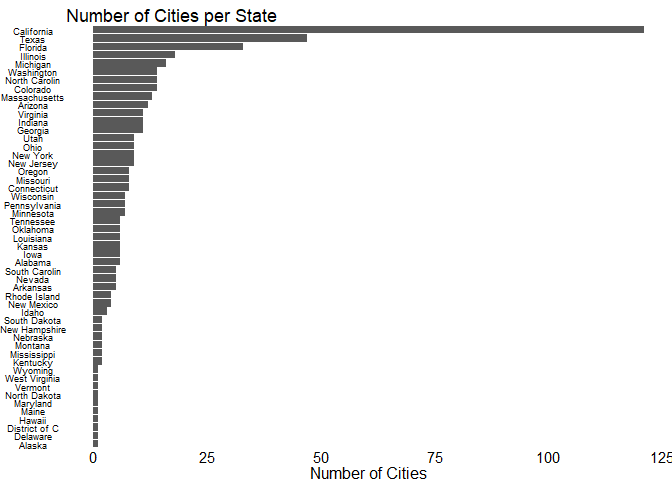
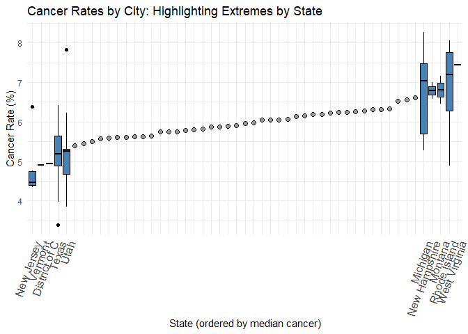
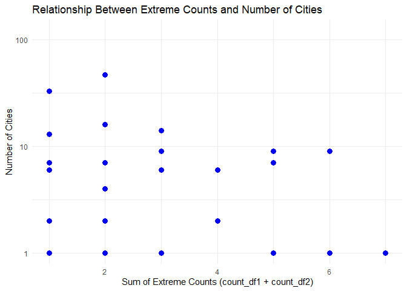

README
================
Naomi Mauss and Grace Wu
2025-04-16

This imports the cleaned dataset from the initial data creation step in
Data Creation.Rmd

``` r
health <- read.csv("https://docs.google.com/spreadsheets/d/e/2PACX-1vQeaKrReyifqjPVoWB2pYHAo54wLlybjEnMZiPP0i6tdpWb-RLqmwrCvhz8HVOBLCjEo_0qYmrnOkEo/pub?output=csv")


healthwfips <-read.csv("https://docs.google.com/spreadsheets/d/e/2PACX-1vTZ4PRD5X0Zcr1rEWwCTusXmef1IkAFgnpPXeJ1dZ3lVpp7iX-ZsbMFCOpkzS-zSA/pub?output=csv")
```

``` r
library(readr)
library(dplyr)
```

    ## Warning: package 'dplyr' was built under R version 4.4.3

    ## 
    ## Attaching package: 'dplyr'

    ## The following objects are masked from 'package:stats':
    ## 
    ##     filter, lag

    ## The following objects are masked from 'package:base':
    ## 
    ##     intersect, setdiff, setequal, union

``` r
library(tidycensus)
library(tidyverse)
```

    ## Warning: package 'tidyverse' was built under R version 4.4.2

    ## Warning: package 'ggplot2' was built under R version 4.4.3

    ## Warning: package 'stringr' was built under R version 4.4.1

    ## ── Attaching core tidyverse packages ──────────────────────── tidyverse 2.0.0 ──
    ## ✔ forcats   1.0.0     ✔ stringr   1.5.1
    ## ✔ ggplot2   3.5.2     ✔ tibble    3.2.1
    ## ✔ lubridate 1.9.3     ✔ tidyr     1.3.1
    ## ✔ purrr     1.0.2

    ## ── Conflicts ────────────────────────────────────────── tidyverse_conflicts() ──
    ## ✖ dplyr::filter() masks stats::filter()
    ## ✖ dplyr::lag()    masks stats::lag()
    ## ℹ Use the conflicted package (<http://conflicted.r-lib.org/>) to force all conflicts to become errors

``` r
library(data.table)
```

    ## 
    ## Attaching package: 'data.table'
    ## 
    ## The following objects are masked from 'package:lubridate':
    ## 
    ##     hour, isoweek, mday, minute, month, quarter, second, wday, week,
    ##     yday, year
    ## 
    ## The following object is masked from 'package:purrr':
    ## 
    ##     transpose
    ## 
    ## The following objects are masked from 'package:dplyr':
    ## 
    ##     between, first, last

``` r
library(gt)
```

    ## Warning: package 'gt' was built under R version 4.4.1

``` r
library(xgboost)
```

    ## Warning: package 'xgboost' was built under R version 4.4.3

    ## 
    ## Attaching package: 'xgboost'
    ## 
    ## The following object is masked from 'package:dplyr':
    ## 
    ##     slice

``` r
library(tigris)
```

    ## Warning: package 'tigris' was built under R version 4.4.3

    ## To enable caching of data, set `options(tigris_use_cache = TRUE)`
    ## in your R script or .Rprofile.

``` r
library(ggplot2)
library(sf)
```

    ## Warning: package 'sf' was built under R version 4.4.3

    ## Linking to GEOS 3.13.0, GDAL 3.10.1, PROJ 9.5.1; sf_use_s2() is TRUE

``` r
library(stringr)
library(rmapshaper)
```

    ## Warning: package 'rmapshaper' was built under R version 4.4.3

``` r
library(knitr)
```

``` r
state_means <- healthwfips %>%
  group_by(StateDesc) %>%
  summarise(
    avgMentalIllness = mean(MHLTH, na.rm = TRUE),
    avgBingeDrinking = mean(BINGE, na.rm = TRUE),
    avgChildhoodAsthma = mean(CASTHMA, na.rm = TRUE),
    avgArthritis = mean(ARTHRITIS, na.rm = TRUE),
    avgCancer = mean(CANCER, na.rm = TRUE),
    avgKidneyDisease = mean(KIDNEY, na.rm = TRUE),
    avgHighBP = mean(BPHIGH, na.rm = TRUE),
    avgDiabetes = mean(DIABETES, na.rm = TRUE),
    avgCOPD = mean(COPD, na.rm = TRUE),
    .groups = "drop"
  )

state_means <- state_means %>%
  mutate(StateDesc = tolower(StateDesc))

state_means <- healthwfips %>% group_by(StateDesc) %>%
  summarise(avgMentalIllness = mean(MHLTH), avgBingeDrinking = mean(BINGE), avgChildhoodAsthma = mean(CASTHMA), avgArthritis = mean(ARTHRITIS), avgCancer = mean(CANCER), avgKidneyDisease = mean(KIDNEY), avgHighBP = mean(BPHIGH), avgDiabetes = mean(DIABETES), avgCOPD = mean(COPD))


state_means$StateDesc[state_means$StateDesc == "South Carolin"] <- "South Carolina"
state_means$StateDesc[state_means$StateDesc == "North Carolin"] <- "North Carolina"
```

Prepare the data to map by state

``` r
#install.packages("viridis")
#library(ggplot2)
#library(dplyr)
#library(maps)      # for map_data
#library(viridis)   # optional: better color scale

# state_means <- read.csv("https://docs.google.com/spreadsheets/d/e/2PACX-1vRPtd9hIIamvljlqlmKcpm8xzcoSxkiNT4bLA78cgczFQqrSjI1DRrKnNiKR5Ger9CZHL8AEd0bx7OW/pub?output=csv")

state_means$StateDesc <- str_to_title(state_means$StateDesc)
```

``` r
# Download the shapefile for all states, including Alaska and Hawaii
us_states_sf <- states(cb = TRUE)
```

    ## Retrieving data for the year 2024

    ##   |                                                                              |                                                                      |   0%  |                                                                              |                                                                      |   1%  |                                                                              |=                                                                     |   1%  |                                                                              |=                                                                     |   2%  |                                                                              |==                                                                    |   2%  |                                                                              |==                                                                    |   3%  |                                                                              |===                                                                   |   4%  |                                                                              |===                                                                   |   5%  |                                                                              |====                                                                  |   5%  |                                                                              |====                                                                  |   6%  |                                                                              |=====                                                                 |   7%  |                                                                              |=====                                                                 |   8%  |                                                                              |======                                                                |   8%  |                                                                              |======                                                                |   9%  |                                                                              |=======                                                               |  10%  |                                                                              |=======                                                               |  11%  |                                                                              |========                                                              |  11%  |                                                                              |========                                                              |  12%  |                                                                              |=========                                                             |  13%  |                                                                              |==========                                                            |  14%  |                                                                              |==========                                                            |  15%  |                                                                              |===========                                                           |  15%  |                                                                              |===========                                                           |  16%  |                                                                              |============                                                          |  17%  |                                                                              |=============                                                         |  18%  |                                                                              |=============                                                         |  19%  |                                                                              |==============                                                        |  20%  |                                                                              |===============                                                       |  21%  |                                                                              |================                                                      |  22%  |                                                                              |================                                                      |  23%  |                                                                              |=================                                                     |  24%  |                                                                              |=================                                                     |  25%  |                                                                              |==================                                                    |  26%  |                                                                              |===================                                                   |  27%  |                                                                              |====================                                                  |  29%  |                                                                              |=====================                                                 |  30%  |                                                                              |======================                                                |  32%  |                                                                              |=======================                                               |  33%  |                                                                              |========================                                              |  34%  |                                                                              |=========================                                             |  36%  |                                                                              |==========================                                            |  38%  |                                                                              |============================                                          |  40%  |                                                                              |==============================                                        |  43%  |                                                                              |=================================                                     |  47%  |                                                                              |=====================================                                 |  53%  |                                                                              |==========================================                            |  60%  |                                                                              |===============================================                       |  68%  |                                                                              |==================================================                    |  72%  |                                                                              |===================================================                   |  72%  |                                                                              |====================================================                  |  74%  |                                                                              |=====================================================                 |  76%  |                                                                              |==========================================================            |  82%  |                                                                              |================================================================      |  92%  |                                                                              |======================================================================|  99%  |                                                                              |======================================================================| 100%

``` r
# View the structure of the data (optional)
head(us_states_sf)
```

    ## Simple feature collection with 6 features and 9 fields
    ## Geometry type: MULTIPOLYGON
    ## Dimension:     XY
    ## Bounding box:  xmin: -124.4096 ymin: 30.22333 xmax: -80.84038 ymax: 45.94545
    ## Geodetic CRS:  NAD83
    ##   STATEFP  STATENS     GEOIDFQ GEOID STUSPS         NAME LSAD        ALAND
    ## 1      35 00897535 0400000US35    35     NM   New Mexico   00 314198519809
    ## 2      46 01785534 0400000US46    46     SD South Dakota   00 196341670967
    ## 3      06 01779778 0400000US06    06     CA   California   00 403673433805
    ## 4      21 01779786 0400000US21    21     KY     Kentucky   00 102266755818
    ## 5      01 01779775 0400000US01    01     AL      Alabama   00 131185561946
    ## 6      13 01705317 0400000US13    13     GA      Georgia   00 149485762701
    ##        AWATER                       geometry
    ## 1   726531289 MULTIPOLYGON (((-109.0502 3...
    ## 2  3387563375 MULTIPOLYGON (((-104.0579 4...
    ## 3 20291632828 MULTIPOLYGON (((-118.6044 3...
    ## 4  2384136185 MULTIPOLYGON (((-89.40565 3...
    ## 5  4581813708 MULTIPOLYGON (((-88.05338 3...
    ## 6  4419221858 MULTIPOLYGON (((-81.27939 3...

``` r
# Map state names in your data to their respective state abbreviations
state_abbreviations <- c(
  "Alaska" = "AK", "Hawaii" = "HI", "Alabama" = "AL", "Arizona" = "AZ", 
  "Arkansas" = "AR", "California" = "CA", "Colorado" = "CO", "Connecticut" = "CT",
  "Delaware" = "DE", "Florida" = "FL", "Georgia" = "GA", "Hawaii" = "HI", 
  "Idaho" = "ID", "Illinois" = "IL", "Indiana" = "IN", "Iowa" = "IA", 
  "Kansas" = "KS", "Kentucky" = "KY", "Louisiana" = "LA", "Maine" = "ME", 
  "Maryland" = "MD", "Massachusetts" = "MA", "Michigan" = "MI", "Minnesota" = "MN", 
  "Mississippi" = "MS", "Missouri" = "MO", "Montana" = "MT", "Nebraska" = "NE", 
  "Nevada" = "NV", "New Hampshire" = "NH", "New Jersey" = "NJ", "New Mexico" = "NM", 
  "New York" = "NY", "North Carolina" = "NC", "North Dakota" = "ND", "Ohio" = "OH", 
  "Oklahoma" = "OK", "Oregon" = "OR", "Pennsylvania" = "PA", "Rhode Island" = "RI", 
  "South Carolina" = "SC", "South Dakota" = "SD", "Tennessee" = "TN", "Texas" = "TX", 
  "Utah" = "UT", "Vermont" = "VT", "Virginia" = "VA", "Washington" = "WA", 
  "West Virginia" = "WV", "Wisconsin" = "WI", "Wyoming" = "WY"
)

# my_data <- state_means %>%
#   mutate(state = tolower(StateDesc)) %>%
#   mutate(state_abbr = recode(state, !!!state_abbreviations))

# Merge map data with your data
map_data_combined <- left_join(us_states_sf, state_means, by = c("NAME" = "StateDesc"))
```

Now we make the maps and box plots

Mental Illness Map

``` r
# Plot full map with AK/HI shifted
formatting <- tigris::states() %>%
  dplyr::filter(GEOID < "60") %>%
  tigris::shift_geometry()
```

    ## Retrieving data for the year 2024

    ##   |                                                                              |                                                                      |   0%  |                                                                              |                                                                      |   1%  |                                                                              |==                                                                    |   2%  |                                                                              |====                                                                  |   5%  |                                                                              |=====                                                                 |   7%  |                                                                              |========                                                              |  11%  |                                                                              |==========                                                            |  15%  |                                                                              |============                                                          |  17%  |                                                                              |===============                                                       |  21%  |                                                                              |=================                                                     |  24%  |                                                                              |==================                                                    |  25%  |                                                                              |===================                                                   |  28%  |                                                                              |====================                                                  |  28%  |                                                                              |====================                                                  |  29%  |                                                                              |======================                                                |  31%  |                                                                              |=======================                                               |  33%  |                                                                              |========================                                              |  35%  |                                                                              |===========================                                           |  38%  |                                                                              |==============================                                        |  42%  |                                                                              |=================================                                     |  47%  |                                                                              |===================================                                   |  51%  |                                                                              |=====================================                                 |  53%  |                                                                              |======================================                                |  54%  |                                                                              |======================================                                |  55%  |                                                                              |===========================================                           |  61%  |                                                                              |===========================================                           |  62%  |                                                                              |============================================                          |  63%  |                                                                              |=============================================                         |  64%  |                                                                              |===============================================                       |  67%  |                                                                              |================================================                      |  68%  |                                                                              |================================================                      |  69%  |                                                                              |=================================================                     |  70%  |                                                                              |==================================================                    |  72%  |                                                                              |====================================================                  |  74%  |                                                                              |=====================================================                 |  75%  |                                                                              |=======================================================               |  78%  |                                                                              |==========================================================            |  83%  |                                                                              |===========================================================           |  84%  |                                                                              |============================================================          |  86%  |                                                                              |=============================================================         |  87%  |                                                                              |===============================================================       |  90%  |                                                                              |================================================================      |  91%  |                                                                              |=================================================================     |  93%  |                                                                              |==================================================================    |  95%  |                                                                              |====================================================================  |  97%  |                                                                              |===================================================================== |  99%  |                                                                              |======================================================================| 100%

``` r
formatting <- formatting %>%
  left_join(state_means, by = c("NAME" = "StateDesc"))

# plot(formatting$geometry, formatting$avgArthritis)


ggplot(formatting) +
  geom_sf(aes(fill = avgMentalIllness)) +
  scale_fill_viridis_c(
      option = "plasma",
      direction = -1,
      name = "Avg Mental Illness Rate"
    ) +
    labs(
      title = "Average Mental Illness Rate by State",
      subtitle = "Data from CDC PLACES and ACS",
      caption = "Source: CDC | Visualization by Naomi Mauss and Grace Wu"
    ) +
    theme_void() +
    theme(
      plot.title = element_text(hjust = 0.5, size = 16, face = "bold"),
      plot.subtitle = element_text(hjust = 0.5, size = 12),
      plot.caption = element_text(hjust = 1, size = 8),
      legend.position = "right",
      legend.title = element_text(size = 10, face = "bold"),
      legend.text = element_text(size = 8)
   )
```

<!-- -->

Mental Illness Box Plot Desc

``` r
stored_means <- data.frame(health %>%
  group_by(StateDesc) %>%
  summarise(mean_COPD = mean(MHLTH, na.rm = TRUE)) %>%
  arrange(mean_COPD))

highlight_states <- c(
  head(stored_means$StateDesc, 5),
  tail(stored_means$StateDesc, 5)
)

health <- health %>%
  mutate(Highlight = ifelse(StateDesc %in% highlight_states, "Highlight", "Other"))

health$StateDesc <- reorder(health$StateDesc, health$MHLTH, FUN = median)


health <- health %>%
  mutate(Highlight = ifelse(StateDesc %in% highlight_states, "Highlight", "Other"),
         StateDesc = factor(StateDesc, levels = stored_means$StateDesc))  # Ensure the correct order

x_mapping <- health %>%
  filter(Highlight == "Highlight") %>%
  arrange(COPD) %>%
  mutate(x_pos = as.numeric(factor(StateDesc)))

# Plot
ggplot() +
  # Plot all "Other" states as points (mean) in the middle
  stat_summary(data = filter(health, Highlight == "Other"),
               aes(x = StateDesc, y = MHLTH),
               fun = mean, geom = "point", shape = 21, fill = "gray60", size = 2) +

  # Plot boxplots for highlighted states (top and bottom 5)
  geom_boxplot(data = filter(health, Highlight == "Highlight"),
               aes(x = StateDesc, y = MHLTH),
               width = 0.8, fill = "steelblue", color = "black") +

  scale_x_continuous(
    breaks = x_mapping$x_pos[x_mapping$StateDesc %in% highlight_states],
    labels = x_mapping$StateDesc[x_mapping$StateDesc %in% highlight_states]) +
  
  labs(title = "Mental Illness Rates by City: Highlighting Extremes by State",
       x = "State (ordered by median mental illness)",
       y = "Mental Illness Rate (%)") +
  theme_minimal() +
 theme(axis.text.x = element_text(angle = 70, hjust = 1, size = 11)) +
  scale_x_discrete(limits = levels(health$StateDesc), labels = function(x) ifelse(x %in% highlight_states, x, ""))
```

    ## Scale for x is already present.
    ## Adding another scale for x, which will replace the existing scale.

<!-- -->

Binge Drinking Map

``` r
ggplot(formatting) +
  geom_sf(aes(fill = avgBingeDrinking))+
  scale_fill_viridis_c(
    option = "plasma",
    direction = -1,
    name = "Avg Binge Drinking Rate"
  ) +
  labs(
    title = "Average Binge Drinking Rate by State",
    subtitle = "Data from CDC PLACES and ACS",
    caption = "Source: CDC | Visualization by Naomi Mauss and Grace Wu"
  ) +
  theme_void() +
  theme(
    plot.title = element_text(hjust = 0.5, size = 16, face = "bold"),
    plot.subtitle = element_text(hjust = 0.5, size = 12),
    plot.caption = element_text(hjust = 1, size = 8),
    legend.position = "right",
    legend.title = element_text(size = 10, face = "bold"),
    legend.text = element_text(size = 8)
  )
```

<!-- -->

Binge Drinking Box Plot Desc

``` r
stored_means <- health %>%
  group_by(StateDesc) %>%
  summarise(mean_COPD = mean(BINGE, na.rm = TRUE)) %>%
  arrange(mean_COPD)

highlight_states <- c(
  head(stored_means$StateDesc, 5),
  tail(stored_means$StateDesc, 5)
)

health <- health %>%
  mutate(Highlight = ifelse(StateDesc %in% highlight_states, "Highlight", "Other"))

health$StateDesc <- reorder(health$StateDesc, health$BINGE, FUN = median)


health <- health %>%
  mutate(Highlight = ifelse(StateDesc %in% highlight_states, "Highlight", "Other"),
         StateDesc = factor(StateDesc, levels = stored_means$StateDesc))  # Ensure the correct order

x_mapping <- health %>%
  filter(Highlight == "Highlight") %>%
  arrange(COPD) %>%
  mutate(x_pos = as.numeric(factor(StateDesc)))

# Plot
ggplot() +
  # Plot all "Other" states as points (mean) in the middle
  stat_summary(data = filter(health, Highlight == "Other"),
               aes(x = StateDesc, y = BINGE),
               fun = mean, geom = "point", shape = 21, fill = "gray60", size = 2) +

  # Plot boxplots for highlighted states (top and bottom 5)
  geom_boxplot(data = filter(health, Highlight == "Highlight"),
               aes(x = StateDesc, y = BINGE),
               width = 0.8, fill = "steelblue", color = "black") +

  scale_x_continuous(
    breaks = x_mapping$x_pos[x_mapping$StateDesc %in% highlight_states],
    labels = x_mapping$StateDesc[x_mapping$StateDesc %in% highlight_states]) +
  
  labs(title = "Binge Drinking Rates by City: Highlighting Extremes by State",
       x = "State (ordered by median binge drinking)",
       y = "Binge Drinking Rate (%)") +
  theme_minimal() +
  theme(axis.text.x = element_text(angle = 70, hjust = 1, size = 11)) +
  scale_x_discrete(limits = levels(health$StateDesc), labels = function(x) ifelse(x %in% highlight_states, x, ""))
```

    ## Scale for x is already present.
    ## Adding another scale for x, which will replace the existing scale.

<!-- -->

Asthma Map

``` r
ggplot(formatting) +
  geom_sf(aes(fill = avgChildhoodAsthma)) +
  scale_fill_viridis_c(
    option = "plasma",
    direction = -1,
    name = "Avg Childhood Asthma Rate"
  ) +
  labs(
    title = "Average Childhood Asthma Rate by State",
    subtitle = "Data from CDC PLACES and ACS",
    caption = "Source: CDC | Visualization by Naomi Mauss and Grace Wu"
  ) +
  theme_void() +
  theme(
    plot.title = element_text(hjust = 0.5, size = 16, face = "bold"),
    plot.subtitle = element_text(hjust = 0.5, size = 12),
    plot.caption = element_text(hjust = 1, size = 8),
    legend.position = "right",
    legend.title = element_text(size = 10, face = "bold"),
    legend.text = element_text(size = 8)
  )
```

<!-- -->

Childhood Asthma Box Plot Desc

``` r
stored_means <- health %>%
  group_by(StateDesc) %>%
  summarise(mean_COPD = mean(CASTHMA, na.rm = TRUE)) %>%
  arrange(mean_COPD)

highlight_states <- c(
  head(stored_means$StateDesc, 5),
  tail(stored_means$StateDesc, 5)
)

health <- health %>%
  mutate(Highlight = ifelse(StateDesc %in% highlight_states, "Highlight", "Other"))

health$StateDesc <- reorder(health$StateDesc, health$CASTHMA, FUN = median)


health <- health %>%
  mutate(Highlight = ifelse(StateDesc %in% highlight_states, "Highlight", "Other"),
         StateDesc = factor(StateDesc, levels = stored_means$StateDesc))  # Ensure the correct order

x_mapping <- health %>%
  filter(Highlight == "Highlight") %>%
  arrange(COPD) %>%
  mutate(x_pos = as.numeric(factor(StateDesc)))

# Plot
ggplot() +
  # Plot all "Other" states as points (mean) in the middle
  stat_summary(data = filter(health, Highlight == "Other"),
               aes(x = StateDesc, y = CASTHMA),
               fun = mean, geom = "point", shape = 21, fill = "gray60", size = 2) +

  # Plot boxplots for highlighted states (top and bottom 5)
  geom_boxplot(data = filter(health, Highlight == "Highlight"),
               aes(x = StateDesc, y = CASTHMA),
               width = 0.8, fill = "steelblue", color = "black") +

  scale_x_continuous(
    breaks = x_mapping$x_pos[x_mapping$StateDesc %in% highlight_states],
    labels = x_mapping$StateDesc[x_mapping$StateDesc %in% highlight_states]) +
  
  labs(title = "Childhood Asthma Rates by City: Highlighting Extremes by State",
       x = "State (ordered by median childhood asthma)",
       y = "Childhood Asthma Rate (%)") +
  theme_minimal() +
 theme(axis.text.x = element_text(angle = 70, hjust = 1, size = 12)) +
  scale_x_discrete(limits = levels(health$StateDesc), labels = function(x) ifelse(x %in% highlight_states, x, ""))
```

    ## Scale for x is already present.
    ## Adding another scale for x, which will replace the existing scale.

<!-- -->

Arthritis Map

``` r
ggplot(formatting) +
  geom_sf(aes(fill = avgArthritis)) +
  scale_fill_viridis_c(
    option = "plasma",
    direction = -1,
    name = "Avg Arthritis Rate"
  ) +
  labs(
    title = "Average Arthritis Rate by State",
    subtitle = "Data from CDC PLACES and ACS",
    caption = "Source: CDC | Visualization by Naomi Mauss and Grace Wu"
  ) +
  theme_void() +
  theme(
    plot.title = element_text(hjust = 0.5, size = 16, face = "bold"),
    plot.subtitle = element_text(hjust = 0.5, size = 12),
    plot.caption = element_text(hjust = 1, size = 8),
    legend.position = "right",
    legend.title = element_text(size = 10, face = "bold"),
    legend.text = element_text(size = 8)
  )
```

<!-- -->

Arthritis Box Plot Desc

``` r
stored_means <- health %>%
  group_by(StateDesc) %>%
  summarise(mean_COPD = mean(ARTHRITIS, na.rm = TRUE)) %>%
  arrange(mean_COPD)

highlight_states <- c(
  head(stored_means$StateDesc, 5),
  tail(stored_means$StateDesc, 5)
)

health <- health %>%
  mutate(Highlight = ifelse(StateDesc %in% highlight_states, "Highlight", "Other"))

health$StateDesc <- reorder(health$StateDesc, health$ARTHRITIS, FUN = median)


health <- health %>%
  mutate(Highlight = ifelse(StateDesc %in% highlight_states, "Highlight", "Other"),
         StateDesc = factor(StateDesc, levels = stored_means$StateDesc))  # Ensure the correct order

x_mapping <- health %>%
  filter(Highlight == "Highlight") %>%
  arrange(COPD) %>%
  mutate(x_pos = as.numeric(factor(StateDesc)))

# Plot
ggplot() +
  # Plot all "Other" states as points (mean) in the middle
  stat_summary(data = filter(health, Highlight == "Other"),
               aes(x = StateDesc, y = ARTHRITIS),
               fun = mean, geom = "point", shape = 21, fill = "gray60", size = 2) +

  # Plot boxplots for highlighted states (top and bottom 5)
  geom_boxplot(data = filter(health, Highlight == "Highlight"),
               aes(x = StateDesc, y = ARTHRITIS),
               width = 0.8, fill = "steelblue", color = "black") +

  scale_x_continuous(
    breaks = x_mapping$x_pos[x_mapping$StateDesc %in% highlight_states],
    labels = x_mapping$StateDesc[x_mapping$StateDesc %in% highlight_states]) +
  
  labs(title = "Arthritis Rates by City: Highlighting Extremes by State",
       x = "State (ordered by median arthritis)",
       y = "Childhood Arthritis Rate (%)") +
  theme_minimal() +
 theme(axis.text.x = element_text(angle = 70, hjust = 1, size = 12)) +
  scale_x_discrete(limits = levels(health$StateDesc), labels = function(x) ifelse(x %in% highlight_states, x, ""))
```

    ## Scale for x is already present.
    ## Adding another scale for x, which will replace the existing scale.

<!-- -->

Kidney Disease Map

``` r
ggplot(formatting) +
  geom_sf(aes(fill = avgKidneyDisease)) +
  scale_fill_viridis_c(
    option = "plasma",
    direction = -1,
    name = "Avg Kidney Disease Rate"
  ) +
  labs(
    title = "Average Kidney Disease Rate by State",
    subtitle = "Data from CDC PLACES and ACS",
    caption = "Source: CDC | Visualization by Naomi Mauss and Grace Wu"
  ) +
  theme_void() +
  theme(
    plot.title = element_text(hjust = 0.5, size = 16, face = "bold"),
    plot.subtitle = element_text(hjust = 0.5, size = 12),
    plot.caption = element_text(hjust = 1, size = 8),
    legend.position = "right",
    legend.title = element_text(size = 10, face = "bold"),
    legend.text = element_text(size = 8)
  )
```

<!-- -->

Kidney Disease Box Plot Desc

``` r
stored_means <- health %>%
  group_by(StateDesc) %>%
  summarise(mean_COPD = mean(KIDNEY, na.rm = TRUE)) %>%
  arrange(mean_COPD)

highlight_states <- c(
  head(stored_means$StateDesc, 5),
  tail(stored_means$StateDesc, 5)
)

health <- health %>%
  mutate(Highlight = ifelse(StateDesc %in% highlight_states, "Highlight", "Other"))

health$StateDesc <- reorder(health$StateDesc, health$KIDNEY, FUN = median)


health <- health %>%
  mutate(Highlight = ifelse(StateDesc %in% highlight_states, "Highlight", "Other"),
         StateDesc = factor(StateDesc, levels = stored_means$StateDesc))  # Ensure the correct order

x_mapping <- health %>%
  filter(Highlight == "Highlight") %>%
  arrange(COPD) %>%
  mutate(x_pos = as.numeric(factor(StateDesc)))

# Plot
ggplot() +
  # Plot all "Other" states as points (mean) in the middle
  stat_summary(data = filter(health, Highlight == "Other"),
               aes(x = StateDesc, y = KIDNEY),
               fun = mean, geom = "point", shape = 21, fill = "gray60", size = 2) +

  # Plot boxplots for highlighted states (top and bottom 5)
  geom_boxplot(data = filter(health, Highlight == "Highlight"),
               aes(x = StateDesc, y = KIDNEY),
               width = 0.8, fill = "steelblue", color = "black") +

  scale_x_continuous(
    breaks = x_mapping$x_pos[x_mapping$StateDesc %in% highlight_states],
    labels = x_mapping$StateDesc[x_mapping$StateDesc %in% highlight_states]) +
  
  labs(title = "Kidney Disease Rates by City: Highlighting Extremes by State",
       x = "State (ordered by median kidney disease)",
       y = "Kidney Disease Rate (%)") +
  theme_minimal() +
 theme(axis.text.x = element_text(angle = 70, hjust = 1, size = 12)) +
  scale_x_discrete(limits = levels(health$StateDesc), labels = function(x) ifelse(x %in% highlight_states, x, ""))
```

    ## Scale for x is already present.
    ## Adding another scale for x, which will replace the existing scale.

<!-- -->

High Blood Pressure Map

``` r
ggplot(formatting) +
  geom_sf(aes(fill = avgHighBP)) +
  scale_fill_viridis_c(
    option = "plasma",
    direction = -1,
    name = "Avg High Blood Pressure Rate"
  ) +
  labs(
    title = "Average High Blood Pressure Rate by State",
    subtitle = "Data from CDC PLACES and ACS",
    caption = "Source: CDC | Visualization by Naomi Mauss and Grace Wu"
  ) +
  theme_void() +
  theme(
    plot.title = element_text(hjust = 0.5, size = 16, face = "bold"),
    plot.subtitle = element_text(hjust = 0.5, size = 12),
    plot.caption = element_text(hjust = 1, size = 8),
    legend.position = "right",
    legend.title = element_text(size = 10, face = "bold"),
    legend.text = element_text(size = 8)
  )
```

<!-- -->

High Blood Pressure Box Plot Desc

``` r
stored_means <- health %>%
  group_by(StateDesc) %>%
  summarise(mean_COPD = mean(BPHIGH, na.rm = TRUE)) %>%
  arrange(mean_COPD)

highlight_states <- c(
  head(stored_means$StateDesc, 5),
  tail(stored_means$StateDesc, 5)
)

health <- health %>%
  mutate(Highlight = ifelse(StateDesc %in% highlight_states, "Highlight", "Other"))

health$StateDesc <- reorder(health$StateDesc, health$BPHIGH, FUN = median)


health <- health %>%
  mutate(Highlight = ifelse(StateDesc %in% highlight_states, "Highlight", "Other"),
         StateDesc = factor(StateDesc, levels = stored_means$StateDesc))  # Ensure the correct order

x_mapping <- health %>%
  filter(Highlight == "Highlight") %>%
  arrange(COPD) %>%
  mutate(x_pos = as.numeric(factor(StateDesc)))

# Plot
ggplot() +
  # Plot all "Other" states as points (mean) in the middle
  stat_summary(data = filter(health, Highlight == "Other"),
               aes(x = StateDesc, y = BPHIGH),
               fun = mean, geom = "point", shape = 21, fill = "gray60", size = 2) +

  # Plot boxplots for highlighted states (top and bottom 5)
  geom_boxplot(data = filter(health, Highlight == "Highlight"),
               aes(x = StateDesc, y = BPHIGH),
               width = 0.8, fill = "steelblue", color = "black") +

  scale_x_continuous(
    breaks = x_mapping$x_pos[x_mapping$StateDesc %in% highlight_states],
    labels = x_mapping$StateDesc[x_mapping$StateDesc %in% highlight_states]) +
  
  labs(title = "High Blood Pressure Rates by City: Highlighting Extremes by State",
       x = "State (ordered by median high blood pressure)",
       y = "High Blood Pressure Rate (%)") +
  theme_minimal() +
 theme(axis.text.x = element_text(angle = 70, hjust = 1, size = 12)) +
  scale_x_discrete(limits = levels(health$StateDesc), labels = function(x) ifelse(x %in% highlight_states, x, ""))
```

    ## Scale for x is already present.
    ## Adding another scale for x, which will replace the existing scale.

<!-- -->

Cancer Map

``` r
ggplot(formatting) +
  geom_sf(aes(fill = avgCancer)) +
  scale_fill_viridis_c(
    option = "plasma",
    direction = -1,
    name = "Avg Cancer Rate"
  ) +
  labs(
    title = "Average Cancer Rate by State",
    subtitle = "Data from CDC PLACES and ACS",
    caption = "Source: CDC | Visualization by Naomi Mauss and Grace Wu"
  ) +
  theme_void() +
  theme(
    plot.title = element_text(hjust = 0.5, size = 16, face = "bold"),
    plot.subtitle = element_text(hjust = 0.5, size = 12),
    plot.caption = element_text(hjust = 1, size = 8),
    legend.position = "right",
    legend.title = element_text(size = 10, face = "bold"),
    legend.text = element_text(size = 8))
```

<!-- -->

Childhood Box Plot Desc

``` r
stored_means <- health %>%
  group_by(StateDesc) %>%
  summarise(mean_COPD = mean(CANCER, na.rm = TRUE)) %>%
  arrange(mean_COPD)

highlight_states <- c(
  head(stored_means$StateDesc, 5),
  tail(stored_means$StateDesc, 5)
)

health <- health %>%
  mutate(Highlight = ifelse(StateDesc %in% highlight_states, "Highlight", "Other"))

health$StateDesc <- reorder(health$StateDesc, health$CANCER, FUN = median)


health <- health %>%
  mutate(Highlight = ifelse(StateDesc %in% highlight_states, "Highlight", "Other"),
         StateDesc = factor(StateDesc, levels = stored_means$StateDesc))  # Ensure the correct order

x_mapping <- health %>%
  filter(Highlight == "Highlight") %>%
  arrange(COPD) %>%
  mutate(x_pos = as.numeric(factor(StateDesc)))

# Plot
ggplot() +
  # Plot all "Other" states as points (mean) in the middle
  stat_summary(data = filter(health, Highlight == "Other"),
               aes(x = StateDesc, y = CANCER),
               fun = mean, geom = "point", shape = 21, fill = "gray60", size = 2) +

  # Plot boxplots for highlighted states (top and bottom 5)
  geom_boxplot(data = filter(health, Highlight == "Highlight"),
               aes(x = StateDesc, y = CANCER),
               width = 0.8, fill = "steelblue", color = "black") +

  scale_x_continuous(
    breaks = x_mapping$x_pos[x_mapping$StateDesc %in% highlight_states],
    labels = x_mapping$StateDesc[x_mapping$StateDesc %in% highlight_states]) +
  
  labs(title = "Cancer Rates by City: Highlighting Extremes by State",
       x = "State (ordered by median cancer)",
       y = "Cancer Rate (%)") +
  theme_minimal() +
 theme(axis.text.x = element_text(angle = 70, hjust = 1, size = 12)) +
  scale_x_discrete(limits = levels(health$StateDesc), labels = function(x) ifelse(x %in% highlight_states, x, ""))
```

    ## Scale for x is already present.
    ## Adding another scale for x, which will replace the existing scale.

<!-- -->

Diabetes Map

``` r
ggplot(formatting) +
  geom_sf(aes(fill = avgDiabetes)) +
  scale_fill_viridis_c(
    option = "plasma",
    direction = -1,
    name = "Avg Diabetes Rate"
  ) +
  labs(
    title = "Average Diabetes Rate by State",
    subtitle = "Data from CDC PLACES and ACS",
    caption = "Source: CDC | Visualization by Naomi Mauss and Grace Wu"
  ) +
  theme_void() +
  theme(
    plot.title = element_text(hjust = 0.5, size = 16, face = "bold"),
    plot.subtitle = element_text(hjust = 0.5, size = 12),
    plot.caption = element_text(hjust = 1, size = 8),
    legend.position = "right",
    legend.title = element_text(size = 10, face = "bold"),
    legend.text = element_text(size = 8))
```

<!-- -->

Childhood Box Plot Desc

``` r
stored_means <- health %>%
  group_by(StateDesc) %>%
  summarise(mean_COPD = mean(DIABETES, na.rm = TRUE)) %>%
  arrange(mean_COPD)

highlight_states <- c(
  head(stored_means$StateDesc, 5),
  tail(stored_means$StateDesc, 5)
)

health <- health %>%
  mutate(Highlight = ifelse(StateDesc %in% highlight_states, "Highlight", "Other"))

health$StateDesc <- reorder(health$StateDesc, health$DIABETES, FUN = median)


health <- health %>%
  mutate(Highlight = ifelse(StateDesc %in% highlight_states, "Highlight", "Other"),
         StateDesc = factor(StateDesc, levels = stored_means$StateDesc))  # Ensure the correct order

x_mapping <- health %>%
  filter(Highlight == "Highlight") %>%
  arrange(COPD) %>%
  mutate(x_pos = as.numeric(factor(StateDesc)))

# Plot
ggplot() +
  # Plot all "Other" states as points (mean) in the middle
  stat_summary(data = filter(health, Highlight == "Other"),
               aes(x = StateDesc, y = DIABETES),
               fun = mean, geom = "point", shape = 21, fill = "gray60", size = 2) +

  # Plot boxplots for highlighted states (top and bottom 5)
  geom_boxplot(data = filter(health, Highlight == "Highlight"),
               aes(x = StateDesc, y = DIABETES),
               width = 0.8, fill = "steelblue", color = "black") +

  scale_x_continuous(
    breaks = x_mapping$x_pos[x_mapping$StateDesc %in% highlight_states],
    labels = x_mapping$StateDesc[x_mapping$StateDesc %in% highlight_states]) +
  
  labs(title = "Diabetes Rates by City: Highlighting Extremes by State",
       x = "State (ordered by median diabetes)",
       y = "Diabetes Rate (%)") +
  theme_minimal() +
 theme(axis.text.x = element_text(angle = 70, hjust = 1, size = 12)) +
  scale_x_discrete(limits = levels(health$StateDesc), labels = function(x) ifelse(x %in% highlight_states, x, ""))
```

    ## Scale for x is already present.
    ## Adding another scale for x, which will replace the existing scale.

<!-- -->

COPD Map

``` r
ggplot(formatting) +
  geom_sf(aes(fill = avgCOPD)) +
  scale_fill_viridis_c(
    option = "plasma",
    direction = -1,
    name = "Avg COPD Rate"
  ) +
  labs(
    title = "Average COPD Rate by State",
    subtitle = "Data from CDC PLACES and ACS",
    caption = "Source: CDC | Visualization by Naomi Mauss and Grace Wu"
  ) +
  theme_void() +
  theme(
    plot.title = element_text(hjust = 0.5, size = 16, face = "bold"),
    plot.subtitle = element_text(hjust = 0.5, size = 12),
    plot.caption = element_text(hjust = 1, size = 8),
    legend.position = "right",
    legend.title = element_text(size = 10, face = "bold"),
    legend.text = element_text(size = 8)
  )
```

<!-- -->

COPD Box Plot Desc

``` r
stored_means <- health %>%
  group_by(StateDesc) %>%
  summarise(mean_COPD = mean(COPD, na.rm = TRUE)) %>%
  arrange(mean_COPD)

highlight_states <- c(
  head(stored_means$StateDesc, 5),
  tail(stored_means$StateDesc, 5)
)


health <- health %>%
  mutate(Highlight = ifelse(StateDesc %in% highlight_states, "Highlight", "Other"))

health$StateDesc <- reorder(health$StateDesc, health$COPD, FUN = median)


health <- health %>%
  mutate(Highlight = ifelse(StateDesc %in% highlight_states, "Highlight", "Other"),
         StateDesc = factor(StateDesc, levels = stored_means$StateDesc))  # Ensure the correct order

x_mapping <- health %>%
  filter(Highlight == "Highlight") %>%
  arrange(COPD) %>%
  mutate(x_pos = as.numeric(factor(StateDesc)))

# Plot
ggplot() +
  # Plot all "Other" states as points (mean) in the middle
  stat_summary(data = filter(health, Highlight == "Other"),
               aes(x = StateDesc, y = COPD),
               fun = mean, geom = "point", shape = 21, fill = "gray60", size = 2) +

  # Plot boxplots for highlighted states (top and bottom 5)
  geom_boxplot(data = filter(health, Highlight == "Highlight"),
               aes(x = StateDesc, y = COPD),
               width = 0.8, fill = "steelblue", color = "black") +

  scale_x_continuous(
    breaks = x_mapping$x_pos[x_mapping$StateDesc %in% highlight_states],
    labels = x_mapping$StateDesc[x_mapping$StateDesc %in% highlight_states]) +
  
  labs(title = "COPD Rates by City: Highlighting Extremes by State",
       x = "State (ordered by median COPD)",
       y = "COPD Rate (%)") +
  theme_minimal() +
 theme(axis.text.x = element_text(angle = 70, hjust = 1, size = 12)) +
  scale_x_discrete(limits = levels(health$StateDesc), labels = function(x) ifelse(x %in% highlight_states, x, ""))  # Reverses the order on the x-axis
```

    ## Scale for x is already present.
    ## Adding another scale for x, which will replace the existing scale.

<!-- -->

Find Healthiest States

``` r
topTen <- state_means %>%
  arrange(avgMentalIllness) %>%
  head(5)

topTen_dt <- as.data.table(topTen)

healthiest <- data.table(StateDesc = topTen_dt$StateDesc)

names(healthiest)[1] <- "Mental Illness"

topTen <-  state_means %>%
  arrange(avgBingeDrinking) %>%
  head(5)

healthiest$BingeDrinking <- topTen$StateDesc


topTen <-  state_means %>%
  arrange(avgChildhoodAsthma) %>%
  head(5)

healthiest$ChildhoodAsthma <- topTen$StateDesc


topTen <-  state_means %>%
  arrange(avgArthritis) %>%
  head(5)

healthiest$Arthritis <- topTen$StateDesc


topTen <-  state_means %>%
  arrange(avgCancer) %>%
  head(5)

healthiest$Cancer <- topTen$StateDesc


topTen <-  state_means %>%
  arrange(avgKidneyDisease) %>%
  head(5)

healthiest$KidneyDisease <- topTen$StateDesc


topTen <-  state_means %>%
  arrange(avgHighBP) %>%
  head(5)

healthiest$HighBloodPressure <- topTen$StateDesc


topTen <-  state_means %>%
  arrange(avgDiabetes) %>%
  head(5)

healthiest$Diabetes <- topTen$StateDesc


topTen <-  state_means %>%
  arrange(avgCOPD) %>%
  head(5)

healthiest$COPD <- topTen$StateDesc


healthiest$Health <- rep("↓")
healthiest$Health[1] <- "Lowest Rate"
healthiest$Health[5] <- "Fifth Lowest Rate"

healthiest <- healthiest %>%
  select(Health, everything())
```

Make a chart

``` r
smallest_values <- state_means %>%
  reframe(across(everything(), ~ sort(.x)[1:5])) %>%
  pivot_longer(cols = where(is_double), 
             names_to = "Variable", 
             values_to = "value") %>%
  group_by(Variable) %>%
  mutate(Rank = row_number()) %>%
  ungroup()

ggplot(smallest_values, aes(x = Rank, y = value, color = Variable)) +
  geom_line() +
  geom_point() +
  labs(
    title = "Five Smallest Values per Illness",
    x = "Rank (1 = smallest, 5 = 5th smallest)",
    y = "Value"
  ) +
  theme_minimal() +
  scale_y_continuous(trans='log10') +
  scale_x_continuous(breaks = 1:5)
```

<!-- -->

Find Least Healthy States

``` r
bottomTen <- state_means %>%
  arrange(desc(avgMentalIllness)) %>%
  head(5)

bottomTen_dt <- as.data.table(bottomTen)

leastHealthy <- data.table(StateDesc = bottomTen_dt$StateDesc)

names(leastHealthy)[1] <- "Mental Illness"

bottomTen <-  state_means %>%
  arrange(desc(avgBingeDrinking)) %>%
  head(5)

leastHealthy$BingeDrinking <- bottomTen$StateDesc


bottomTen <-  state_means %>%
  arrange(desc(avgChildhoodAsthma)) %>%
  head(5)

leastHealthy$ChildhoodAsthma <- bottomTen$StateDesc


bottomTen <-  state_means %>%
  arrange(desc(avgArthritis)) %>%
  head(5)

leastHealthy$Arthritis <- bottomTen$StateDesc


bottomTen <-  state_means %>%
  arrange(desc(avgCancer)) %>%
  head(5)

leastHealthy$Cancer <- bottomTen$StateDesc


bottomTen <-  state_means %>%
  arrange(desc(avgKidneyDisease)) %>%
  head(5)

leastHealthy$KidneyDisease <- bottomTen$StateDesc


bottomTen <-  state_means %>%
  arrange(desc(avgHighBP)) %>%
  head(5)

leastHealthy$HighBloodPressure <- bottomTen$StateDesc


bottomTen <-  state_means %>%
  arrange(desc(avgDiabetes)) %>%
  head(5)

leastHealthy$Diabetes <- bottomTen$StateDesc


bottomTen <-  state_means %>%
  arrange(desc(avgCOPD)) %>%
  head(5)

leastHealthy$COPD <- bottomTen$StateDesc


leastHealthy$Health <- rep("↓")
leastHealthy$Health[1] <- "Highest Rate"
leastHealthy$Health[5] <- "Fifth Highest Rate"

leastHealthy <- leastHealthy %>%
  select(Health, everything())


least_long <- leastHealthy %>%
  select(-1) %>%
  pivot_longer(cols = everything(), values_to = "state") %>%
  count(state) %>%
  mutate(type = "Least Healthy")

most_long <- healthiest %>%
  select(-1) %>%
  pivot_longer(cols = everything(), values_to = "state") %>%
  count(state) %>%
  mutate(type = "Most Healthy")

# Step 2: Combine both
combined_counts <- bind_rows(least_long, most_long)

combined_counts <- combined_counts %>% filter(n > 2)

# Step 3: Plot
ggplot(combined_counts, aes(x = reorder(state, n), y = n, fill = type)) +
  geom_bar(stat = "identity") +
  scale_fill_manual(values = c("Least Healthy" = "orange", "Most Healthy" = "green")) +
  labs(
    title = "Frequency of States in Least/Most Healthy Rankings",
    x = "State",
    y = "Frequency",
    fill = "Health Category"
  ) +
  theme_minimal() +
  theme(axis.text.x = element_text(angle = 90, hjust = 1))
```

<!-- -->

Make a chart

``` r
biggest_values <- state_means %>%
  reframe(across(everything(), ~ sort(.x, decreasing = TRUE)[1:5])) %>%
  pivot_longer(cols = where(is_double), 
             names_to = "Variable", 
             values_to = "value") %>%
  group_by(Variable) %>%
  mutate(Rank = row_number()) %>%
  ungroup()

ggplot(biggest_values, aes(x = Rank, y = value, color = Variable)) +
  geom_line() +
  geom_point() +
  labs(
    title = "Five Biggest Values per Illness",
    x = "Rank (1 = smallest, 5 = 5th smallest)",
    y = "Value"
  ) +
  theme_minimal() +
  scale_y_continuous(trans='log10') +
  scale_x_continuous(breaks = 1:5)
```

<!-- -->

Create a new grouping and perform Kruskal-Wallis analysis

``` r
group1_states <- c("Alabama", "Georgia", "Louisiana")
group2_states <- c("Ohio", "West Virginia", "Pennsylvania")


state_means$Group <- ifelse(state_means$StateDesc %in% group1_states, "Group1",
                      ifelse(state_means$StateDesc %in% group2_states, "Group2", "Group3"))

group_averages <- state_means %>%
  group_by(Group) %>%
  summarise(across(-StateDesc, mean, na.rm = TRUE))
```

    ## Warning: There was 1 warning in `summarise()`.
    ## ℹ In argument: `across(-StateDesc, mean, na.rm = TRUE)`.
    ## ℹ In group 1: `Group = "Group1"`.
    ## Caused by warning:
    ## ! The `...` argument of `across()` is deprecated as of dplyr 1.1.0.
    ## Supply arguments directly to `.fns` through an anonymous function instead.
    ## 
    ##   # Previously
    ##   across(a:b, mean, na.rm = TRUE)
    ## 
    ##   # Now
    ##   across(a:b, \(x) mean(x, na.rm = TRUE))

``` r
long_data <- state_means %>%
  pivot_longer(cols = -c(StateDesc, Group), names_to = "Illness", values_to = "Rate")


results <- long_data %>%
  group_by(Illness) %>%
  summarise(p_value = kruskal.test(Rate ~ Group)$p.value)

results <- results[-10, ]


ggplot(results, aes(x = Illness, y = p_value)) +
  geom_bar(stat = "identity", fill = "steelblue") +
  geom_hline(yintercept = 0.05, linetype = "dashed", color = "red") +
  labs(title = "Kruskal-Wallis p-values by Illness for Regional Groupings",
       x = "Illness",
       y = "p-value") +
  geom_text(aes(label = sprintf("%.4f", p_value)), vjust = -0.5) +
  theme_minimal() +
  theme(axis.text.x = element_text(angle = 45, hjust = 1)) +
  scale_y_continuous(expand = expansion(mult = c(0, 0.1)))
```

<!-- -->

``` r
group1_states <- c("Alabama")


state_means$Group <- ifelse(state_means$StateDesc %in% group1_states, "Group1","Group2")

group_averages <- state_means %>%
  group_by(Group) %>%
  summarise(across(-StateDesc, mean, na.rm = TRUE))

long_data <- state_means %>%
  pivot_longer(cols = -c(StateDesc, Group), names_to = "Illness", values_to = "Rate")


results <- long_data %>%
  group_by(Illness) %>%
  summarise(p_value = kruskal.test(Rate ~ Group)$p.value)

results <- results[-10, ]


ggplot(results, aes(x = Illness, y = p_value)) +
  geom_bar(stat = "identity", fill = "steelblue") +
  geom_hline(yintercept = 0.05, linetype = "dashed", color = "red") +
  labs(title = "Kruskal-Wallis p-values by Illness for Alabama",
       x = "Illness",
       y = "p-value") +
  geom_text(aes(label = sprintf("%.4f", p_value)), vjust = -0.5) +
  theme_minimal() +
  theme(axis.text.x = element_text(angle = 45, hjust = 1)) +
  scale_y_continuous(expand = expansion(mult = c(0, 0.1)))
```

<!-- -->

``` r
group1_states <- c("Georgia")


state_means$Group <- ifelse(state_means$StateDesc %in% group1_states, "Group1","Group2")

group_averages <- state_means %>%
  group_by(Group) %>%
  summarise(across(-StateDesc, mean, na.rm = TRUE))

long_data <- state_means %>%
  pivot_longer(cols = -c(StateDesc, Group), names_to = "Illness", values_to = "Rate")


results <- long_data %>%
  group_by(Illness) %>%
  summarise(p_value = kruskal.test(Rate ~ Group)$p.value)

results <- results[-10, ]


ggplot(results, aes(x = Illness, y = p_value)) +
  geom_bar(stat = "identity", fill = "steelblue") +
  geom_hline(yintercept = 0.05, linetype = "dashed", color = "red") +
  labs(title = "Kruskal-Wallis p-values by Illness for Georgia",
       x = "Illness",
       y = "p-value") +
  geom_text(aes(label = sprintf("%.4f", p_value)), vjust = -0.5) +
  theme_minimal() +
  theme(axis.text.x = element_text(angle = 45, hjust = 1)) +
  scale_y_continuous(expand = expansion(mult = c(0, 0.1)))
```

<!-- -->

``` r
group1_states <- c("Louisiana")


state_means$Group <- ifelse(state_means$StateDesc %in% group1_states, "Group1","Group2")

group_averages <- state_means %>%
  group_by(Group) %>%
  summarise(across(-StateDesc, mean, na.rm = TRUE))

long_data <- state_means %>%
  pivot_longer(cols = -c(StateDesc, Group), names_to = "Illness", values_to = "Rate")


results <- long_data %>%
  group_by(Illness) %>%
  summarise(p_value = kruskal.test(Rate ~ Group)$p.value)

results <- results[-10, ]


ggplot(results, aes(x = Illness, y = p_value)) +
  geom_bar(stat = "identity", fill = "steelblue") +
  geom_hline(yintercept = 0.05, linetype = "dashed", color = "red") +
  labs(title = "Kruskal-Wallis p-values by Illness for Louisiana",
       x = "Illness",
       y = "p-value") +
  geom_text(aes(label = sprintf("%.4f", p_value)), vjust = -0.5) +
  theme_minimal() +
  theme(axis.text.x = element_text(angle = 45, hjust = 1)) +
  scale_y_continuous(expand = expansion(mult = c(0, 0.1)))
```

<!-- -->

``` r
group1_states <- c("Ohio")


state_means$Group <- ifelse(state_means$StateDesc %in% group1_states, "Group1","Group2")

group_averages <- state_means %>%
  group_by(Group) %>%
  summarise(across(-StateDesc, mean, na.rm = TRUE))

long_data <- state_means %>%
  pivot_longer(cols = -c(StateDesc, Group), names_to = "Illness", values_to = "Rate")


results <- long_data %>%
  group_by(Illness) %>%
  summarise(p_value = kruskal.test(Rate ~ Group)$p.value)

results <- results[-10, ]


ggplot(results, aes(x = Illness, y = p_value)) +
  geom_bar(stat = "identity", fill = "steelblue") +
  geom_hline(yintercept = 0.05, linetype = "dashed", color = "red") +
  labs(title = "Kruskal-Wallis p-values by Illness for Ohio",
       x = "Illness",
       y = "p-value") +
  geom_text(aes(label = sprintf("%.4f", p_value)), vjust = -0.5) +
  theme_minimal() +
  theme(axis.text.x = element_text(angle = 45, hjust = 1)) +
  scale_y_continuous(expand = expansion(mult = c(0, 0.1)))
```

<!-- -->

``` r
group1_states <- c("West Virginia")


state_means$Group <- ifelse(state_means$StateDesc %in% group1_states, "Group1","Group2")

group_averages <- state_means %>%
  group_by(Group) %>%
  summarise(across(-StateDesc, mean, na.rm = TRUE))

long_data <- state_means %>%
  pivot_longer(cols = -c(StateDesc, Group), names_to = "Illness", values_to = "Rate")


results <- long_data %>%
  group_by(Illness) %>%
  summarise(p_value = kruskal.test(Rate ~ Group)$p.value)

results <- results[-10, ]


ggplot(results, aes(x = Illness, y = p_value)) +
  geom_bar(stat = "identity", fill = "steelblue") +
  geom_hline(yintercept = 0.05, linetype = "dashed", color = "red") +
  labs(title = "Kruskal-Wallis p-values by Illness for West Virginia",
       x = "Illness",
       y = "p-value") +
  geom_text(aes(label = sprintf("%.4f", p_value)), vjust = -0.5) +
  theme_minimal() +
  theme(axis.text.x = element_text(angle = 45, hjust = 1)) +
  scale_y_continuous(expand = expansion(mult = c(0, 0.1)))
```

<!-- -->

``` r
group1_states <- c("Pennsylvania")


state_means$Group <- ifelse(state_means$StateDesc %in% group1_states, "Group1","Group2")

group_averages <- state_means %>%
  group_by(Group) %>%
  summarise(across(-StateDesc, mean, na.rm = TRUE))

long_data <- state_means %>%
  pivot_longer(cols = -c(StateDesc, Group), names_to = "Illness", values_to = "Rate")


results <- long_data %>%
  group_by(Illness) %>%
  summarise(p_value = kruskal.test(Rate ~ Group)$p.value)

results <- results[-10, ]


ggplot(results, aes(x = Illness, y = p_value)) +
  geom_bar(stat = "identity", fill = "steelblue") +
  geom_hline(yintercept = 0.05, linetype = "dashed", color = "red") +
  labs(title = "Kruskal-Wallis p-values by Illness for Pennsylvania",
       x = "Illness",
       y = "p-value") +
  geom_text(aes(label = sprintf("%.4f", p_value)), vjust = -0.5) +
  theme_minimal() +
  theme(axis.text.x = element_text(angle = 45, hjust = 1)) +
  scale_y_continuous(expand = expansion(mult = c(0, 0.1)))
```

<!-- -->

``` r
highest_illness_table <- state_means %>% 
  select(-Group) %>% 
  pivot_longer(cols = -StateDesc, names_to = "Illness", values_to = "Rate") %>% 
  group_by(StateDesc) %>% 
  slice_max(order_by = Rate, n = 1, with_ties = FALSE)

highest_illness_table <- highest_illness_table %>%
  mutate(Illness = recode(Illness,
                             "avgHighBP" = "High BP  "))
  
kable(highest_illness_table, caption = "Most Common Illness By State")
```

| StateDesc      | Illness |     Rate |
|:---------------|:--------|---------:|
| Alabama        | High BP | 39.53300 |
| Alaska         | High BP | 28.20727 |
| Arizona        | High BP | 27.02496 |
| Arkansas       | High BP | 34.06836 |
| California     | High BP | 26.83477 |
| Colorado       | High BP | 24.52598 |
| Connecticut    | High BP | 29.64839 |
| Delaware       | High BP | 39.75833 |
| District Of C  | High BP | 29.93371 |
| Florida        | High BP | 33.89831 |
| Georgia        | High BP | 32.94242 |
| Hawaii         | High BP | 29.99444 |
| Idaho          | High BP | 27.35007 |
| Illinois       | High BP | 29.92947 |
| Indiana        | High BP | 34.18720 |
| Iowa           | High BP | 29.35824 |
| Kansas         | High BP | 30.53456 |
| Kentucky       | High BP | 36.27268 |
| Louisiana      | High BP | 39.85396 |
| Maine          | High BP | 26.28000 |
| Maryland       | High BP | 37.08844 |
| Massachusetts  | High BP | 28.37614 |
| Michigan       | High BP | 33.23448 |
| Minnesota      | High BP | 24.34788 |
| Mississippi    | High BP | 41.44627 |
| Missouri       | High BP | 29.43863 |
| Montana        | High BP | 24.97616 |
| Nebraska       | High BP | 27.48620 |
| Nevada         | High BP | 29.56724 |
| New Hampshire  | High BP | 28.74722 |
| New Jersey     | High BP | 34.10120 |
| New Mexico     | High BP | 27.03840 |
| New York       | High BP | 32.14596 |
| North Carolina | High BP | 31.23558 |
| North Dakota   | High BP | 25.63200 |
| Ohio           | High BP | 37.26775 |
| Oklahoma       | High BP | 33.83674 |
| Oregon         | High BP | 26.05479 |
| Pennsylvania   | High BP | 32.53476 |
| Rhode Island   | High BP | 32.66825 |
| South Carolina | High BP | 33.33365 |
| South Dakota   | High BP | 29.79310 |
| Tennessee      | High BP | 34.83376 |
| Texas          | High BP | 31.06765 |
| Utah           | High BP | 23.30946 |
| Vermont        | High BP | 20.91818 |
| Virginia       | High BP | 33.46746 |
| Washington     | High BP | 27.55424 |
| West Virginia  | High BP | 44.02273 |
| Wisconsin      | High BP | 28.23588 |
| Wyoming        | High BP | 29.89375 |

Most Common Illness By State

``` r
numeric_data <- state_means[sapply(state_means, is.numeric)]
cor_matrix <- cor(numeric_data, use = "complete.obs")
cor_melted <- reshape2::melt(cor_matrix)
ggplot(data = cor_melted, aes(x = Var1, y = Var2, fill = value)) +
  geom_tile(color = "white") +
  scale_fill_gradient2(low = "blue", high = "red", mid = "white",
                       midpoint = 0.2, limit = c(-1,1), space = "Lab",
                       name="Correlation") +
  theme_minimal() +
  theme(axis.text.x = element_text(angle = 60, vjust = 1, 
                                   size = 10, hjust = 1)) +
  coord_fixed()
```

<!-- -->

There is a strong negative correlation between binge drinking and all
the other variables, as well as a very low correlation between cancer
and all the other variables.
